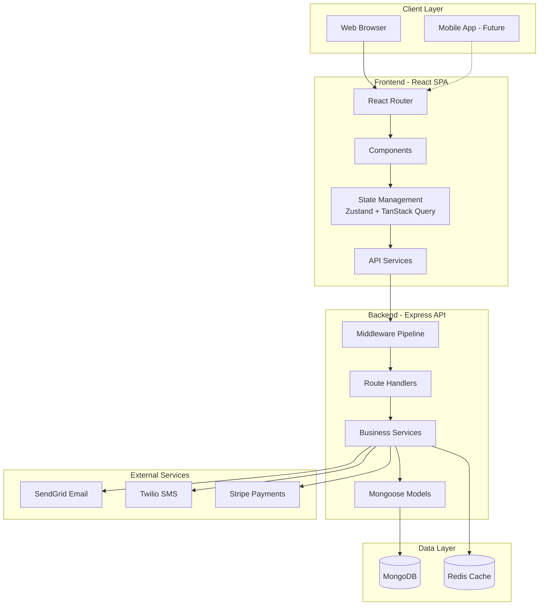
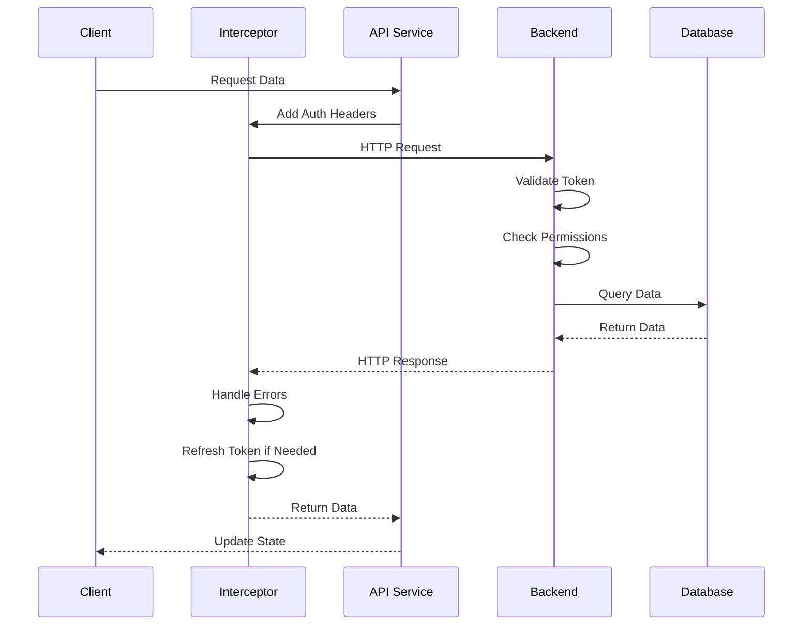
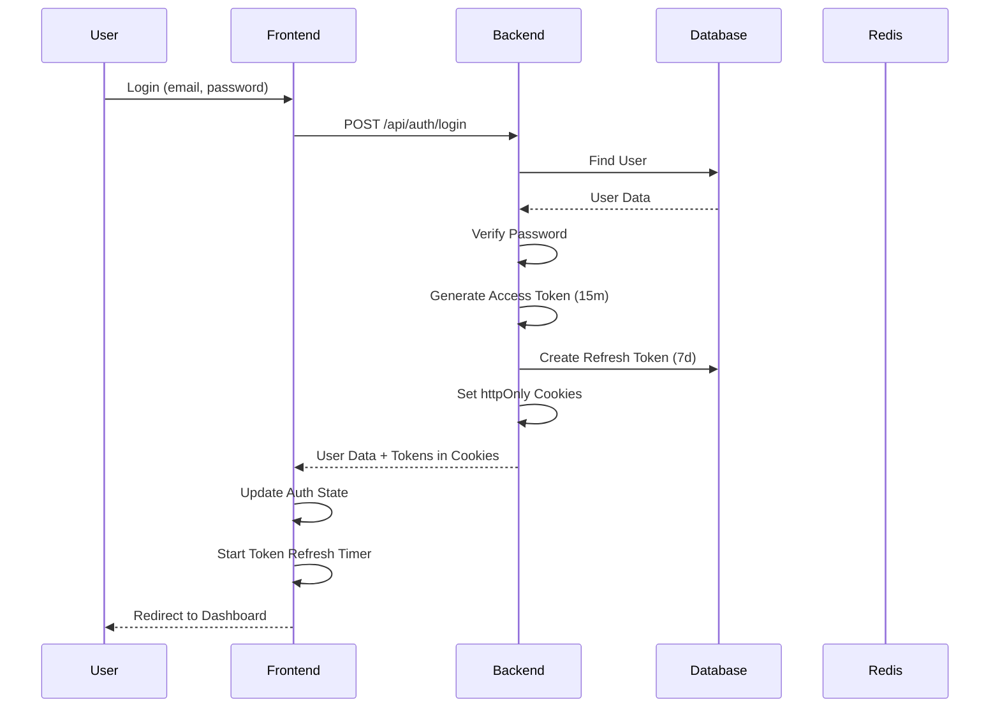

# TopSmile System Architecture Overview

**Version:** 1.0.0  
**Last Updated:** 2024  
**Document Type:** Architecture Specification

---

## Table of Contents
1. [Executive Summary](#executive-summary)
2. [System Architecture](#system-architecture)
3. [Component Diagrams](#component-diagrams)
4. [Technology Stack](#technology-stack)
5. [Integration Patterns](#integration-patterns)
6. [Deployment Architecture](#deployment-architecture)
7. [Authentication & Authorization](#authentication--authorization)
8. [Error Handling & Logging](#error-handling--logging)
9. [Improvement Recommendations](#improvement-recommendations)

---

## Executive Summary

TopSmile is a full-stack dental clinic management system built as a TypeScript monorepo. The system follows a **layered architecture** with clear separation between presentation (React), business logic (Express services), and data persistence (MongoDB).

### Key Architectural Decisions
- **Monorepo structure** with shared types package for type safety
- **JWT authentication** with httpOnly cookies for security
- **Role-based access control (RBAC)** with 6 user roles
- **RESTful API** design with standardized response format
- **Microservices-ready** architecture with service layer abstraction

---

## System Architecture

### High-Level Architecture



### Layered Architecture Pattern

```
┌─────────────────────────────────────────┐
│         Presentation Layer              │
│  (React Components, Pages, Layouts)     │
└─────────────────────────────────────────┘
                  ↓
┌─────────────────────────────────────────┐
│      Application/State Layer            │
│  (Zustand Stores, TanStack Query)       │
└─────────────────────────────────────────┘
                  ↓
┌─────────────────────────────────────────┐
│         API Service Layer               │
│    (HTTP Client, Interceptors)          │
└─────────────────────────────────────────┘
                  ↓
        ═══════════════════════
         HTTP/REST API
        ═══════════════════════
                  ↓
┌─────────────────────────────────────────┐
│       Middleware Pipeline               │
│  (Auth, CORS, Rate Limit, CSRF)         │
└─────────────────────────────────────────┘
                  ↓
┌─────────────────────────────────────────┐
│         Route Handlers                  │
│  (Request Validation, Response)         │
└─────────────────────────────────────────┘
                  ↓
┌─────────────────────────────────────────┐
│       Business Logic Layer              │
│    (Services, Domain Logic)             │
└─────────────────────────────────────────┘
                  ↓
┌─────────────────────────────────────────┐
│         Data Access Layer               │
│    (Mongoose Models, Schemas)           │
└─────────────────────────────────────────┘
                  ↓
┌─────────────────────────────────────────┐
│           Database Layer                │
│         (MongoDB, Redis)                │
└─────────────────────────────────────────┘
```

---

## Component Diagrams

### Frontend Component Architecture

```
src/
├── App.tsx                    # Root component
├── routes/                    # Lazy-loaded route definitions
├── pages/                     # Page-level components
│   ├── Admin/                 # Admin dashboard pages
│   ├── Patient/               # Patient portal pages
│   └── Public/                # Public-facing pages
├── components/
│   ├── Admin/                 # Admin-specific components
│   ├── Auth/                  # Authentication components
│   ├── Booking/               # Appointment booking
│   ├── Calendar/              # Calendar views
│   ├── Clinical/              # Clinical workflows
│   ├── PatientPortal/         # Patient portal components
│   ├── Payment/               # Payment processing
│   ├── common/                # Shared components
│   └── UI/                    # Base UI library
├── contexts/                  # React Context providers
│   ├── AuthContext.tsx        # Admin authentication
│   ├── PatientAuthContext.tsx # Patient authentication
│   └── ErrorContext.tsx       # Global error handling
├── store/                     # Zustand state stores
│   ├── authStore.ts
│   ├── clinicalStore.ts
│   └── appStore.ts
├── services/                  # API client services
│   ├── apiService.ts          # Main API service
│   ├── http.ts                # HTTP client
│   └── interceptors/          # Request/response interceptors
├── hooks/                     # Custom React hooks
├── layouts/                   # Layout components
└── features/                  # Feature-based modules
```

### Backend Service Architecture

```
backend/src/
├── app.ts                     # Express app setup
├── routes/                    # API route definitions
│   ├── auth.ts                # Authentication routes
│   ├── admin/                 # Admin routes
│   ├── clinical/              # Clinical routes
│   ├── patient/               # Patient routes
│   ├── provider/              # Provider routes
│   ├── scheduling/            # Scheduling routes
│   ├── security/              # Security routes
│   └── public/                # Public routes
├── services/                  # Business logic services
│   ├── auth/                  # Authentication services
│   │   ├── authService.ts
│   │   ├── tokenBlacklistService.ts
│   │   └── patientAuthService.ts
│   └── admin/                 # Admin services
│       └── contactService.ts
├── models/                    # Mongoose models
│   ├── User.ts
│   ├── Patient.ts
│   ├── PatientUser.ts
│   ├── Appointment.ts
│   ├── Provider.ts
│   ├── Clinic.ts
│   ├── Contact.ts
│   ├── DentalChart.ts
│   ├── TreatmentPlan.ts
│   ├── ClinicalNote.ts
│   ├── Prescription.ts
│   └── RefreshToken.ts
├── middleware/                # Express middleware
│   ├── auth/                  # Authentication middleware
│   ├── security/              # Security middleware
│   ├── database.ts            # Database middleware
│   ├── errorHandler.ts        # Error handling
│   └── auditLogger.ts         # Audit logging
├── config/                    # Configuration
│   ├── env.ts                 # Environment config
│   ├── database/              # Database config
│   └── logger.ts              # Logging config
├── utils/                     # Utility functions
│   └── errors/                # Custom error classes
└── validation/                # Request validation schemas
```

---

## Technology Stack

### Frontend Technologies

| Category | Technology | Version | Purpose |
|----------|-----------|---------|---------|
| **Core Framework** | React | 18.2.0 | UI library |
| **Language** | TypeScript | 4.9.5+ | Type safety |
| **Routing** | React Router DOM | 6.30.1 | Client-side routing |
| **State Management** | Zustand | 4.5.7 | Global state |
| **Server State** | TanStack Query | 5.89.0 | Data fetching & caching |
| **HTTP Client** | Fetch API | Native | API requests |
| **Styling** | CSS3 + CSS Variables | - | Styling |
| **Animation** | Framer Motion | 10.16.5 | Animations |
| **Date/Time** | Luxon | 3.7.1 | Date manipulation |
| **Payment** | Stripe React | 4.0.2 | Payment UI |
| **Build Tool** | Create React App | 5.0.1 | Build tooling |
| **Testing** | Jest + RTL | 27.5.1 | Unit testing |
| **E2E Testing** | Cypress | 15.1.0 | End-to-end testing |

### Backend Technologies

| Category | Technology | Version | Purpose |
|----------|-----------|---------|---------|
| **Runtime** | Node.js | 18+ | JavaScript runtime |
| **Framework** | Express | 4.21.2 | Web framework |
| **Language** | TypeScript | 5.9.2 | Type safety |
| **Database** | MongoDB | Latest | NoSQL database |
| **ODM** | Mongoose | 8.18.0 | MongoDB modeling |
| **Cache** | Redis + ioredis | 5.8.2 | Caching & sessions |
| **Authentication** | jsonwebtoken | 9.0.2 | JWT tokens |
| **Password Hashing** | bcrypt | 6.0.0 | Password security |
| **Validation** | express-validator | 7.2.1 | Request validation |
| **Security** | Helmet | 7.2.0 | Security headers |
| **CORS** | cors | 2.8.5 | Cross-origin requests |
| **Rate Limiting** | express-rate-limit | 7.5.1 | API rate limiting |
| **Logging** | Pino | 9.11.0 | Structured logging |
| **Email** | Nodemailer + SendGrid | 6.10.1 | Email service |
| **SMS** | Twilio | 5.10.2 | SMS notifications |
| **Job Queue** | BullMQ | 5.58.2 | Background jobs |
| **Testing** | Jest + Supertest | 29.7.0 | API testing |

### Shared Technologies

| Category | Technology | Purpose |
|----------|-----------|---------|
| **Monorepo** | npm workspaces | Package management |
| **Types Package** | @topsmile/types | Shared TypeScript types |
| **CI/CD** | GitHub Actions | Automated testing & deployment |
| **Code Quality** | ESLint + TypeScript ESLint | Linting |

---

## Integration Patterns

### Frontend-Backend Communication



### Authentication Flow



### Data Fetching Pattern

```typescript
// Frontend: TanStack Query Hook
export const usePatients = (filters: PatientFilters) => {
  return useQuery({
    queryKey: ['patients', filters],
    queryFn: () => apiService.patients.getAll(filters),
    staleTime: 5 * 60 * 1000, // 5 minutes
    cacheTime: 10 * 60 * 1000, // 10 minutes
  });
};

// Frontend: Mutation Hook
export const useUpdatePatient = () => {
  const queryClient = useQueryClient();
  return useMutation({
    mutationFn: ({ id, data }: UpdateParams) => 
      apiService.patients.update(id, data),
    onSuccess: () => {
      queryClient.invalidateQueries({ queryKey: ['patients'] });
    }
  });
};

// Backend: Route Handler
router.get('/', authenticate, async (req, res) => {
  const filters = req.query;
  const patients = await patientService.getAll(filters);
  return res.json({ success: true, data: patients });
});

// Backend: Service Layer
class PatientService {
  async getAll(filters: PatientFilters) {
    const query = this.buildQuery(filters);
    return await Patient.find(query)
      .populate('clinic', 'name')
      .sort({ createdAt: -1 });
  }
}
```

---

## Deployment Architecture

### Current Deployment Model

```
┌─────────────────────────────────────────┐
│         Load Balancer / CDN             │
│         (Future: CloudFlare)            │
└─────────────────────────────────────────┘
                  ↓
┌─────────────────────────────────────────┐
│      Frontend (Static Hosting)          │
│    Vercel / Netlify / AWS S3+CF         │
│         React Build Output              │
└─────────────────────────────────────────┘
                  ↓
┌─────────────────────────────────────────┐
│      Backend API Server(s)              │
│    Heroku / AWS EC2 / DigitalOcean      │
│         Node.js + Express               │
└─────────────────────────────────────────┘
                  ↓
┌─────────────────────────────────────────┐
│         Database Cluster                │
│      MongoDB Atlas / Self-hosted        │
└─────────────────────────────────────────┘
                  ↓
┌─────────────────────────────────────────┐
│          Cache Layer                    │
│      Redis Cloud / ElastiCache          │
└─────────────────────────────────────────┘
```

### Environment Configuration

| Environment | Frontend URL | Backend URL | Database | Purpose |
|-------------|-------------|-------------|----------|---------|
| **Development** | localhost:3000 | localhost:5000 | Local MongoDB | Local development |
| **Staging** | staging.topsmile.com | api-staging.topsmile.com | MongoDB Atlas (Staging) | Testing & QA |
| **Production** | topsmile.com | api.topsmile.com | MongoDB Atlas (Prod) | Live system |

---

## Authentication & Authorization

### JWT Token Strategy

```typescript
// Access Token (Short-lived: 15 minutes)
{
  userId: string;
  email: string;
  role: 'super_admin' | 'admin' | 'manager' | 'dentist' | 'assistant' | 'patient';
  clinicId?: string;
  iss: 'topsmile-api';
  aud: 'topsmile-client';
  exp: timestamp;
}

// Refresh Token (Long-lived: 7 days)
// Stored in database with device info
{
  token: string; // Random 48-byte hex
  userId: ObjectId;
  expiresAt: Date;
  isRevoked: boolean;
  deviceInfo: {
    userAgent?: string;
    ipAddress?: string;
    deviceId?: string;
  };
}
```

### Role-Based Access Control

| Role | Permissions | Access Level |
|------|------------|--------------|
| **super_admin** | Full system access, user management, clinic management | All routes |
| **admin** | Clinic management, staff management, reports | Clinic-scoped |
| **manager** | Scheduling, patient management, reports | Clinic-scoped |
| **dentist** | Clinical workflows, patient records, appointments | Assigned patients |
| **assistant** | Scheduling, basic patient info | Limited access |
| **patient** | Personal portal, appointments, records | Own data only |

### Security Middleware Pipeline

```typescript
// Middleware execution order
app.use(helmet());                    // Security headers
app.use(cors(corsOptions));           // CORS configuration
app.use(rateLimit);                   // Rate limiting
app.use(express.json());              // Body parsing
app.use(mongoSanitization);           // NoSQL injection prevention
app.use(csrfProtection);              // CSRF protection
app.use(checkDatabaseConnection);     // DB health check
app.use(authenticate);                // JWT verification
app.use(authorize(...roles));         // Role-based access
app.use(auditLogger);                 // Audit logging
```

---

## Error Handling & Logging

### Error Handling Strategy

```typescript
// Custom Error Classes
class AppError extends Error {
  constructor(message: string, statusCode: number) {
    super(message);
    this.statusCode = statusCode;
  }
}

class ValidationError extends AppError {
  constructor(message: string) {
    super(message, 400);
  }
}

class UnauthorizedError extends AppError {
  constructor(message: string) {
    super(message, 401);
  }
}

class NotFoundError extends AppError {
  constructor(resource: string) {
    super(`${resource} não encontrado`, 404);
  }
}

// Centralized Error Handler
app.use((err, req, res, next) => {
  logger.error({
    err,
    req: { method: req.method, url: req.url },
    user: req.user?.id
  });
  
  res.status(err.statusCode || 500).json({
    success: false,
    message: err.message,
    ...(process.env.NODE_ENV === 'development' && { stack: err.stack })
  });
});
```

### Logging Architecture

```typescript
// Pino Logger Configuration
const logger = pino({
  level: process.env.LOG_LEVEL || 'info',
  transport: {
    target: 'pino-pretty',
    options: {
      colorize: true,
      translateTime: 'SYS:standard',
      ignore: 'pid,hostname'
    }
  }
});

// HTTP Request Logging
app.use(pinoHttp({
  logger,
  customLogLevel: (req, res, err) => {
    if (res.statusCode >= 500) return 'error';
    if (res.statusCode >= 400) return 'warn';
    return 'info';
  }
}));

// Audit Logging
const auditLogger = (req, res, next) => {
  const log = {
    userId: req.user?.id,
    action: `${req.method} ${req.path}`,
    ipAddress: req.ip,
    timestamp: new Date(),
    changes: req.body
  };
  
  AuditLog.create(log);
  next();
};
```

---

## Improvement Recommendations

### 🟥 Critical Improvements

1. **Implement API Gateway Pattern**
   - **Issue:** Direct frontend-to-backend communication lacks centralized control
   - **Solution:** Introduce API Gateway (Kong, AWS API Gateway) for:
     - Centralized authentication
     - Rate limiting per user/IP
     - Request/response transformation
     - API versioning
   - **Impact:** Improved security, scalability, and monitoring

2. **Add Database Connection Pooling**
   - **Issue:** No explicit connection pool configuration
   - **Solution:** Configure Mongoose connection pool:
     ```typescript
     mongoose.connect(DATABASE_URL, {
       maxPoolSize: 10,
       minPoolSize: 2,
       socketTimeoutMS: 45000,
     });
     ```
   - **Impact:** Better performance under load

3. **Implement Distributed Caching**
   - **Issue:** Redis configured but not consistently used
   - **Solution:** Implement caching layer for:
     - User sessions
     - Frequently accessed data (clinics, providers)
     - API response caching
   - **Impact:** Reduced database load, faster response times

### 🟧 High Priority Improvements

4. **Add API Versioning**
   - **Issue:** No API versioning strategy
   - **Solution:** Implement URL-based versioning:
     ```typescript
     app.use('/api/v1', routesV1);
     app.use('/api/v2', routesV2);
     ```
   - **Impact:** Backward compatibility, easier migrations

5. **Implement GraphQL for Complex Queries**
   - **Issue:** REST API requires multiple requests for related data
   - **Solution:** Add GraphQL endpoint for complex queries:
     - Patient with appointments, treatments, and notes
     - Dashboard aggregations
   - **Impact:** Reduced network requests, better performance

6. **Add Real-time Updates with WebSockets**
   - **Issue:** No real-time updates for appointments, notifications
   - **Solution:** Implement Socket.io for:
     - Appointment updates
     - Calendar synchronization
     - Notifications
   - **Impact:** Better user experience, real-time collaboration

7. **Implement Comprehensive Monitoring**
   - **Issue:** Limited observability
   - **Solution:** Add monitoring stack:
     - Application: New Relic / Datadog
     - Logs: ELK Stack / CloudWatch
     - Metrics: Prometheus + Grafana
     - Alerts: PagerDuty / Opsgenie
   - **Impact:** Proactive issue detection, better debugging

### 🟨 Medium Priority Improvements

8. **Optimize Database Indexes**
   - **Issue:** Some queries lack proper indexes
   - **Solution:** Review and add indexes for:
     - Appointment queries by date range
     - Patient search by name/email
     - Contact filtering by status
   - **Impact:** Faster query performance

9. **Implement Request Validation Middleware**
   - **Issue:** Inconsistent validation across routes
   - **Solution:** Centralize validation with Zod schemas
   - **Impact:** Better data integrity, clearer error messages

10. **Add Automated Database Backups**
    - **Issue:** No automated backup strategy documented
    - **Solution:** Implement:
      - Daily automated backups
      - Point-in-time recovery
      - Backup testing procedures
    - **Impact:** Data protection, disaster recovery

### 🟩 Low Priority Improvements

11. **Implement Feature Flags**
    - **Solution:** Add feature flag system (LaunchDarkly, Unleash)
    - **Impact:** Gradual rollouts, A/B testing

12. **Add API Documentation with Swagger UI**
    - **Solution:** Complete Swagger annotations, deploy Swagger UI
    - **Impact:** Better developer experience

13. **Implement Code Coverage Thresholds**
    - **Solution:** Enforce 80% code coverage in CI/CD
    - **Impact:** Better test quality

---

## Related Documents

- [02-Authentication-Authorization-Specification.md](./02-Authentication-Authorization-Specification.md)
- [04-Frontend-Architecture.md](./04-Frontend-Architecture.md)
- [05-Backend-Architecture.md](./05-Backend-Architecture.md)
- [11-Comprehensive-Improvement-Analysis.md](./11-Comprehensive-Improvement-Analysis.md)

---

## Changelog

### Version 1.0.0 (2024)
- Initial architecture documentation
- Component diagrams and technology stack
- Integration patterns and deployment architecture
- Comprehensive improvement recommendations
