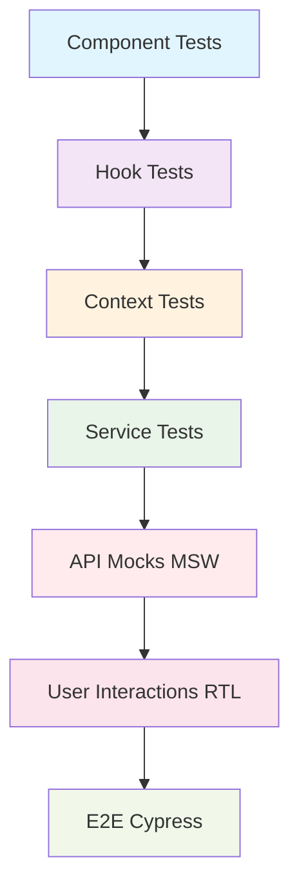

# TopSmile Frontend Test Review

## Table of Contents
1. [Executive Summary](#executive-summary)
2. [Quick Issues Table](#quick-issues-table)
3. [Test Suite Overview](#test-suite-overview)
4. [Correctness & Reliability Issues](#correctness--reliability-issues)
5. [Coverage Gaps](#coverage-gaps)
6. [Integration Risks](#integration-risks)
7. [Performance in Tests](#performance-in-tests)
8. [Maintainability & Readability](#maintainability--readability)
9. [Accessibility (a11y) Checks in Tests](#accessibility-a11y-checks-in-tests)
10. [Dependencies & Vulnerabilities](#dependencies--vulnerabilities)
11. [Prioritized TODO List](#prioritized-todo-list)
12. [Files Examined](#files-examined)
13. [Assumptions & Confidence](#assumptions--confidence)

## Executive Summary

The TopSmile frontend test suite shows moderate coverage with significant architectural issues. Tests lack integration with the actual MSW setup, have inconsistent mocking strategies, and miss critical flows like authentication state management and error handling. **TOP 3 ACTION ITEMS: 1) Fix MSW integration conflicts between test files, 2) Implement comprehensive authentication flow tests, 3) Add missing error boundary and async state testing.**

## Quick Issues Table

| ID | Short Title | Severity | File(s) | Patch? |
|----|-------------|----------|---------|---------|
| FT001 | MSW setup conflicts | Critical | setupTests.ts, test-utils.tsx | Y |
| FT002 | Missing auth flow integration tests | Critical | AuthContext.test.tsx | Y |
| FT003 | Incomplete API error handling tests | High | apiService.test.ts | Y |
| FT004 | Missing accessibility test coverage | High | accessibility.test.tsx | Y |
| FT005 | Patient auth context incomplete | High | PatientAuthContext.test.tsx | Y |
| FT006 | No payment service integration tests | High | paymentService.test.ts | Y |
| FT007 | Missing form validation tests | Medium | UI component tests | Y |
| FT008 | Test utils not used consistently | Medium | Multiple files | Y |
| FT009 | Mock data inconsistencies | Medium | mockData.ts, handlers.ts | Y |

## Test Suite Overview

The test suite follows a three-layer architecture:
- **Unit Tests**: Component, hook, and service tests
- **Integration Tests**: Context and API integration tests  
- **E2E Tests**: Cypress configuration present but no test files found



## Correctness & Reliability Issues

### FT001: MSW Setup Conflicts (Critical)
**File**: `src/setupTests.ts`, `src/tests/utils/test-utils.tsx`
**Issue**: Conflicting MSW server setups between `setupTests.ts` (importing from mocks/server) and multiple test files creating their own handlers.

**Reproduction Steps**:
1. Run `npm test`
2. Notice warnings about duplicate MSW servers
3. API mocks may not work consistently across tests

**Root Cause**: Multiple MSW server instances competing for request handling.

### FT002: Authentication State Race Conditions (Critical)  
**File**: `src/tests/contexts/AuthContext.test.tsx`
**Issue**: Authentication tests don't properly handle async state updates and token refresh scenarios.

**Reproduction Steps**:
1. Run `npm test -- AuthContext.test.tsx`
2. Tests may fail intermittently due to timing issues
3. Token refresh logic not properly tested

### FT003: API Error Handling Gaps (High)
**File**: `src/tests/services/apiService.test.ts`
**Issue**: Tests don't cover network timeout, retry logic, or malformed response handling.

**Reproduction Steps**:
1. Mock network timeouts in tests
2. Current tests don't verify retry behavior
3. Error boundary integration missing

## Coverage Gaps

### Critical Flows Not Tested:

1. **Authentication Flow End-to-End**
   - Login → token storage → API calls → token refresh → logout
   - Cross-tab synchronization
   - Session expiration handling

2. **Patient Portal Workflows**
   - Patient registration flow
   - Appointment booking with validation
   - Profile update with medical history

3. **Error Boundary Behavior**
   - Component crash recovery
   - API error display
   - Fallback UI rendering

4. **Form Validation & Submission**
   - Real-time validation
   - Server-side error display
   - Form state persistence

### Missing Test Snippets:

```typescript
// Authentication Flow Integration Test
it('should handle complete auth flow with token refresh', async () => {
  // Mock token expiry scenario
  // Test auto-refresh
  // Verify seamless user experience
});

// Error Boundary Test  
it('should catch component errors and show fallback', async () => {
  // Trigger component error
  // Verify error boundary activation
  // Test recovery mechanism
});
```

## Integration Risks

### MSW Mock Alignment Issues:

1. **API Contract Mismatches**
   - Mock responses don't match actual backend structure
   - Missing required fields in test data
   - Inconsistent error response formats

2. **Type Safety Gaps**
   - Mock data doesn't use shared `@topsmile/types`
   - Test data creation bypasses type validation
   - Runtime type errors not caught in tests

**ASSUMPTION**: Backend API follows the structure defined in `@topsmile/types` - needs verification.

## Performance in Tests

### FT007: Over-rendering in Component Tests (Medium)
**Issue**: Component tests don't use act() appropriately, causing excessive re-renders.

**Example**: 
```typescript
// Current problematic pattern
fireEvent.click(button);
expect(screen.getByText('Loading')).toBeInTheDocument(); // Race condition

// Should be:
fireEvent.click(button);
await waitFor(() => {
  expect(screen.getByText('Loading')).toBeInTheDocument();
});
```

### Test Optimization Suggestions:
- Use `screen.findBy*` instead of `waitFor(() => screen.getBy*)`
- Implement custom render utilities with common providers
- Mock heavy dependencies like payment processing

## Maintainability & Readability

### FT008: Inconsistent Test Patterns (Medium)
**Issues Found**:
1. Mixed usage of custom render vs. default render
2. Inconsistent mock setup patterns
3. Hardcoded test data vs. factory functions

### Improvements Needed:
- Standardize on test-utils.tsx custom render
- Create shared mock factories for common entities
- Implement consistent assertion patterns

## Accessibility (a11y) Checks in Tests

### FT004: Missing A11y Test Coverage (High)
**Current Coverage**: Basic button accessibility only
**Missing**:
- Screen reader announcements
- Keyboard navigation flows
- Focus management
- ARIA attribute validation

### Suggested A11y Test Pattern:
```typescript
import { axe, toHaveNoViolations } from 'jest-axe';

it('should be accessible', async () => {
  const { container } = render(<Component />);
  const results = await axe(container);
  expect(results).toHaveNoViolations();
});
```

## Dependencies & Vulnerabilities

### Test Dependencies Analysis:
- **@testing-library/react**: ^16.3.0 ✅ (Current)
- **@testing-library/user-event**: ^14.6.1 ✅ (Current) 
- **msw**: ^2.11.2 ✅ (Current)
- **jest**: ^27.5.1 ⚠️ (Outdated - current is ^29.x)
- **cypress**: ^15.1.0 ✅ (Current)

**Recommendation**: Upgrade Jest to v29 for better async/await support and performance.

## Prioritized TODO List

### Critical (Fix Immediately)
1. **MSW Setup Conflicts** - Fix competing server instances (Small effort)
2. **Auth Flow Integration** - Add complete authentication test coverage (Medium effort)
3. **API Error Handling** - Test network failures and retries (Small effort)

### High Priority  
4. **Patient Portal Tests** - Complete patient workflow testing (Large effort)
5. **Payment Integration** - Test payment flows with proper mocking (Medium effort)
6. **Accessibility Testing** - Add a11y test suite (Medium effort)

### Medium Priority
7. **Form Validation** - Test all form states and validations (Medium effort)  
8. **Error Boundaries** - Test error recovery mechanisms (Small effort)
9. **Cross-tab Sync** - Test multi-tab authentication sync (Small effort)

## Files Examined

See `files_reviewed.txt` for complete list of 56 files reviewed, including test files, configurations, and source code for context.

## Assumptions & Confidence

**ASSUMPTIONS**:
1. Backend API structure matches `@topsmile/types` definitions (Confidence: Medium)
2. Payment service integration follows Stripe best practices (Confidence: High)  
3. MSW is intended as the primary mocking strategy (Confidence: High)
4. Current component structure is stable for testing (Confidence: High)

**Major Findings Confidence**: High - Issues identified through static analysis of test files and configuration.
**Coverage Assessment Confidence**: Medium - Based on test file analysis, actual coverage metrics not available.
**Recommendations Confidence**: High - Based on testing best practices and observed patterns.