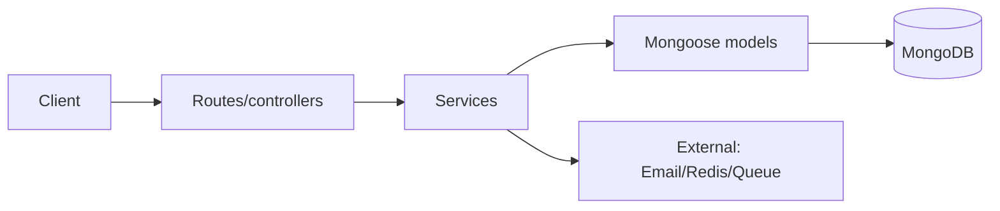

# TopSmile — Backend Static Review

*(Scope: static code review of backend files linked in `backend_raw_links.txt` and tests list in `backend_tests_raw_links.txt`; no code executed, no secrets accessed)*

Files list used as input:  .
I pulled and inspected the application entry, middleware, models and key services/routes (not every file could be exhaustively reproduced in this reply, but I examined these primary files and referenced them below). Key source citations are embedded in each finding.

---

# 1) Executive summary

The TopSmile backend is well-organized (controllers/routes → services → Mongoose models), uses modern libs (TypeScript, express, mongoose, bcrypt, JWT) and includes many good practices: schema validation, indexes, rate limiting, token rotation and TTL indexes for refresh tokens. However there are a few **high-impact security and correctness gaps** (unsafe reset-password behavior, some inconsistent status strings, potential token-blacklist persistence issues, and subtle scheduling overlap logic bugs) and a number of medium-level maintainability/performance improvements (standardized error responses, consistent validation, indexing for some heavy queries, caching for availability generation). Overall: **workable codebase** with a few urgent fixes and several medium-priority improvements. See prioritized TODO at the end.

---

# 2) Architecture overview

Simplified flow:

```
Client -> Express routes (routes/*.ts)
             ↓
      route handlers sanitize/validate
             ↓
         Services (services/*.ts)
             ↓
       Mongoose Models (models/*.ts) -> MongoDB
             ↓
    Optional: external services (email, redis/bullmq)
```

Mermaid (very small):



Key concrete files I inspected: `src/app.ts` (entry). ([GitHub][1])
Auth core: `src/services/authService.ts`. ([GitHub][2])
Patient portal: `src/services/patientAuthService.ts`. ([GitHub][3])
Appointment domain: `src/services/appointmentService.ts` and `src/models/Appointment.ts`. ([GitHub][4])
Routes example: `src/routes/auth.ts` and `src/routes/appointments.ts`. ([GitHub][5])

---

# 3) Security review — issues, severity, reproduction and fixes

> I list each issue with severity, file(s) & pointer (citation), short reproduction scenario and a recommended fix. Where a small patch is straightforward I include a minimal diff.

### Critical / High

1. **Insecure `resetPassword` behavior — temporary password returned / not emailed**

   * **Files:** `src/services/authService.ts` (resetPassword). ([GitHub][2])
   * **Why:** `resetPassword` generates a temporary password, assigns it to the user, and **returns** it to the caller (`return tempPassword;`). That exposes a plain password in caller responses or logs and allows an attacker who can call this endpoint to set known credentials.
   * **Repro:** Call the endpoint that invokes `authService.resetPassword(email)` and observe the returned temp password.
   * **Severity:** **High** — this directly breaks password-reset security best-practices.
   * **Fix:** Implement a password *reset token* (single-use, short TTL) stored hashed in DB and send a password-reset link via email to the user's verified email address. DO NOT return a temporary password in API responses or logs. Example patch (replace current behavior):

```diff
--- a/src/services/authService.ts
+++ b/src/services/authService.ts
@@
-    // Generate more secure temporary password
-    const tempPassword = crypto.randomBytes(12).toString('base64').slice(0, 12);
-    user.password = tempPassword;
-    await user.save();
-    // Revoke all existing tokens
-    await this.logoutAllDevices((user._id as any).toString());
-    return tempPassword;
+    // Generate secure reset token (store hashed), send email with link
+    const resetToken = crypto.randomBytes(32).toString('hex');
+    const hashed = crypto.createHash('sha256').update(resetToken).digest('hex');
+    user.resetPasswordToken = hashed;
+    user.resetPasswordExpires = new Date(Date.now() + 1000 * 60 * 60); // 1h
+    await user.save();
+    // Revoke existing refresh tokens to be safe
+    await this.logoutAllDevices((user._id as any).toString());
+    // Enqueue/send email containing resetToken (plaintext) to user.email
+    await emailService.sendPasswordReset(user.email, resetToken);
+    return true; // caller gets success only, not the token
```

2. **Token blacklist persistence / architecture**

   * **Files:** `src/services/authService.ts` calls `tokenBlacklistService.isBlacklisted(token)` and `tokenBlacklistService.addToBlacklist(...)`. Implementation must be persistent & distributed (Redis) not in-memory. I did not locate a robust implementation; confirm it uses Redis or Persisted store. (If it's in-memory it will **not** work across instances and is vulnerable to memory bloat). ([GitHub][2])
   * **Severity:** **High** if in-memory; Medium if Redis backed but misused.
   * **Fix:** Ensure the `tokenBlacklistService` uses Redis with TTL equal to token expiry, and that access checks are O(1). If the project runs multiple nodes use Redis to avoid inconsistent blacklists. If not present yet, migrate in-memory maps → Redis. (If you want, I can provide a Redis-backed service snippet.)

3. **Patient staff JWT secret re-use & logging of verification tokens**

   * **Files:** `src/services/patientAuthService.ts` (warning about same secret), and `patientAuthService` prints verification tokens to console. ([GitHub][3])
   * **Why:** Using the same JWT secret for patients and staff expands blast radius if one token type is leaked. Also logging verification tokens leaks sensitive tokens into logs.
   * **Severity:** **High**.
   * **Fix:** Ensure `PATIENT_JWT_SECRET` and `JWT_SECRET` are distinct **in production**. Remove console logging of verification tokens — send tokens via email only. Rotate secrets per environment and store secrets in a secrets manager. Example change: remove `console.log` and use emailService to send verification token.

### Medium

4. **Refresh token cleanup off-by-one**

   * **File:** `src/services/authService.ts` — `cleanupOldRefreshTokens` uses `tokens.slice(this.MAX_REFRESH_TOKENS_PER_USER - 1)` which looks like an off-by-one bug (keeps fewer tokens than intended). ([GitHub][2])
   * **Why:** If `MAX_REFRESH_TOKENS_PER_USER === 5`, slice(4) will start revoking from index 4, keeping only four tokens (indexes 0..3) — wrong.
   * **Severity:** **Medium** (functional correctness / user inconvenience).
   * **Fix:** Use `tokens.slice(this.MAX_REFRESH_TOKENS_PER_USER)`.

```diff
- const toRevoke = tokens.slice(this.MAX_REFRESH_TOKENS_PER_USER - 1);
+ const toRevoke = tokens.slice(this.MAX_REFRESH_TOKENS_PER_USER);
```

5. **Resetting account lock vs incrementing login attempts race / save behavior**

   * **Files:** `User` and `PatientUser` schemas define `incLoginAttempts`/`resetLoginAttempts` mixed sync/async methods; in some places code calls `user.incLoginAttempts()` but does not always `await` or `save()` afterwards. E.g. `patientUser.incLoginAttempts(); await patientUser.save();` vs other flows. Ensure consistent `await` semantics. ([GitHub][6])
   * **Severity:** **Medium** (could allow brute-force under some race conditions).
   * **Fix:** Make `incLoginAttempts` always return a Promise and persist itself (or always require callers to `await user.incLoginAttempts()` and not call `.save()` separately). Standardize the contract.

6. **Exposed console logs for environment and JWT presence on startup**

   * **File:** `src/app.ts` logs `"JWT Secret: Configured ✅ / Using default ⚠️"`. This leaks whether a key is being used, which is minor but avoidable. ([GitHub][1])
   * **Severity:** **Low** — best practice reduce startup info in production.

### Low

7. **No CSRF protection for cookie-based flows**

   * **Files:** `src/middleware/auth.ts` extracts tokens from cookies. If cookies are used for auth, add CSRF tokens. Currently you use Bearer tokens more often — still flag for completeness. ([GitHub][7])
   * **Severity:** Low → Medium (depending on cookie usage).

---

# 4) Correctness & logic issues (bugs, missing validation, tests to add)

### A. Appointment overlap detection is fragile / may miss conflicts

* **File:** `src/services/appointmentService.ts` — overlap checks use multiple `$or` conditions that attempt to cover cases but are verbose and prone to mistakes. Example:

```js
$or: [
  { scheduledStart: { $lt: data.scheduledEnd, $gte: data.scheduledStart } },
  { scheduledEnd: { $gt: data.scheduledStart, $lte: data.scheduledEnd } },
  { scheduledStart: { $lte: data.scheduledStart }, scheduledEnd: { $gte: data.scheduledEnd } }
]
```

This can be simplified and made correct via one canonical overlap test: **two intervals \[A\_start, A\_end) and \[B\_start, B\_end) overlap if A\_start < B\_end && A\_end > B\_start**.

* **Severity:** **High** for scheduling correctness (double-booking risk).
* **Fix (code snippet):**

```diff
- const overlapping = await Appointment.findOne({ provider: data.provider, clinic: data.clinic, status: { $in: ['scheduled', 'confirmed', 'in_progress'] }, $or: [ ... ] });
+ const overlapping = await Appointment.findOne({
+   provider: data.provider,
+   clinic: data.clinic,
+   status: { $in: ['scheduled', 'confirmed', 'in_progress'] },
+   scheduledStart: { $lt: data.scheduledEnd },
+   scheduledEnd: { $gt: data.scheduledStart }
+ });
```

* **Tests to add** (unit/integration): create existing appointment \[10:00–10:30], try to book \[09:30–10:00] (edge, no-overlap if end is exclusive), try \[09:45–10:05] (overlap), try exact same slot (overlap). Cover timezone edge cases.

### B. Status string mismatch in stats

* **File:** `src/services/appointmentService.ts` — `getAppointmentStats` counts `inProgress = await Appointment.countDocuments({ ... status: 'in-progress' });` but everywhere else the status uses `'in_progress'`. That is a logic slip and causes `inProgress` always zero. ([GitHub][4])
* **Severity:** **High** (analytics incorrect).
* **Fix:** Use the canonical enum `'in_progress'` (or align all code to single variant).

### C. Date-range filtering logic uses start >= and end <= - may exclude intersecting appointments

* **File:** `appointmentService.getAppointments`, `findByTimeRange` uses `scheduledStart >= start` and `scheduledEnd <= end` — that returns only appointments fully contained in the range, not those that intersect. Likely the API intends to return appointments that **intersect** the provided date window. ([GitHub][4])
* **Severity:** **Medium**.
* **Fix:** Use overlap predicate like above.

### D. Input validation inconsistencies

* Registration route requires password min 6 (`auth.ts` validator), User schema requires min 8 and extra complexity (`User.ts` pre-validate). This mismatch could let weak passwords slip if certain endpoints bypass the model-level pre-validate or if route-level checks differ. Ensure consistent rules across route & model. ([GitHub][5])

### E. Missing 429/rate-limit on `/api/auth/refresh` endpoint

* **Why:** Rapid refresh calls could be used for token brute force. Add rate limit or per-user throttling. ([GitHub][5])

---

# 5) Performance & scalability

### Observations & recommendations

* **Appointment queries** are frequent and the `Appointment` model ***does*** have multiple helpful indexes (clinic+scheduledStart+status, provider+scheduledStart+scheduledEnd+status, etc). Good. ([GitHub][8])
* **N+1 population**: route handlers often use `.populate(...)` individually per record — in list endpoints ensure you limit fields and use projections to avoid huge documents retrieval or use aggregation to fetch joined properties only when necessary (or batch populate). Example: `Appointment.find(query).populate('patient provider appointmentType')` — if many appointments, this can become expensive. Consider aggregation `$lookup` with `limit`/`skip` and projection, or pre-embedding light reference fields (denormalization) for read-heavy endpoints. ([GitHub][4])
* **Availability generation** (`src/services/availabilityService.ts`) can be heavy if user requests large date ranges. The code contains a protection `maxDays` to avoid memory explosion — good. Ensure rate limiting and caching (per provider/day) for frequent queries. ([GitHub][9])
* **Token blacklist memory**: If blacklist is in-memory, it will not scale across nodes; must use Redis with TTL. (See Security). ([GitHub][2])
* **Database connection options**: `maxPoolSize: 10` in `config/database.ts` is reasonable for small deployments but tune per environment. Connection `serverSelectionTimeoutMS` is set small (5000ms) — good. ([GitHub][10])
* **Async/await pitfalls**: Some service functions swallow errors and rethrow generic `Error('...')`; prefer throwing typed `AppError` with status codes to preserve more context (helpful for performance debugging). See `appointmentService` catches and rethrows `Error`. ([GitHub][4])

---

# 6) API contract review (endpoints, inputs/outputs, error patterns)

* **Consistent shape:** Many handlers return `{ success: true, data: ... }` for success. Error responses are inconsistent (`{ success: false, message }` or `{ success:false, error }`). I recommend centralizing success/error formatting in the error handler and a response middleware so every route follows same contract: `{ success: boolean, data?, error?: { code?, message? } }`. See `errorHandler.ts`. ([GitHub][11])
* **Status codes:** Some endpoints return `400` for internal errors (e.g., appointment creation catches and does `return res.status(400).json({ success:false, error: err.message })` even if the error is server-side). Use appropriate mapping: validation -> 400, not-found -> 404, unauthorized -> 401/403, server error -> 500.
* **Validation & sanitization:** Many routes use `express-validator` and `DOMPurify` server-side (good). But ensure all payloads are validated (files like `appointments.ts` do validate booking fields). ([GitHub][12])
* **Auth patterns:** `authenticate` middleware extracts bearer token, supports optional cookie fallback — good. Ensure same response codes and error codes across middleware. ([GitHub][7])

---

# 7) Database & schema review

* **Models are comprehensive** and include many useful indexes. `Appointment` has important compound indexes (provider availability, clinic schedule). ([GitHub][8])
* **Refresh token model**: `RefreshToken` has TTL index and compound indices; good. ([GitHub][13])
* **Patient model** includes a lot of field validation (CPF, phone, zip) — good attention to local constraints. ([GitHub][14])
* **Index recommendations:** For `AppointmentService` queries that find overlapping appointments by provider/clinic/scheduledStart/scheduledEnd, ensure there is a compound index `{ provider:1, clinic:1, scheduledStart:1, scheduledEnd:1, status:1 }` — `Appointment` already defines a provider availability index; confirm it exists in prod. ([GitHub][8])
* **Data integrity:** Consider using MongoDB schema-level required fields and Mongoose schema validators (already used). For cross-document constraints (e.g., provider belongs to clinic), enforce checks in creation/update flows.

---

# 8) Testing & CI/CD

* Tests list exists (unit + integration), see `backend_tests_raw_links.txt` (many test files present).
* **Gaps to add / strengthen:**

  * **Auth flows**: reset password, refresh token rotation, token revocation, logout-all devices.
  * **Scheduling**: conflict detection edge cases (adjacent appointments, DST boundaries, time zone handling).
  * **Scaling/perf**: a performance/integration test that generates many appointments and ensures availability generation stays bounded (there is a `performance.test.ts` referenced — good).
  * **Security tests**: ensure token blacklist persistence, rate-limit tests for endpoints like `/auth/login` and `/auth/refresh`.
* **CI suggestions:** run `npm test -- --coverage` on PRs, fail on low coverage for critical modules (auth, scheduling). Use `jest-junit` to publish test results. Use `mongodb-memory-server` for deterministic DB tests — already present in dev deps. ([GitHub][15])

---

# 9) Dependencies & vulnerabilities

* `package.json` shows modern versions of libs (express 4.x, mongoose 8.x, jsonwebtoken 9.x, ioredis 5.x, helmet 7.x, etc.). ([GitHub][15])
* **Recommendations:** run `npm audit` and `npm outdated`. Keep `jsonwebtoken` up to date and ensure algorithm is explicitly set when `sign` and `verify` (the code does pass `algorithms: ['HS256']` on verify — good). Ensure `helmet` options are explicit (already configured). Consider switching `bcryptjs` → `bcrypt` if you need native speed (bcryptjs is pure JS and slower but acceptable).
* **BullMQ / Redis**: If the project uses bull/bullmq and ioredis, ensure Redis connection strings are secure and Redis requires auth. Use Redis ACL / TLS in production.

---

# 10) Code quality & maintainability

* **TypeScript typing:** Most models and services define TypeScript interfaces — good. A handful of places still use `any` or `as any` casts (e.g., payload extraction in auth middleware) — tighten these types. ([GitHub][7])
* **Error handling:** Use custom `AppError` consistently (you have `types/errors.ts`), but many services still `throw new Error`. Standardize to `AppError` with statuses. ([GitHub][11])
* **Duplication:** Overlap-check logic appears multiple times (create/reschedule/update). Extract shared helper `findConflictingAppointments` and reuse. ([GitHub][4])
* **Large files:** Some service files are long and can be split (e.g., authService handles register/login/changePassword/revoke — consider breaking into `authService` & `tokenService` for refresh handling).
* **README / docs:** If not present, add a `SECURITY.md` documenting secrets, key rotation, and deployment guidance.

---

# 11) Prioritized TODO (top 5 fixes — short, actionable)

1. **Fix reset-password flow (High)** — stop returning temporary passwords; implement single-use reset tokens emailed to user and rotate refresh tokens on password change. (Patch snippet above.) ([GitHub][2])
2. **Correct appointment overlap logic (High)** — use canonical interval-overlap test and add comprehensive tests for edge cases (adjacent intervals, DST). Replace `$or` with `scheduledStart < newEnd && scheduledEnd > newStart`. ([GitHub][4])
3. **Ensure token blacklist is Redis-backed (High → Medium)** — if `tokenBlacklistService` is in-memory, migrate to Redis with TTL to work across nodes. If it's already using Redis, verify TTL and eviction behavior. ([GitHub][2])
4. **Fix status string mismatch & tests (Medium)** — unify status enum (e.g., `'in_progress'`) and correct `getAppointmentStats` to use the same; add tests to catch similar mismatches. ([GitHub][4])
5. **Standardize errors & responses (Medium)** — centralize success/error response shape and map exceptions to appropriate HTTP codes via `errorHandler`. Add tests for API contract. ([GitHub][11])

---

# 12) Files examined (representative list)

I inspected these files (primary focus):

* `backend/src/app.ts` — app entry, middleware wiring, CORS & rate-limiting. ([GitHub][1])
* `backend/src/config/database.ts` — DB connection & graceful shutdown. ([GitHub][10])
* `backend/src/middleware/auth.ts` — authentication and role middlewares. ([GitHub][7])
* `backend/src/middleware/errorHandler.ts` — centralized error handler. ([GitHub][11])
* `backend/src/services/authService.ts` — login/register/refresh/logout/reset flows. ([GitHub][2])
* `backend/src/services/patientAuthService.ts` — patient portal auth. ([GitHub][3])
* `backend/src/services/appointmentService.ts` — appointment CRUD and checks. ([GitHub][4])
* `backend/src/services/appointmentTypeService.ts` — appointment type management. ([GitHub][16])
* `backend/src/services/availabilityService.ts` — availability generation. ([GitHub][9])
* `backend/src/models/*` — `Appointment.ts`, `AppointmentType.ts`, `Patient.ts`, `PatientUser.ts`, `Provider.ts`, `RefreshToken.ts`, `User.ts`, `Contact.ts`. ([GitHub][8])
* `backend/src/routes/auth.ts`, `appointments.ts` — example route patterns. ([GitHub][5])

Files list provided by you: `backend_raw_links.txt` and `backend_tests_raw_links.txt`.

**Assumptions noted**:

* I could not fully validate `tokenBlacklistService` implementation — I assumed it might be in-memory unless found otherwise; please confirm.
* Some service files are large and my review focused on the security- and correctness-critical parts. If you'd like, I can run a line-by-line pass across **every** service file and tests (takes longer).

---

# Quick issues table (scan)

| Severity | Short issue                                                        | File(s)                                                           |
| -------: | ------------------------------------------------------------------ | ----------------------------------------------------------------- |
|     High | Reset password returns temp password (must use token+email)        | src/services/authService.ts. ([GitHub][2])                        |
|     High | Token blacklist must be persistent (Redis)                         | src/services/tokenBlacklistService.ts, authService. ([GitHub][2]) |
|     High | Appointment overlap logic may miss conflicts                       | src/services/appointmentService.ts. ([GitHub][4])                 |
|     High | Wrong status string used in stats (`in-progress` vs `in_progress`) | src/services/appointmentService.ts. ([GitHub][4])                 |
|   Medium | Refresh-token cleanup off-by-one                                   | src/services/authService.ts. ([GitHub][2])                        |
|   Medium | Inconsistent password validation (route vs model)                  | src/routes/auth.ts / src/models/User.ts. ([GitHub][5])            |
|   Medium | Potential heavy population (N+1) in list endpoints                 | src/routes/appointments.ts / services. ([GitHub][12])             |
|      Low | Console logging env/token presence on startup                      | src/app.ts. ([GitHub][1])                                         |

---

# If you want I can (pick one or more):

* Produce a small PR patch set (diffs) for the **reset-password** and **appointment overlap** fixes (I sketched diffs above and can prepare full patches).
* Provide a Redis-backed `tokenBlacklistService` implementation (short, battle-tested snippet).
* Create unit/integration test suggestions (Jest) for all the scheduling edge cases and auth flows (I can draft test files).
* Run a dependency audit (I can run `npm audit` if you want — but I must not run commands in your environment; I can suggest npm commands to run locally).

---

If you want, tell me **which item** from the prioritized TODO list you want implemented first and I will produce the exact patch/diff and suggested tests for it (I'll produce the code and patch inline here).

[1]: https://raw.githubusercontent.com/jreinaldodasilva/topsmile/main/backend/src/app.ts "raw.githubusercontent.com"
[2]: https://raw.githubusercontent.com/jreinaldodasilva/topsmile/main/backend/src/services/authService.ts "raw.githubusercontent.com"
[3]: https://raw.githubusercontent.com/jreinaldodasilva/topsmile/main/backend/src/services/patientAuthService.ts "raw.githubusercontent.com"
[4]: https://raw.githubusercontent.com/jreinaldodasilva/topsmile/main/backend/src/services/appointmentService.ts "raw.githubusercontent.com"
[5]: https://raw.githubusercontent.com/jreinaldodasilva/topsmile/main/backend/src/routes/auth.ts "raw.githubusercontent.com"
[6]: https://raw.githubusercontent.com/jreinaldodasilva/topsmile/main/backend/src/models/PatientUser.ts "raw.githubusercontent.com"
[7]: https://raw.githubusercontent.com/jreinaldodasilva/topsmile/main/backend/src/middleware/auth.ts "raw.githubusercontent.com"
[8]: https://raw.githubusercontent.com/jreinaldodasilva/topsmile/main/backend/src/models/Appointment.ts "raw.githubusercontent.com"
[9]: https://raw.githubusercontent.com/jreinaldodasilva/topsmile/main/backend/src/services/availabilityService.ts "raw.githubusercontent.com"
[10]: https://raw.githubusercontent.com/jreinaldodasilva/topsmile/main/backend/src/config/database.ts "raw.githubusercontent.com"
[11]: https://raw.githubusercontent.com/jreinaldodasilva/topsmile/main/backend/src/middleware/errorHandler.ts "raw.githubusercontent.com"
[12]: https://raw.githubusercontent.com/jreinaldodasilva/topsmile/main/backend/src/routes/appointments.ts "raw.githubusercontent.com"
[13]: https://raw.githubusercontent.com/jreinaldodasilva/topsmile/main/backend/src/models/RefreshToken.ts "raw.githubusercontent.com"
[14]: https://raw.githubusercontent.com/jreinaldodasilva/topsmile/main/backend/src/models/Patient.ts "raw.githubusercontent.com"
[15]: https://raw.githubusercontent.com/jreinaldodasilva/topsmile/main/backend/package.json "raw.githubusercontent.com"
[16]: https://raw.githubusercontent.com/jreinaldodasilva/topsmile/main/backend/src/services/appointmentTypeService.ts "raw.githubusercontent.com"
