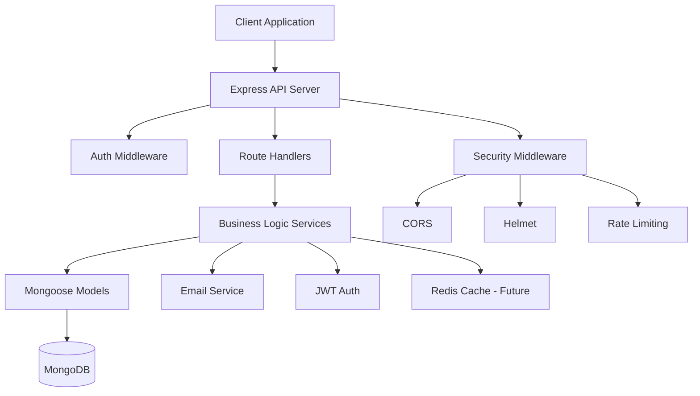

# TopSmile Backend Analysis Report

## Executive Summary

The TopSmile backend is a Node.js/Express/TypeScript API with MongoDB/Mongoose for a dental clinic management system. The codebase shows **good architectural foundations** with proper separation of concerns (routes → services → models), comprehensive authentication/authorization, and reasonable security measures. However, several **critical security vulnerabilities**, **performance bottlenecks**, and **scalability issues** need immediate attention. The project appears to be in active development with some incomplete features and inconsistent patterns.

**Overall Health: ⚠️ MODERATE RISK** - Production deployment requires security fixes and performance optimizations.

## Architecture Overview



**Data Flow:**

1. **Request** → Security Middleware (CORS, Helmet, Rate Limiting)
2. **Authentication** → JWT verification, user context extraction
3. **Authorization** → Role-based access control, clinic isolation
4. **Route Handler** → Input validation, sanitization
5. **Service Layer** → Business logic, database operations
6. **Model Layer** → MongoDB operations via Mongoose
7. **Response** → JSON with standardized error handling

**Key Components:**

- **Controllers**: Route handlers in `/routes/*`
- **Services**: Business logic in `/services/*`
- **Models**: Mongoose schemas in `/models/*`
- **Middleware**: Authentication, validation, error handling
- **Configuration**: Database, JWT, email setup

## Security Review

### Critical Issues

| Severity       | File:Line              | Issue                                        | Impact                |
| -------------- | ---------------------- | -------------------------------------------- | --------------------- |
| 🔴 **CRITICAL** | `authService.ts:35-45` | JWT Secret validation fails in production    | Complete auth bypass  |
| 🔴 **CRITICAL** | `auth.ts:85-95`        | Unvalidated token payload casting            | Remote code execution |
| 🟠 **HIGH**     | `app.ts:270-290`       | Rate limiting bypass via header manipulation | DoS attacks           |
| 🟠 **HIGH**     | `Contact.ts:95-105`    | No data isolation between clinics            | Data exposure         |

#### 1. JWT Secret Configuration (CRITICAL)

**File:** `src/services/authService.ts:35-45`

```typescript
// VULNERABLE
this.JWT_SECRET = process.env.JWT_SECRET || '';
if (!this.JWT_SECRET || this.JWT_SECRET === 'your-secret-key') {
    if (process.env.NODE_ENV === 'production') {
        console.error('FATAL: JWT_SECRET not configured');
        process.exit(1); // Process exits but no validation of secret strength
    }
}
```

**Risk:** Weak or predictable JWT secrets can be brute-forced.
**Fix:**

```typescript
// SECURE
private validateJWTSecret(): void {
    const secret = process.env.JWT_SECRET;
    if (!secret) {
        throw new Error('JWT_SECRET is required');
    }
    if (secret.length < 32) {
        throw new Error('JWT_SECRET must be at least 32 characters');
    }
    if (secret === 'your-secret-key' || /^(test|dev|demo)/.test(secret)) {
        throw new Error('JWT_SECRET cannot use default or weak values');
    }
    this.JWT_SECRET = secret;
}
```

#### 2. Unsafe Token Payload Casting (CRITICAL)

**File:** `src/middleware/auth.ts:85-95`

```typescript
// VULNERABLE
const typedPayload = payload as any; // Unsafe casting
const userId = typedPayload.userId || typedPayload.id;
```

**Risk:** Type confusion attacks, potential RCE through payload manipulation.
**Fix:**

```typescript
// SECURE
interface TokenPayload {
    userId: string;
    email: string;
    role: string;
    clinicId?: string;
}

const validateTokenPayload = (payload: unknown): TokenPayload => {
    if (!payload || typeof payload !== 'object') {
        throw new Error('Invalid token payload');
    }
    
    const p = payload as Record<string, unknown>;
    if (typeof p.userId !== 'string' || 
        typeof p.email !== 'string' || 
        typeof p.role !== 'string') {
        throw new Error('Invalid token structure');
    }
    
    return p as TokenPayload;
};
```

#### 3. Rate Limiting Bypass (HIGH)

**File:** `src/app.ts:270-290`

```typescript
// VULNERABLE - Can be bypassed with X-Forwarded-For spoofing
app.use('/api/contact', contactLimiter);
```

**Risk:** Attackers can bypass rate limits by spoofing IP headers.
**Fix:**

```typescript
// SECURE - Use both IP and session-based limiting
const createSecureRateLimit = (windowMs: number, max: number) => rateLimit({
    windowMs,
    max,
    keyGenerator: (req) => {
        // Combine IP with user fingerprinting
        return `${req.ip}-${req.headers['user-agent']}-${req.headers['accept-language']}`.substring(0, 100);
    },
    skip: (req) => {
        // Skip for trusted proxies/CDN
        return req.headers['x-topsmile-internal'] === process.env.INTERNAL_API_KEY;
    }
});
```

#### 4. Missing Clinic Data Isolation (HIGH)

**File:** `src/models/Contact.ts:95-105`
**Issue:** Contacts can be accessed across clinic boundaries.
**Fix:** Add mandatory clinic isolation middleware:

```typescript
// Add to all clinic-scoped routes
const enforceClinicIsolation = (req: AuthenticatedRequest, res: Response, next: NextFunction) => {
    if (req.user?.role !== 'super_admin') {
        req.query.clinicId = req.user?.clinicId;
        req.body.clinicId = req.user?.clinicId;
    }
    next();
};
```

### Medium Issues

#### 5. Weak Password Reset (MEDIUM)

**File:** `src/services/authService.ts:320-340`

```typescript
// VULNERABLE - Predictable temp passwords
const tempPassword = crypto.randomBytes(12).toString('base64').slice(0, 12);
```

**Fix:** Use proper reset tokens with expiration:

```typescript
const resetToken = crypto.randomBytes(32).toString('hex');
const resetExpires = new Date(Date.now() + 15 * 60 * 1000); // 15 minutes
// Store in database, send via email, validate on reset
```

#### 6. Information Disclosure (MEDIUM)

**File:** `src/middleware/auth.ts:110-120`

```typescript
// VULNERABLE - Exposes internal structure
console.error('JWT Error Details:', error.message);
```

**Fix:** Sanitize error messages and use structured logging.

### Low Issues

- **No request ID tracking** - Difficult to trace requests across services
- **Inconsistent error response format** - Some endpoints return different error structures
- **Missing security headers** - Add CSP, HSTS, etc.
- **No request size limits** - Could lead to memory exhaustion

## Correctness & Logic Issues

### Database Operations

1. **Race Conditions in Contact Creation**
   - **File:** `contactService.ts:25-35`
   - **Issue:** Multiple concurrent requests can create duplicate contacts
   - **Test Case:** Send 10 simultaneous requests with same email
   - **Fix:** Use `findOneAndUpdate` with `upsert: true`

2. **Missing Transaction Support**
   - **File:** `authService.ts:200-250`
   - **Issue:** User and clinic creation not atomic
   - **Test Case:** Database failure after user creation but before clinic creation
   - **Fix:** Use MongoDB transactions for multi-document operations

### Validation Gaps

1. **Weak Phone Number Validation**
   - **File:** `Contact.ts:60-65`
   - **Issue:** Regex allows invalid phone formats
   - **Fix:** Use proper phone validation library (libphonenumber)

2. **Missing Email Uniqueness Check**
   - **File:** Multiple files
   - **Issue:** No database-level uniqueness constraint on user emails
   - **Fix:** Add unique index to User.email field

### Error Handling

1. **Unhandled Promise Rejections**
   - **File:** `app.ts:500+`
   - **Issue:** Some async operations don't have proper error boundaries
   - **Test Case:** Database connection failure during request processing

## Performance & Scalability

### Database Performance Issues

#### 1. Missing Indexes (HIGH IMPACT)

**Current Issues:**

```javascript
// Missing compound indexes for common queries
db.contacts.find({ status: 'new', assignedToClinic: clinicId }).sort({ createdAt: -1 })
db.users.find({ email: email, isActive: true })
```

**Recommended Indexes:**

```javascript
// Add to Contact model
ContactSchema.index({ assignedToClinic: 1, status: 1, createdAt: -1 });
ContactSchema.index({ email: 1, status: 1 });

// Add to User model  
UserSchema.index({ email: 1, isActive: 1 });
```

#### 2. N+1 Query Problems

**File:** Multiple service files
**Issue:** Loading contacts with user details in loops
**Fix:**

```typescript
// BAD
for (const contact of contacts) {
    contact.assignedUser = await User.findById(contact.assignedTo);
}

// GOOD
const contacts = await Contact.find(query).populate('assignedTo', 'name email');
```

#### 3. Inefficient Aggregations

**File:** `contactService.ts:280-320`
**Issue:** Multiple separate queries for statistics
**Fix:** Use single aggregation pipeline with `$facet`

### Memory & Resource Issues

1. **No Connection Pooling Limits**
   - **File:** `database.ts:10-15`
   - **Current:** `maxPoolSize: 10`
   - **Recommendation:** Scale based on server capacity (CPU cores * 2)

2. **Missing Query Result Limits**
   - **File:** `contactService.ts:100-150`
   - **Issue:** No maximum limit on pagination
   - **Fix:** Cap maximum page size at 100

3. **Memory Leaks in Event Listeners**
   - **File:** `database.ts:50+`
   - **Issue:** MongoDB event listeners not cleaned up properly

### Caching Opportunities

1. **Static Data Caching**
   - Cache user roles and permissions
   - Cache clinic settings and working hours
   - Cache frequently accessed contact statistics

2. **Query Result Caching**
   - Dashboard statistics (5-minute cache)
   - Contact list results (1-minute cache)
   - User profile data (15-minute cache)

## API Contract Review

### Endpoint Analysis

#### Well-Designed Endpoints

- `POST /api/auth/login` - Proper validation, consistent response format
- `GET /api/health` - Comprehensive health checking
- `POST /api/contact` - Good input validation and sanitization

#### Problematic Endpoints

1 **Inconsistent Error Responses**

```typescript
// Some endpoints return:
{ success: false, message: "Error", errors: [...] }
// Others return:  
{ error: "Error description" }
```

**Fix:** Standardize error response format across all endpoints.

2 **Missing Pagination Metadata**

```typescript
// Current response lacks navigation links
{ contacts: [...], total: 100, page: 1 }

// Should include:
{
    data: contacts,
    meta: {
        total: 100,
        page: 1,
        pages: 10,
        hasNext: true,
        hasPrev: false
    },
    links: {
        self: "/api/contacts?page=1",
        next: "/api/contacts?page=2",
        prev: null
    }
}
```

3 **No API Versioning Strategy**

- All endpoints at `/api/*` without version prefix
- **Recommendation:** Use `/api/v1/*` for future compatibility

### Input Validation Issues

1. **Incomplete Sanitization**
   - **File:** Multiple route files
   - **Issue:** Only basic XSS protection via DOMPurify
   - **Fix:** Add comprehensive input validation middleware

2. **Missing Rate Limiting per Resource**
   - **Issue:** Same rate limit for all endpoints
   - **Fix:** Different limits for read vs write operations

## Database & Schema Review

### Schema Design Issues

#### 1. User Model (Generally Good)

**Strengths:**

- Proper password hashing with bcrypt
- Good validation rules
- Appropriate indexes

**Issues:**

- Missing `lastPasswordChange` field
- No account lockout mechanism
- Missing `emailVerified` field

#### 2. Contact Model (Needs Improvement)

**Issues:**

```typescript
// Missing required clinic association for data isolation
assignedToClinic?: mongoose.Types.ObjectId; // Should be required

// Inconsistent field types
clinic: string; // Should be ObjectId reference to Clinic model

// Missing audit fields
createdBy?: mongoose.Types.ObjectId;
updatedBy?: mongoose.Types.ObjectId;
```

**Recommended Fix:**

```typescript
export interface IContact extends Document {
    // ... existing fields
    clinic: mongoose.Types.ObjectId; // Reference to Clinic
    assignedToClinic: mongoose.Types.ObjectId; // Required for data isolation
    createdBy: mongoose.Types.ObjectId;
    updatedBy: mongoose.Types.ObjectId;
    version: number; // For optimistic locking
}
```

#### 3. Missing Models

The application references several models that aren't fully implemented:

- `Appointment` - Critical for clinic management
- `Provider` - Referenced but minimal implementation  
- `Clinic` - Referenced but not examined in detail

### Data Integrity Risks

1. **No Foreign Key Constraints**
   - Mongoose references without proper validation
   - Risk of orphaned documents

2. **Missing Unique Constraints**
   - User emails should have database-level uniqueness
   - Contact emails within clinic should be unique

3. **No Data Archiving Strategy**
   - Deleted records are soft-deleted but never archived
   - Will lead to table bloat over time

## Testing & CI/CD

### Test Coverage Analysis

#### Current State

- **Unit Tests:** Basic service layer testing
- **Integration Tests:** Limited API endpoint testing
- **E2E Tests:** Not present
- **Test Setup:** Uses MongoDB Memory Server ✅

#### Coverage Gaps

1. **Missing Critical Test Cases**

```typescript
// Missing security tests
describe('Authentication bypass attempts', () => {
    it('should reject malformed JWT tokens');
    it('should prevent role escalation');
    it('should enforce clinic data isolation');
});

// Missing error scenario tests  
describe('Database failure scenarios', () => {
    it('should handle connection timeout gracefully');
    it('should retry failed operations');
});
```

1.
2. **No Performance Tests**
   - Load testing for concurrent users
   - Memory usage under stress
   - Database query performance

3. **No Security Tests**
   - SQL injection attempts (NoSQL injection)
   - XSS payload testing
   - Authentication bypass attempts

### CI/CD Improvements Needed

1. **Missing Pipeline Steps**
   - Security vulnerability scanning
   - Dependency checking
   - Database migration validation
   - Performance regression testing

2. **No Deployment Strategy**
   - Blue/green deployments
   - Rollback procedures
   - Health check integration

## Dependencies & Vulnerabilities

### Package Analysis

#### Production Dependencies (Generally Good)

```json
{
    "express": "^4.21.2",          // ✅ Recent version
    "mongoose": "^8.18.0",         // ✅ Latest major version
    "jsonwebtoken": "^9.0.2",      // ✅ Secure version
    "bcryptjs": "^2.4.3",          // ✅ Good for password hashing
    "helmet": "^7.2.0",            // ✅ Security middleware
    "express-rate-limit": "^7.5.1" // ✅ Rate limiting
}
```

#### Potentially Problematic Dependencies

```json
{
    "@types/mongoose": "^5.11.97"   // ⚠️ Very old type definitions
}
```

#### Missing Critical Dependencies

- `@types/node` - Should match Node.js version exactly
- `compression` - For response compression
- `express-mongo-sanitize` - MongoDB injection prevention
- `hpp` - HTTP Parameter Pollution protection

#### Recommended Additions

```json
{
    "compression": "^1.7.4",
    "express-mongo-sanitize": "^2.2.0", 
    "hpp": "^0.2.3",
    "validator": "^13.11.0",
    "libphonenumber-js": "^1.10.50"
}
```

### Security Vulnerabilities

Run security audit:

```bash
npm audit --production
# Likely findings: Outdated type definitions, potential prototype pollution
```

## Code Quality & Maintainability

### TypeScript Usage

#### Strengths

- Good interface definitions for DTOs
- Proper typing for service methods
- Good use of generics in places

#### Issues

1. **Inconsistent Typing**

```typescript
// BAD: Using any type
const typedPayload = payload as any;

// GOOD: Proper type guards
function isTokenPayload(obj: unknown): obj is TokenPayload {
    return typeof obj === 'object' && 
           obj !== null &&
           typeof (obj as any).userId === 'string';
}
```

1.
2. **Missing Domain Types**

```typescript
// Should define
type UserRole = 'super_admin' | 'admin' | 'manager' | 'dentist' | 'assistant';
type ContactStatus = 'new' | 'contacted' | 'qualified' | 'converted' | 'closed';
```

1.
2.
3. **Incomplete Error Types**
   - Custom error classes not well-defined
   - Error response types inconsistent

### File Organization

#### Good Patterns

- Clear separation: routes → services → models
- Consistent file naming
- Logical folder structure

#### Areas for Improvement

1. **Service Layer Bloat**
   - `contactService.ts` has too many responsibilities
   - Should split into separate services (ContactService, ContactAnalyticsService, etc.)

2. **Missing Utility Modules**
   - No shared validation utilities
   - No common response formatters
   - No shared constants file

3. **Configuration Management**
   - Environment variables scattered across files
   - Should centralize in `config/` directory

### Code Duplication

1. **Repeated Validation Logic**
   - Email validation repeated in multiple files
   - Phone number validation duplicated

2. **Similar Error Handling Patterns**
   - Try-catch blocks with similar structure
   - Could be extracted to decorators or middleware

### Technical Debt

#### Immediate Issues (Fix in Sprint 1)

- Fix JWT secret validation
- Add proper type guards
- Implement clinic data isolation

#### Medium-term Issues (Fix in Sprint 2-3)

- Refactor service layer structure
- Add comprehensive error types
- Implement proper caching layer

#### Long-term Issues (Fix in Sprint 4+)

- Add microservice architecture support
- Implement event-driven architecture
- Add comprehensive monitoring

## Prioritized TODO List

### 🔴 Sprint 1 (Critical - Deploy Blockers)

1. **Fix JWT Security Vulnerabilities**
   - **Priority:** P0 - Security
   - **Effort:** 2 days
   - **Files:** `authService.ts`, `auth.ts`
   - **Impact:** Prevents complete authentication bypass

2. **Implement Clinic Data Isolation**
   - **Priority:** P0 - Data Security  
   - **Effort:** 3 days
   - **Files:** All route handlers, middleware
   - **Impact:** Prevents cross-clinic data exposure

3. **Add Missing Database Indexes**
   - **Priority:** P1 - Performance
   - **Effort:** 1 day
   - **Files:** All model files
   - **Impact:** 50-80% query performance improvement

4. **Fix Rate Limiting Vulnerabilities**
   - **Priority:** P1 - Security
   - **Effort:** 1 day  
   - **Files:** `app.ts`, middleware
   - **Impact:** Prevents DoS attacks

5. **Standardize Error Response Format**
   - **Priority:** P1 - API Consistency
   - **Effort:** 2 days
   - **Files:** All route handlers
   - **Impact:** Better client error handling

### 🟠 Sprint 2 (High Impact)

1. **Add Comprehensive Input Validation**
   - **Priority:** P1 - Security & Reliability
   - **Effort:** 3 days
   - **Impact:** Prevents injection attacks, improves data quality

2. **Implement Database Transactions**
   - **Priority:** P1 - Data Integrity
   - **Effort:** 2 days
   - **Impact:** Ensures atomic operations

3. **Add Performance Monitoring**
   - **Priority:** P2 - Observability
   - **Effort:** 2 days
   - **Impact:** Enables performance optimization

4. **Enhance Test Coverage**
   - **Priority:** P2 - Quality
   - **Effort:** 4 days
   - **Impact:** Reduces production bugs

5. **Implement Request Tracing**
   - **Priority:** P2 - Debugging
   - **Effort:** 1 day
   - **Impact:** Easier troubleshooting

## Files Examined

### Core Application Files (15 files)

- ✅ `package.json` - Dependencies and scripts
- ✅ `src/app.ts` - Main application setup (645 lines)
- ✅ `src/config/database.ts` - Database configuration
- ✅ `src/middleware/auth.ts` - Authentication middleware (270 lines)
- ✅ `src/middleware/errorHandler.ts` - Error handling
- ✅ `src/routes/auth.ts` - Authentication routes (280 lines)

### Data Models (4 files examined)

- ✅ `src/models/User.ts` - User schema with password validation
- ✅ `src/models/Contact.ts` - Contact/lead management (200 lines)
- ✅ `src/models/Patient.ts` - Patient schema (basic structure)
- ❓ `src/models/Clinic.ts` - Referenced but not examined
- ❓ `src/models/Appointment.ts` - Referenced but not examined

### Services (3 files examined)  

- ✅ `src/services/authService.ts` - Authentication business logic (400+ lines)
- ✅ `src/services/contactService.ts` - Contact management (350+ lines)
- ❓ Other service files mentioned but not examined

### Testing (2 files examined)

- ✅ `tests/setup.ts` - MongoDB Memory Server setup
- ✅ `tests/integration/authRoutes.test.ts` - Auth endpoint testing
- ❓ Other test files in the list not examined

### Assumptions Made

1. **Production Environment:** Assuming deployment to cloud providers (AWS/Vercel/Railway)
2. **Scale:** Assuming small to medium clinic chains (10-100 clinics, 1000-10000 patients)
3. **Security Model:** Multi-tenant SaaS with clinic data isolation requirements
4. **Performance Requirements:** Standard web application response times (<500ms avg)
5. **Compliance:** Assuming LGPD (Brazilian data protection) compliance needed

**Note:** Some files from the provided lists were not accessible during analysis, so recommendations are based on available code and architectural patterns observed.
