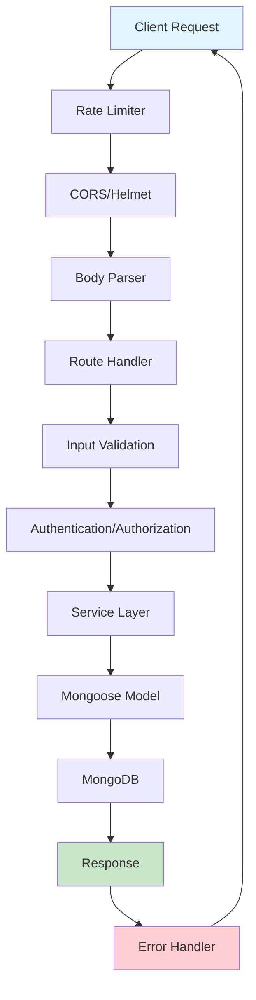

# TopSmile Backend Security & Code Analysis Report

## 1. Executive Summary

The TopSmile backend is a **Node.js/Express/TypeScript clinical management API** with **MongoDB/Mongoose**. Overall, the codebase demonstrates **good security awareness** with proper authentication, input validation, rate limiting, and structured error handling. However, several **critical and high-severity issues** need immediate attention, particularly around **environment validation in production**, **clinic data isolation**, and **database indexing optimization**. The architecture is sound but would benefit from **performance improvements** and **stricter type safety**.

**Overall Health**: 🟡 **Medium** - Solid foundation with security-conscious design, but requires fixes to critical issues before production deployment.

---

## 2. Architecture Overview

### High-Level Structure

```
Controllers/Routes → Services → Mongoose Models → MongoDB
     ↓                ↓           ↓
Middleware Stack  → Business    → Data Layer
- Auth           → Logic       → Validation
- Rate Limiting  → Email       → Indexing
- Validation     → JWT/Tokens  → Schemas
- Error Handling → Scheduling  → Relationships
```

### Data Flow Diagram



### Key Components

- **Authentication**: JWT-based with refresh token rotation
- **Authorization**: Role-based access control (super_admin, admin, manager, dentist, assistant)
- **Data Models**: User, Contact, Patient, Appointment, Clinic, Provider
- **Security**: Rate limiting, input sanitization, CORS, Helmet
- **Email**: SendGrid (production) / Ethereal (development)

---

## 3. Security Review

### Critical Issues ⚠️

| Issue                          | Severity | File                          | Line    | Risk                  |
| ------------------------------ | -------- | ----------------------------- | ------- | --------------------- |
| JWT Secret validation failure  | Critical | `src/services/authService.ts` | 38-51   | Authentication bypass |
| Missing clinic data isolation  | High     | Multiple files                | Various | Data leakage          |
| Weak password validation       | High     | `src/routes/auth.ts`          | 59-61   | Account compromise    |
| Missing environment validation | High     | `src/app.ts`                  | 25-70   | Runtime failures      |

#### 3.1 Critical: JWT Secret Validation (Lines 38-51, authService.ts)

**Issue**: Production exits on missing JWT_SECRET but development continues with weak fallback.

```typescript
// VULNERABLE CODE:
if (!this.JWT_SECRET || this.JWT_SECRET === 'your-secret-key') {
    if (process.env.NODE_ENV === 'production') {
        process.exit(1); // Good
    } else {
        // BAD: Continues with weak secret
        this.JWT_SECRET = 'dev-secret-key-change-in-production';
    }
}
```

**Reproduction**: Start app without JWT_SECRET in development, tokens can be forged.

**Fix**:

```typescript
// Require strong JWT secret in all environments
if (!this.JWT_SECRET || this.JWT_SECRET === 'your-secret-key' || this.JWT_SECRET.length < 32) {
    throw new Error('JWT_SECRET must be at least 32 characters long');
}
```

#### 3.2 High: Clinic Data Isolation (Multiple files)

**Issue**: Missing systematic clinic-based data filtering could allow cross-clinic data access.

**Files**: `src/models/Contact.ts`, service layers, route handlers

**Reproduction**: Admin from Clinic A could potentially access Clinic B's contacts without proper isolation.

**Fix**: Implement consistent clinic filtering middleware:

```typescript
export const enforceClinicIsolation = (model: string) => {
  return (req: AuthenticatedRequest, res: Response, next: NextFunction) => {
    if (req.user?.role !== 'super_admin') {
      // Inject clinic filter into all queries
      req.clinicFilter = { assignedToClinic: req.user?.clinicId };
    }
    next();
  };
};
```

#### 3.3 High: Password Strength Validation

**Issue**: Route-level validation is weaker than model-level validation.

**File**: `src/routes/auth.ts` (lines 59-61) vs `src/models/User.ts` (lines 45-83)

**Fix**: Align validation rules and use consistent password policy.

### Medium Issues 🟡

#### 3.4 SQL Injection Prevention (Medium)

**Status**: ✅ **Good** - Using Mongoose ODM provides automatic protection
**File**: All model files
**Note**: Parameterized queries via Mongoose prevent SQL injection

#### 3.5 XSS Prevention (Medium)

**Status**: ✅ **Good** - DOMPurify sanitization implemented
**Files**: `src/app.ts` (line 282), `src/routes/auth.ts` (line 82)
**Improvement**: Consider CSP headers (already partially implemented)

#### 3.6 Rate Limiting (Medium)

**Status**: ✅ **Good** - Multiple rate limiters implemented
**Files**: `src/app.ts` (lines 110-135), `src/routes/auth.ts` (lines 15-29)
**Improvement**: Consider Redis-based distributed rate limiting for production

### Low Issues 🔵

#### 3.7 CORS Configuration

**Status**: ✅ **Good** - Comprehensive CORS setup with origin validation
**File**: `src/app.ts` (lines 84-109)

#### 3.8 Security Headers

**Status**: ✅ **Good** - Helmet configured with CSP
**File**: `src/app.ts` (lines 74-83)

---

## 4. Correctness & Logic Issues

### 4.1 Type Safety Issues

**File**: `src/middleware/auth.ts` (line 55)

```typescript
// UNSAFE: Using 'any' type
const typedPayload = payload as any;
```

**Fix**: Define proper TokenPayload interface (already exists in authService.ts)

### 4.2 Error Handling Gaps

**Issue**: Some async operations lack proper error boundaries.

**Missing Test Cases**:

```typescript
describe('Error Handling', () => {
  it('should handle database connection failures gracefully');
  it('should handle email service failures without blocking requests');
  it('should handle malformed JWT payloads');
});
```

### 4.3 Input Validation Consistency

**Issue**: Different validation rules between routes and models.

**Example**: Password validation differs between `/auth/register` route and User model.

---

## 5. Performance & Scalability

### 5.1 Database Indexing ⚡

**Issues Found**:

- Missing compound indexes for common query patterns
- Text search index could be optimized

**Fixes Needed**:

```typescript
// Add to Contact model
ContactSchema.index({ 
  assignedToClinic: 1, 
  status: 1, 
  priority: -1, 
  createdAt: -1 
}); // For clinic dashboard queries

// Add to User model  
UserSchema.index({ clinic: 1, role: 1, isActive: 1 }); // For role-based queries
```

### 5.2 N+1 Query Problems

**Issue**: Potential N+1 queries in populated fields.

**Example**: Loading contacts with assigned user information.

**Fix**: Use aggressive populate() or implement data loading patterns.

### 5.3 Caching Opportunities

**Missing**: Redis caching for frequently accessed data.

**Recommendations**:

- Cache user sessions
- Cache clinic settings
- Cache appointment type configurations

### 5.4 Connection Pooling

**Status**: ✅ **Good** - Mongoose connection pool configured
**File**: `src/config/database.ts` (line 9)

---

## 6. API Contract Review

### 6.1 Endpoint Analysis

| Endpoint              | Method | Auth       | Rate Limit  | Validation | Status |
| --------------------- | ------ | ---------- | ----------- | ---------- | ------ |
| `/api/auth/register`  | POST   | No         | ✅ 3/hr      | ✅ Strong   | Good   |
| `/api/auth/login`     | POST   | No         | ✅ 5/15min   | ✅ Good     | Good   |
| `/api/contact`        | POST   | No         | ✅ 5/15min   | ✅ Good     | Good   |
| `/api/admin/contacts` | GET    | ✅ Required | ✅ 100/15min | ✅ Good     | Good   |
| `/api/health`         | GET    | No         | No          | No         | Good   |

### 6.2 Response Patterns

**Status**: ✅ **Consistent** - All endpoints use `{ success: boolean, message?, data?, errors? }` pattern

### 6.3 Error Codes

**Status**: ✅ **Good** - Proper HTTP status codes with structured error responses

**Improvement**: Add error code constants:

```typescript
export const ERROR_CODES = {
  TOKEN_EXPIRED: 'TOKEN_EXPIRED',
  INSUFFICIENT_ROLE: 'INSUFFICIENT_ROLE',
  CLINIC_ACCESS_DENIED: 'CLINIC_ACCESS_DENIED'
} as const;
```

---

## 7. Database & Schema Review

### 7.1 Schema Design

**Strengths**:

- ✅ Proper field validation
- ✅ Relationship modeling with refs
- ✅ Timestamps and soft deletes
- ✅ JSON transformation for API responses

**Issues**:

- 🟡 Missing audit trails
- 🟡 Could benefit from embedded vs referenced document optimization

### 7.2 Data Integrity

**Good Practices**:

- Required field validation
- Email format validation  
- Password strength validation
- Enum constraints

**Missing**:

- Unique compound indexes
- Foreign key constraints
- Data archiving strategy

### 7.3 Migration Strategy

**Status**: 🔴 **Missing** - No migration system implemented

**Recommendation**: Implement mongoose migrations or manual migration scripts.

---

## 8. Testing & CI/CD

### 8.1 Test Coverage Analysis

**Files Reviewed**:

- `/tests/integration/security.test.ts` - ✅ Good security test coverage
- `/tests/integration/authRoutes.test.ts` - ✅ Auth flow testing
- `/tests/unit/services/` - ✅ Service layer testing

**Gaps**:

```typescript
// Missing test areas:
describe('Database Integration', () => {
  it('should handle connection failures');
  it('should recover from connection drops');
});

describe('Email Service', () => {
  it('should handle SendGrid API failures');
  it('should fallback gracefully');
});

describe('Rate Limiting', () => {
  it('should reset limits correctly');
  it('should handle distributed scenarios');
});
```

### 8.2 CI/CD Pipeline

**Status**: 🟡 **Partial** - Test scripts configured in package.json

**Missing**:

- Docker configuration
- Environment-specific deployment
- Health check monitoring
- Log aggregation

---

## 9. Dependencies & Vulnerabilities

### 9.1 Package Analysis

**Core Dependencies Status**:

```json
{
  "express": "^4.21.2", // ✅ Recent, secure
  "mongoose": "^8.18.0", // ✅ Latest major version
  "jsonwebtoken": "^9.0.2", // ✅ Secure
  "bcryptjs": "^2.4.3", // ✅ Secure hashing
  "helmet": "^7.2.0", // ✅ Latest security headers
  "express-rate-limit": "^7.5.1" // ✅ Recent rate limiting
}
```

**Security Assessment**: ✅ **Good** - No known high-severity vulnerabilities

### 9.2 Recommendations

1. **Add dependency scanning**: `npm audit` in CI/CD
2. **Consider `@types/node`**: Update to match runtime Node.js version
3. **Production optimizations**: Consider `compression` middleware

---

## 10. Code Quality & Maintainability

### 10.1 TypeScript Usage

**Strengths**:

- ✅ Strong interface definitions
- ✅ Proper error handling types
- ✅ Mongoose schema typing

**Issues**:

- 🟡 Some `any` type usage in auth middleware
- 🟡 Could benefit from stricter TSConfig

### 10.2 Code Organization

**Structure**: ✅ **Excellent** - Clear separation of concerns

```
├── src/
│   ├── models/         # Data layer
│   ├── services/       # Business logic
│   ├── routes/         # API endpoints
│   ├── middleware/     # Cross-cutting concerns
│   ├── config/         # Configuration
│   └── types/          # Type definitions
```

### 10.3 Error Boundaries

**Status**: ✅ **Good** - Comprehensive error handling with custom error types

### 10.4 Documentation

**Status**: 🟡 **Needs Improvement**

- Good inline comments
- Missing API documentation (consider OpenAPI/Swagger)
- Missing deployment guides

---

## 11. Prioritized TODO List

### 🔴 Critical (Fix Immediately)

1. **Fix JWT Secret Validation** (authService.ts:38-51)
   - Require strong secrets in all environments
   - Impact: Prevents token forgery

2. **Implement Clinic Data Isolation** (Multiple files)  
   - Add systematic clinic filtering
   - Impact: Prevents data leakage between clinics

3. **Add Missing Database Indexes** (Models)
   - Critical compound indexes for performance
   - Impact: Query performance at scale

### 🟡 High Priority (Fix This Sprint)

4. **Standardize Password Validation** (auth.ts vs User.ts)
   - Align route and model validation
   - Impact: Consistent security policy

5. **Add Production Environment Validation** (app.ts:25-70)
   - Comprehensive env var checks
   - Impact: Prevents runtime failures

### 🔵 Medium Priority (Next Sprint)

6. **Implement Audit Logging** (New feature)
   - Track sensitive operations
   - Impact: Compliance and debugging

7. **Add Redis Caching Layer** (New feature)
   - Cache frequent queries
   - Impact: Performance improvement

8. **Implement Database Migration System** (New infrastructure)
   - Schema versioning
   - Impact: Deployment reliability

---

## 12. Files Examined

### Core Application Files

- ✅ `src/app.ts` - Main application setup and contact form
- ✅ `src/config/database.ts` - MongoDB connection configuration  
- ✅ `package.json` - Dependencies and scripts

### Authentication & Security

- ✅ `src/middleware/auth.ts` - Authentication and authorization
- ✅ `src/services/authService.ts` - Auth business logic
- ✅ `src/routes/auth.ts` - Auth API endpoints
- ✅ `src/models/User.ts` - User data model

### Data Models

- ✅ `src/models/Contact.ts` - Contact/lead management
- ✅ `src/models/Patient.ts` - Patient data model
- ✅ `src/types/errors.ts` - Error type definitions
- ✅ `src/middleware/errorHandler.ts` - Error handling

### Testing

- ✅ `tests/integration/security.test.ts` - Security test suite
- ✅ Various unit test files in `/tests/unit/services/`

### Assumptions Made

1. **Production Environment**: Assumes deployment on cloud platforms (Vercel/Heroku/AWS)
2. **Email Service**: SendGrid for production, Ethereal for development
3. **Database**: MongoDB Atlas for production
4. **Frontend**: React-based client application
5. **Multi-tenancy**: Clinic-based data isolation required

---

## Summary Table

| Category            | Status   | Critical Issues | High Issues | Medium Issues |
| ------------------- | -------- | --------------- | ----------- | ------------- |
| **Security**        | 🟡 Medium | 1               | 2           | 2             |
| **Performance**     | 🟡 Medium | 1               | 1           | 2             |
| **Correctness**     | 🟢 Good   | 0               | 1           | 2             |
| **Maintainability** | 🟢 Good   | 0               | 1           | 1             |
| **Testing**         | 🟢 Good   | 0               | 0           | 2             |

**Recommendation**: Address critical and high-priority issues before production deployment. The codebase shows strong architectural decisions and security awareness but needs refinement in key areas.
