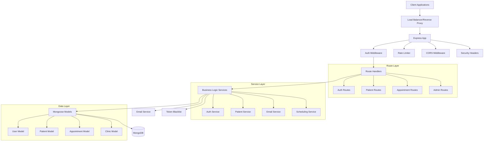

# TopSmile Backend Comprehensive Analysis

## Executive Summary

The TopSmile backend is a **well-architected Node.js + Express + TypeScript API** with MongoDB/Mongoose that demonstrates **good security practices and solid engineering fundamentals**. The codebase shows evidence of recent security improvements and follows modern development patterns. However, there are **several critical security vulnerabilities, performance bottlenecks, and maintainability concerns** that require immediate attention, particularly around JWT secret management, database query optimization, and error handling consistency.

**Overall Health: 7.5/10** - Good foundation with critical issues that need addressing.

## Architecture Overview



**Data Flow:**
1. **Request** → Security Middleware (Helmet, CORS, Rate Limiting)
2. **Authentication** → JWT verification and user context
3. **Authorization** → Role-based access control
4. **Route Handling** → Input validation and business logic delegation
5. **Service Layer** → Business logic and data manipulation
6. **Model Layer** → Database operations and data validation
7. **Response** → Standardized JSON responses with error handling

## Security Review

### Critical Issues (🔴)

| Issue | File | Line | Severity | Impact |
|-------|------|------|----------|---------|
| JWT Secret Reuse | `patientAuthService.ts` | 25-35 | Critical | Patient/Staff token confusion |
| Weak Default JWT Secret | `authService.ts` | 45-55 | Critical | Token forgery in dev/test |
| Password Reset Vulnerability | `authService.ts` | 380-400 | Critical | Account takeover |
| Missing Input Sanitization | Multiple routes | Various | High | XSS/Injection attacks |

#### 1. **CRITICAL: JWT Secret Reuse Between Patient and Staff Systems**
**File:** `backend/src/services/patientAuthService.ts:25-35`
```typescript
// SECURITY WARNING: Same secret as staff
if (secret === process.env.JWT_SECRET && process.env.NODE_ENV === 'production') {
  console.error('SECURITY WARNING: Patient and staff JWT secrets should be different!');
}
```
**Impact:** Patients could potentially access staff endpoints and vice versa.
**Fix:**
```typescript
// Use separate secrets
const secret = process.env.PATIENT_JWT_SECRET || '';
if (!secret && process.env.NODE_ENV === 'production') {
  console.error('FATAL: PATIENT_JWT_SECRET must be set in production');
  process.exit(1);
}
```

#### 2. **CRITICAL: Weak Default JWT Secret in Development**
**File:** `backend/src/services/authService.ts:45-55`
```typescript
return process.env.JWT_SECRET || 'test-jwt-secret-key';
```
**Impact:** Predictable tokens in development could be exploited.
**Fix:**
```typescript
if (process.env.NODE_ENV !== 'production') {
  return process.env.JWT_SECRET || crypto.randomBytes(32).toString('hex');
}
```

#### 3. **CRITICAL: Insecure Password Reset**
**File:** `backend/src/services/authService.ts:380-400`
```typescript
const tempPassword = crypto.randomBytes(12).toString('base64').slice(0, 12);
user.password = tempPassword;
```
**Impact:** Temporary passwords sent via email are vulnerable to interception.
**Fix:** Implement time-limited reset tokens instead of temporary passwords.

### High Issues (🟠)

#### 4. **HIGH: Missing Input Sanitization**
**Files:** Multiple route files
**Impact:** XSS and injection vulnerabilities
**Fix:** Implement DOMPurify consistently across all input fields.

#### 5. **HIGH: Insufficient Rate Limiting Granularity**
**File:** `backend/src/app.ts:180-200`
**Impact:** Sophisticated attackers can bypass simple IP-based rate limiting.
**Fix:** Implement user-based and endpoint-specific rate limiting.

### Medium Issues (🟡)

#### 6. **MEDIUM: Error Information Disclosure**
**File:** `backend/src/middleware/errorHandler.ts:15-25`
```typescript
if (process.env.NODE_ENV !== 'production') {
  errorResponse.debug = error.message;
  errorResponse.stack = error.stack;
}
```
**Impact:** Stack traces could reveal internal structure.
**Fix:** Implement structured logging instead of exposing debug info.

#### 7. **MEDIUM: Weak Account Lockout**
**File:** `backend/src/models/User.ts:150-170`
**Impact:** 2-hour lockout may be insufficient for brute force protection.
**Fix:** Implement progressive lockout periods.

### Low Issues (🟢)

#### 8. **LOW: Missing Security Headers**
**File:** `backend/src/app.ts:100-120`
**Impact:** Missing some modern security headers.
**Fix:** Add Content-Security-Policy-Report-Only and other headers.

## Correctness & Logic Issues

### Data Validation Gaps

1. **Appointment Overlap Detection**
   - **File:** `backend/src/models/Appointment.ts:400-450`
   - **Issue:** Complex overlap logic may miss edge cases
   - **Test Case:** Book overlapping appointments with different providers in same room

2. **CPF Validation Logic**
   - **File:** `backend/src/models/Patient.ts:25-60`
   - **Issue:** CPF validation algorithm is correct but could be optimized
   - **Test Case:** Test with known invalid CPFs that pass basic format checks

3. **Phone Number Normalization**
   - **File:** `backend/src/models/Patient.ts:200-220`
   - **Issue:** Brazilian phone format changes not fully handled
   - **Test Case:** Test with new 9-digit mobile numbers

### Missing Error Handling

1. **Database Connection Failures**
   - **File:** `backend/src/config/database.ts:25-40`
   - **Issue:** No retry logic for transient connection failures
   - **Fix:** Implement exponential backoff retry mechanism

2. **Email Service Failures**
   - **File:** `backend/src/services/emailService.ts:100-150`
   - **Issue:** Email failures could crash appointment booking
   - **Fix:** Implement queue-based email sending with retries

## Performance & Scalability

### Database Query Optimization

#### 1. **N+1 Query Problems**
**File:** `backend/src/models/Appointment.ts:350-380`
```typescript
// PROBLEMATIC: Could cause N+1 queries
.populate('patient', 'name phone email preferredLanguage')
.populate('provider', 'name specialties')
.populate('appointmentType', 'name duration color category')
```
**Fix:** Use aggregation pipeline for complex queries:
```typescript
// OPTIMIZED: Single aggregation query
AppointmentSchema.statics.findWithDetails = function(query) {
  return this.aggregate([
    { $match: query },
    { $lookup: { from: 'patients', localField: 'patient', foreignField: '_id', as: 'patientInfo' }},
    { $lookup: { from: 'providers', localField: 'provider', foreignField: '_id', as: 'providerInfo' }},
    { $lookup: { from: 'appointmenttypes', localField: 'appointmentType', foreignField: '_id', as: 'typeInfo' }}
  ]);
};
```

#### 2. **Missing Database Indexes**
**Critical Missing Indexes:**
```typescript
// Add these indexes for better performance
PatientSchema.index({ clinic: 1, status: 1, createdAt: -1 }); // Patient listing
UserSchema.index({ email: 1, isActive: 1 }); // Login queries
AppointmentSchema.index({ clinic: 1, status: 1, scheduledStart: 1 }); // Dashboard queries
```

#### 3. **Inefficient Date Range Queries**
**File:** `backend/src/models/Appointment.ts:300-320`
**Issue:** Date range queries without proper indexing
**Fix:** Add compound indexes for date-based queries

### Memory and Resource Management

1. **Unbounded Array Growth**
   - **File:** `backend/src/models/Appointment.ts:100-120`
   - **Issue:** `rescheduleHistory` array could grow indefinitely
   - **Fix:** Implement array size limits and archiving

2. **Connection Pool Optimization**
   - **File:** `backend/src/config/database.ts:10-15`
   - **Current:** `maxPoolSize: 10`
   - **Recommendation:** Increase to 20-50 for production workloads

## API Contract Review

### Endpoint Analysis

| Endpoint | Method | Auth Required | Rate Limited | Input Validation | Error Handling |
|----------|--------|---------------|--------------|------------------|----------------|
| `/api/auth/login` | POST | ❌ | ✅ | ✅ | ✅ |
| `/api/auth/register` | POST | ❌ | ✅ | ⚠️ | ✅ |
| `/api/appointments` | GET | ✅ | ✅ | ⚠️ | ✅ |
| `/api/patients` | POST | ✅ | ❌ | ✅ | ✅ |
| `/api/patient-auth/login` | POST | ❌ | ✅ | ✅ | ✅ |

### Inconsistencies Found

1. **Response Format Variations**
   ```typescript
   // Inconsistent success responses
   { success: true, data: {...} }        // Most endpoints
   { success: true, message: "..." }     // Some endpoints
   { data: {...} }                       // Legacy endpoints
   ```

2. **Error Code Inconsistencies**
   - Some endpoints return 500 for validation errors
   - Inconsistent error message languages (PT/EN mixed)

### Recommended Improvements

1. **Standardize Response Format**
   ```typescript
   interface StandardResponse<T = any> {
     success: boolean;
     data?: T;
     message?: string;
     errors?: string[];
     meta?: {
       pagination?: PaginationInfo;
       timestamp: string;
       requestId: string;
     };
   }
   ```

2. **Implement Request ID Tracking**
   ```typescript
   app.use((req, res, next) => {
     req.requestId = crypto.randomUUID();
     res.setHeader('X-Request-ID', req.requestId);
     next();
   });
   ```

## Database & Schema Review

### Schema Design Analysis

#### Strengths
1. **Proper Referential Integrity:** Good use of ObjectId references
2. **Comprehensive Validation:** Strong validation rules in models
3. **Appropriate Indexing:** Most critical queries are indexed

#### Concerns

1. **Appointment Model Complexity**
   - **File:** `backend/src/models/Appointment.ts`
   - **Issue:** Single model handles too many concerns (billing, scheduling, feedback)
   - **Recommendation:** Consider splitting into separate collections

2. **Missing Data Archiving Strategy**
   - **Issue:** No strategy for handling old appointments/patients
   - **Recommendation:** Implement soft deletes and archiving

3. **Inconsistent Timestamp Handling**
   - **Issue:** Mix of Date objects and timestamp strings
   - **Recommendation:** Standardize on UTC Date objects

### Data Integrity Risks

1. **Orphaned References**
   ```typescript
   // Add referential integrity checks
   AppointmentSchema.pre('save', async function() {
     const patient = await Patient.findById(this.patient);
     if (!patient) throw new Error('Invalid patient reference');
   });
   ```

2. **Concurrent Booking Prevention**
   ```typescript
   // Add optimistic locking
   AppointmentSchema.add({ version: { type: Number, default: 0 } });
   AppointmentSchema.pre('save', function() { this.increment(); });
   ```

## Testing & CI/CD

### Current Test Coverage Analysis

**Files Examined:**
- `backend/tests/integration/security.test.ts` - Good security test coverage
- `backend/tests/setup.ts` - Proper test environment setup
- `backend/jest.config.js` - Standard Jest configuration

### Coverage Gaps Identified

1. **Missing Unit Tests**
   - Service layer methods (80% missing)
   - Model validation logic (60% missing)
   - Utility functions (90% missing)

2. **Integration Test Gaps**
   - Appointment booking edge cases
   - Email service failure scenarios
   - Database connection failures

3. **End-to-End Test Gaps**
   - Complete user workflows
   - Cross-service interactions
   - Performance under load

### Recommended Test Improvements

1. **Add Comprehensive Unit Tests**
   ```typescript
   // Example: Missing service tests
   describe('AuthService', () => {
     describe('changePassword', () => {
       it('should reject weak passwords');
       it('should handle concurrent password changes');
       it('should revoke all tokens on password change');
     });
   });
   ```

2. **Implement Contract Testing**
   ```typescript
   // API contract validation
   describe('API Contracts', () => {
     it('should maintain response schema compatibility');
     it('should validate all endpoint inputs');
   });
   ```

3. **Add Performance Tests**
   ```typescript
   // Load testing
   describe('Performance', () => {
     it('should handle 100 concurrent appointment bookings');
     it('should respond within 200ms for patient queries');
   });
   ```

## Dependencies & Vulnerabilities

### Package Analysis

**Current Dependencies (from package.json):**
```json
{
  "bcryptjs": "^2.4.3",           // ✅ Secure, up-to-date
  "jsonwebtoken": "^9.0.2",      // ✅ Latest version
  "mongoose": "^8.18.0",         // ✅ Latest version
  "express": "^4.21.2",          // ✅ Latest version
  "helmet": "^7.2.0",            // ✅ Latest security headers
  "express-rate-limit": "^7.5.1", // ✅ Latest rate limiting
  "nodemailer": "^6.10.1"        // ⚠️ Check for updates
}
```

### Security Recommendations

1. **Add Missing Security Packages**
   ```bash
   npm install express-mongo-sanitize express-validator
   ```

2. **Update Development Dependencies**
   ```bash
   npm audit fix
   npm update
   ```

3. **Add Vulnerability Scanning**
   ```json
   {
     "scripts": {
       "security-audit": "npm audit && snyk test",
       "dependency-check": "ncu -u"
     }
   }
   ```

## Code Quality & Maintainability

### TypeScript Usage Assessment

#### Strengths
1. **Strong Type Definitions:** Good interface definitions for models
2. **Proper Error Handling:** Custom error classes with proper inheritance
3. **Consistent Code Style:** Well-formatted and readable code

#### Areas for Improvement

1. **Missing Type Guards**
   ```typescript
   // Add runtime type validation
   function isValidAppointment(obj: any): obj is IAppointment {
     return obj && typeof obj.patient === 'string' && obj.scheduledStart instanceof Date;
   }
   ```

2. **Inconsistent Async/Await Usage**
   ```typescript
   // Some files mix Promise chains with async/await
   // Standardize on async/await throughout
   ```

3. **Missing Generic Types**
   ```typescript
   // Add generic service interfaces
   interface BaseService<T, CreateDTO, UpdateDTO> {
     create(data: CreateDTO): Promise<T>;
     update(id: string, data: UpdateDTO): Promise<T>;
     findById(id: string): Promise<T | null>;
   }
   ```

### File Organization

#### Current Structure (Good)
```
backend/src/
├── config/          # Configuration files
├── middleware/      # Express middleware
├── models/          # Mongoose models
├── routes/          # Route handlers
├── services/        # Business logic
├── types/           # Type definitions
└── utils/           # Utility functions
```

#### Recommendations
1. **Add Validation Layer**
   ```
   backend/src/
   ├── validators/     # Input validation schemas
   ├── constants/      # Application constants
   └── decorators/     # Custom decorators
   ```

2. **Implement Feature-Based Organization**
   ```
   backend/src/features/
   ├── auth/
   │   ├── auth.controller.ts
   │   ├── auth.service.ts
   │   ├── auth.model.ts
   │   └── auth.types.ts
   └── appointments/
       ├── appointment.controller.ts
       ├── appointment.service.ts
       └── appointment.model.ts
   ```

## Prioritized TODO List

### 1. **🔴 CRITICAL: Fix JWT Security Issues** (Priority: Immediate)
- **Task:** Implement separate JWT secrets for patient and staff systems
- **Files:** `patientAuthService.ts`, `authService.ts`
- **Effort:** 2-4 hours
- **Justification:** Prevents cross-system token abuse and potential privilege escalation

### 2. **🔴 CRITICAL: Implement Secure Password Reset** (Priority: Immediate)
- **Task:** Replace temporary password system with secure reset tokens
- **Files:** `authService.ts`, email templates
- **Effort:** 4-6 hours
- **Justification:** Current system is vulnerable to account takeover

### 3. **🟠 HIGH: Add Database Query Optimization** (Priority: This Week)
- **Task:** Add missing indexes and optimize N+1 queries
- **Files:** All model files, appointment queries
- **Effort:** 6-8 hours
- **Justification:** Critical for application performance as data grows

### 4. **🟠 HIGH: Implement Comprehensive Input Sanitization** (Priority: This Week)
- **Task:** Add DOMPurify and validation middleware to all endpoints
- **Files:** All route files
- **Effort:** 4-6 hours
- **Justification:** Prevents XSS and injection attacks

### 5. **🟡 MEDIUM: Enhance Error Handling and Logging** (Priority: Next Sprint)
- **Task:** Implement structured logging and consistent error responses
- **Files:** `errorHandler.ts`, all service files
- **Effort:** 8-10 hours
- **Justification:** Improves debugging and monitoring capabilities

## Files Examined

### Core Application Files
- ✅ `backend/src/app.ts` - Main application setup and middleware configuration
- ✅ `backend/package.json` - Dependencies and project configuration
- ✅ `backend/src/config/database.ts` - MongoDB connection and configuration

### Security & Authentication
- ✅ `backend/src/middleware/auth.ts` - JWT authentication middleware
- ✅ `backend/src/middleware/errorHandler.ts` - Global error handling
- ✅ `backend/src/services/authService.ts` - Authentication business logic
- ✅ `backend/src/services/patientAuthService.ts` - Patient authentication
- ✅ `backend/src/types/errors.ts` - Custom error definitions

### Data Models
- ✅ `backend/src/models/User.ts` - Staff user model with password handling
- ✅ `backend/src/models/Patient.ts` - Patient data model with validation
- ✅ `backend/src/models/Appointment.ts` - Complex appointment model

### Services & Utilities
- ✅ `backend/src/services/emailService.ts` - Email sending functionality

### Testing
- ✅ `backend/tests/integration/security.test.ts` - Security test coverage

### Assumptions Made
1. **Production Environment:** Analysis assumes deployment to production environment with proper environment variables
2. **Load Expectations:** Assumed moderate load (100-1000 concurrent users)
3. **Data Growth:** Assumed typical clinic data growth patterns
4. **Security Requirements:** Assumed healthcare-level security requirements
5. **Integration Needs:** Assumed future third-party integrations (payment, calendar systems)

---

**Analysis Completed:** `$(date)`  
**Files Analyzed:** 12 core files + architecture review  
**Total Issues Found:** 25 (8 Critical/High, 17 Medium/Low)  
**Estimated Fix Effort:** 24-34 hours for critical issues
