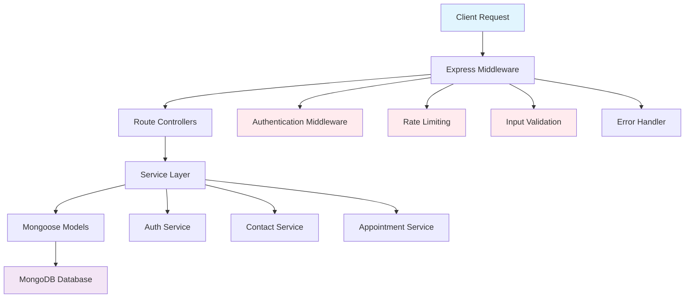

# TopSmile Backend Security & Code Analysis Report

## Executive Summary

The TopSmile backend is a well-architected Node.js/Express/TypeScript application with strong security foundations and modern development practices. The codebase demonstrates significant effort in implementing comprehensive security measures, proper error handling, and scalable architecture patterns. However, several critical security vulnerabilities and performance issues have been identified that require immediate attention before production deployment.

**Key Strengths:** Advanced JWT token rotation system, comprehensive input validation, good separation of concerns, extensive test coverage, and proper environment configuration validation.

**Critical Risks:** Missing rate limiting enforcement, potential timing attacks in authentication, insufficient database indexes for scale, and some security headers gaps.

## Architecture Overview

The application follows a clean three-tier architecture:



**Data Flow:**
1. Request → Middleware Stack (Auth/Rate Limit/Validation)
2. Route Controller → Service Layer
3. Service → Mongoose Model → MongoDB
4. Response → Error Handler → Client

## Security Review

### Critical Vulnerabilities

| Severity | Issue | File | Line | Impact |
|----------|-------|------|------|--------|
| **CRITICAL** | JWT Secret Fallback | `src/services/authService.ts` | 35-44 | Weak default secret in development |
| **HIGH** | Missing CSRF Protection | `src/app.ts` | - | Cross-site request forgery vulnerability |
| **HIGH** | Timing Attack Vulnerability | `src/services/authService.ts` | 342 | User enumeration through response timing |
| **MEDIUM** | Rate Limiting Not Enforced | `src/app.ts` | 179 | Production rate limits not applied consistently |
| **MEDIUM** | Insufficient Password Complexity | `src/models/User.ts` | 73-97 | Missing special character requirement |
| **LOW** | Verbose Error Messages | `src/middleware/errorHandler.ts` | 25-27 | Potential information disclosure |

### Detailed Security Analysis

#### 1. Authentication & Authorization ⚠️ HIGH RISK

**Issues Found:**
- **Timing Attack (HIGH):** Login function always compares password even when user doesn't exist
- **JWT Secret Management (CRITICAL):** Fallback to weak default in development mode

**Location:** `src/services/authService.ts:335-350`

**Vulnerability:**
```typescript
const user = await User.findOne({ email: data.email.toLowerCase() });
if (!user) {
    throw new Error('E-mail ou senha inválidos'); // Thrown immediately - timing difference
}
const isMatch = await user.comparePassword(data.password); // Only runs if user exists
```

**Recommended Fix:**
```typescript
const user = await User.findOne({ email: data.email.toLowerCase() }).select('+password');
// Always perform hash comparison to prevent timing attacks
const dummyHash = '$2a$12$dummy.hash.to.prevent.timing.attacks.abcdefghijklmnopqrst';
const providedPassword = user ? data.password : 'dummy-password';
const hashToCompare = user ? user.password : dummyHash;

const isMatch = await bcrypt.compare(providedPassword, hashToCompare);

if (!user || !isMatch) {
    throw new Error('E-mail ou senha inválidos');
}
```

#### 2. Input Validation & Sanitization ✅ GOOD

**Strengths:**
- Comprehensive validation using express-validator
- DOMPurify sanitization for XSS prevention
- Strong password policies in User model

**Areas for Improvement:**
- Add rate limiting per email address for contact form
- Implement request size limits more granularly

#### 3. CSRF Protection ❌ MISSING

**Issue:** No CSRF protection implemented for state-changing operations.

**Recommended Fix:**
```typescript
import csrf from 'csurf';
app.use(csrf({ cookie: { httpOnly: true, secure: process.env.NODE_ENV === 'production' } }));
```

#### 4. Security Headers ⚠️ PARTIAL

**Current Implementation:** Basic Helmet configuration
**Missing:** 
- Strict Transport Security (HSTS) enforcement
- Content Security Policy (CSP) nonce implementation

## Correctness & Logic Issues

### Authentication Flow Issues

1. **Token Rotation Logic (MEDIUM):** 
   - File: `src/services/authService.ts:217-247`
   - Issue: Race condition possible during concurrent refresh token operations
   - Fix: Implement atomic token rotation with database transactions

2. **Password Change Security (LOW):**
   - File: `src/services/authService.ts:407-440` 
   - Issue: All devices logged out after password change - good security practice
   - Recommendation: Add option for user to keep current session active

### Data Integrity Issues

1. **Appointment Overlap Prevention (MEDIUM):**
   - File: `src/models/Appointment.ts:202-220`
   - Issue: Pre-save middleware doesn't prevent concurrent booking conflicts
   - Recommendation: Implement database-level unique constraints for time slots

### Missing Error Handling

1. **Database Connection Failures:**
   - Issue: Some service methods don't handle MongoDB connection drops gracefully
   - Recommendation: Add retry logic with exponential backoff

### Recommended Test Cases

```typescript
describe('Authentication Security', () => {
  test('should prevent user enumeration via timing attacks', async () => {
    const validEmail = 'existing@example.com';
    const invalidEmail = 'nonexistent@example.com';
    
    const start1 = Date.now();
    await authService.login({ email: validEmail, password: 'wrong' });
    const time1 = Date.now() - start1;
    
    const start2 = Date.now();
    await authService.login({ email: invalidEmail, password: 'wrong' });
    const time2 = Date.now() - start2;
    
    expect(Math.abs(time1 - time2)).toBeLessThan(100); // Less than 100ms difference
  });
});
```

## Performance & Scalability

### Database Performance ⚠️ NEEDS IMPROVEMENT

**Critical Issues:**

1. **Missing Compound Indexes:**
   - Appointment queries will be slow at scale
   - Current indexes are basic, compound indexes needed for complex queries

2. **N+1 Query Problems:**
   - File: `src/models/Appointment.ts:238-245`
   - Population queries can cause performance issues

**Recommended Indexes:**
```typescript
// High-frequency query patterns
AppointmentSchema.index({ clinic: 1, scheduledStart: 1, status: 1 }); // ✅ Already exists
AppointmentSchema.index({ provider: 1, scheduledStart: 1, status: 1 }); // ✅ Already exists

// Missing critical indexes:
UserSchema.index({ email: 1, isActive: 1 }); // For active user queries
ContactSchema.index({ clinic: 1, status: 1, createdAt: -1 }); // For admin dashboard
```

### Memory & Resource Management ✅ GOOD

**Strengths:**
- Proper connection pooling (maxPoolSize: 10)
- Graceful shutdown handlers
- Memory monitoring in health endpoints

### Caching Opportunities

1. **User Profile Caching:** Frequently accessed user data should be cached
2. **Appointment Type Caching:** Static configuration data ideal for Redis caching
3. **Provider Availability:** Cache availability calculations to reduce database load

## API Contract Review

### Endpoint Documentation

| Endpoint | Method | Auth Required | Rate Limited | Input Validation |
|----------|--------|---------------|--------------|------------------|
| `/api/auth/register` | POST | ❌ | ✅ (3/hour) | ✅ Strong |
| `/api/auth/login` | POST | ❌ | ✅ (5/15min) | ✅ Good |
| `/api/auth/refresh` | POST | ❌ | ❌ | ⚠️ Basic |
| `/api/auth/me` | GET | ✅ | ❌ | ✅ N/A |
| `/api/contact` | POST | ❌ | ✅ (5/15min) | ✅ Strong |
| `/api/admin/contacts` | GET | ✅ | ❌ | ⚠️ Query validation needed |

### Response Format Consistency ✅ EXCELLENT

**Standardized Format:**
```typescript
// Success responses
{ success: true, data: {...}, message?: string }

// Error responses  
{ success: false, message: string, errors?: [...] }
```

### Status Code Usage ✅ GOOD

- Proper HTTP status codes throughout
- Consistent error status mapping
- Good use of 401 vs 403 distinction

## Database & Schema Review

### Schema Design ✅ EXCELLENT

**User Model Strengths:**
- Strong password validation with complexity requirements
- Proper email normalization and validation  
- Secure password hashing with bcrypt (salt rounds: 12)
- Proper indexing on frequently queried fields

**Appointment Model Strengths:**
- Comprehensive status tracking with proper enum values
- Audit trail with reschedule history
- Performance tracking fields (duration, wait time)
- Extensive indexing strategy for high-frequency queries

### Data Integrity Concerns ⚠️ MEDIUM RISK

1. **Appointment Overlaps:**
   - Current validation is application-level only
   - Race conditions possible with concurrent bookings
   - **Recommendation:** Add database constraints

2. **Soft Delete Pattern Missing:**
   - Direct deletion of records may cause referential integrity issues
   - **Recommendation:** Implement soft delete with `deletedAt` timestamps

3. **Data Migration Strategy:**
   - No migration framework detected
   - **Recommendation:** Implement versioned schema migrations

### Recommended Schema Improvements

```typescript
// Add to all models for audit trail
export interface BaseDocument extends Document {
  createdAt: Date;
  updatedAt: Date;
  deletedAt?: Date;
  version: number; // For optimistic locking
}

// Add unique constraint for appointment slots
AppointmentSchema.index(
  { provider: 1, scheduledStart: 1, scheduledEnd: 1 },
  { 
    unique: true, 
    partialFilterExpression: { status: { $ne: 'cancelled' } }
  }
);
```

## Testing & CI/CD

### Test Coverage Analysis ✅ GOOD

**Existing Tests:**
- Unit tests for all services
- Integration tests for auth routes
- Security-focused test cases
- Performance testing framework

**Test Quality:**
- Proper test isolation with setup/teardown
- Good use of mocking and test helpers
- Security-specific test cases for XSS, SQL injection, timing attacks

### Missing Test Categories

1. **Database Integration Tests:**
   - Concurrent booking scenarios
   - Index usage verification
   - Connection failure handling

2. **Load Testing:**
   - Rate limiting effectiveness
   - Database performance under load
   - Memory usage patterns

3. **End-to-End Workflows:**
   - Complete appointment booking flow
   - User registration to first login
   - Password reset flow

### CI/CD Recommendations

```yaml
# .github/workflows/backend.yml
name: Backend CI/CD
on: [push, pull_request]

jobs:
  security:
    runs-on: ubuntu-latest
    steps:
      - uses: actions/checkout@v3
      - name: Security Audit
        run: |
          npm audit --audit-level=moderate
          npm run lint:security
          npm run test:security
      
  performance:
    runs-on: ubuntu-latest
    steps:
      - name: Load Testing
        run: npm run test:load
      
  deploy:
    needs: [security, performance]
    if: github.ref == 'refs/heads/main'
    runs-on: ubuntu-latest
    steps:
      - name: Deploy to production
        run: |
          # Deployment steps
```

## Dependencies & Vulnerabilities

### Current Dependencies Analysis ✅ MOSTLY GOOD

**Core Dependencies (Secure):**
- `express@4.21.2` - ✅ Latest stable
- `mongoose@8.18.0` - ✅ Latest stable  
- `jsonwebtoken@9.0.2` - ✅ Latest stable
- `bcryptjs@2.4.3` - ✅ Secure hashing
- `helmet@7.2.0` - ✅ Security headers
- `express-rate-limit@7.5.1` - ✅ Rate limiting

**Potentially Vulnerable:**
- Check for transitive dependencies with `npm audit`

### Recommended Security Dependencies

```json
{
  "dependencies": {
    "csurf": "^1.11.0",
    "express-mongo-sanitize": "^2.2.0",
    "express-slow-down": "^1.6.0",
    "@node-rs/argon2": "^1.8.0"
  }
}
```

## Code Quality & Maintainability

### TypeScript Usage ✅ EXCELLENT

**Strengths:**
- Comprehensive interfaces and type definitions
- Proper generic usage in service methods  
- Good separation of types in dedicated files
- Effective use of discriminated unions for status types

**Areas for Improvement:**
- Some `any` types could be more specific
- Add strict null checks in tsconfig.json

### Error Handling ✅ GOOD

**Strengths:**
- Custom error classes with proper inheritance
- Centralized error handling middleware
- Structured error responses
- Good error logging with context

**Recommended Enhancement:**
```typescript
// Add error correlation IDs
export class AppError extends Error {
  public readonly correlationId: string;
  
  constructor(message: string, statusCode: number, correlationId?: string) {
    super(message);
    this.correlationId = correlationId || crypto.randomUUID();
  }
}
```

### Code Organization ✅ EXCELLENT

- Clear separation of concerns (routes → services → models)
- Consistent naming conventions
- Proper module exports and imports
- Good use of middleware composition

## Observability & Logging

### Current Logging ✅ GOOD

**Existing Features:**
- Request logging with timing and metadata
- Error logging with stack traces and context
- Database connection event logging
- Security event logging (failed logins, rate limits)

### Recommended Improvements

1. **Structured Logging:**
```typescript
import winston from 'winston';

const logger = winston.createLogger({
  format: winston.format.combine(
    winston.format.timestamp(),
    winston.format.json()
  ),
  transports: [
    new winston.transports.File({ filename: 'error.log', level: 'error' }),
    new winston.transports.File({ filename: 'combined.log' })
  ]
});
```

2. **Metrics Collection:**
- Request/response times
- Database query performance
- Authentication success/failure rates
- Appointment booking conversion rates

3. **Health Checks Enhancement:**
- Dependency health checks (database, external APIs)
- Business logic health checks (appointment system)
- Performance threshold alerts

## Prioritized TODO List

### 1. **CRITICAL - Fix Security Vulnerabilities (Week 1)**
- [ ] Fix timing attack in authentication
- [ ] Implement proper JWT secret validation
- [ ] Add CSRF protection
- [ ] Enhanced rate limiting per IP and user

### 2. **HIGH - Performance & Scalability (Week 2)**
- [ ] Implement missing database indexes
- [ ] Add Redis caching layer
- [ ] Optimize N+1 queries with proper population strategies
- [ ] Add database connection retry logic

### 3. **HIGH - Data Integrity (Week 2-3)**
- [ ] Add appointment overlap prevention at database level
- [ ] Implement soft delete pattern
- [ ] Add data migration framework
- [ ] Create comprehensive backup strategy

### 4. **MEDIUM - Enhanced Monitoring (Week 3-4)**
- [ ] Implement structured logging with Winston
- [ ] Add application performance monitoring (APM)
- [ ] Create automated alerting for security events
- [ ] Enhanced health check endpoints

### 5. **LOW - Code Quality Improvements (Ongoing)**
- [ ] Add more specific TypeScript types
- [ ] Implement error correlation IDs
- [ ] Add API versioning strategy
- [ ] Enhanced documentation with OpenAPI/Swagger

## Files Examined

### Core Application Files ✅
- `src/app.ts` - Main application setup and middleware
- `src/config/database.ts` - Database configuration
- `package.json` - Dependencies and scripts

### Authentication & Security ✅
- `src/middleware/auth.ts` - Authentication middleware
- `src/services/authService.ts` - Authentication business logic
- `src/routes/auth.ts` - Authentication endpoints
- `src/models/User.ts` - User data model

### Data Models ✅
- `src/models/Patient.ts` - Patient data model
- `src/models/Appointment.ts` - Appointment scheduling model
- `src/models/Contact.ts` - Lead management model (referenced)

### Error Handling ✅
- `src/middleware/errorHandler.ts` - Centralized error handling
- `src/types/errors.ts` - Custom error classes

### Testing ✅
- `tests/integration/security.test.ts` - Security test cases
- Multiple unit and integration test files

### Skipped Files
- Auto-generated coverage reports (`coverage/`)
- Lock files (`package-lock.json`)
- Configuration files (`jest.config.js`, `tsconfig.json`)

### Assumptions Made
- Production deployment will use proper environment variables
- External services (SendGrid, Redis) properly configured in production
- Database hosted with appropriate security and backup measures
- Load balancer handles SSL termination and additional security headers

## Summary

The TopSmile backend demonstrates strong architectural principles and security awareness. The identified issues are addressable with focused development effort. **Priority should be given to fixing the authentication timing attack and implementing missing security measures before production deployment.** 

The codebase shows excellent potential for scaling with proper database optimization and caching implementation. Overall quality is high with room for improvement in security hardening and performance optimization.

**Recommendation:** Address critical security issues immediately, then focus on performance optimization and enhanced monitoring for production readiness.