# TopSmile System Diagrams

**Document Version:** 1.0.0  
**Last Updated:** 2024-01-15

This document contains Mermaid diagrams for visualizing the TopSmile system architecture and flows.

---

## System Architecture Diagram

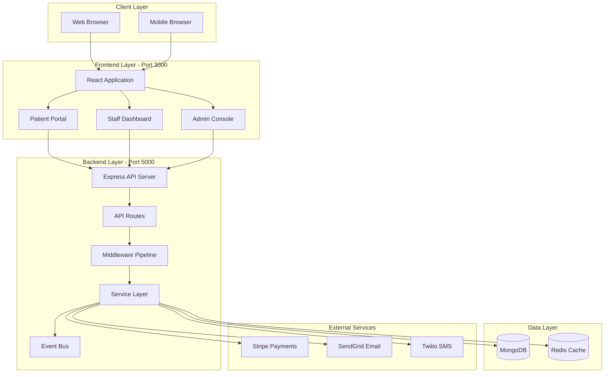

---

## Authentication Flow Diagram

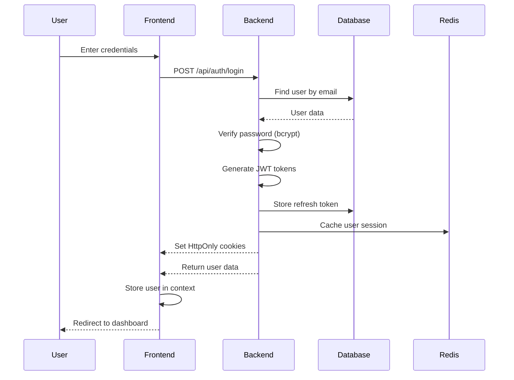

---

## Token Refresh Flow

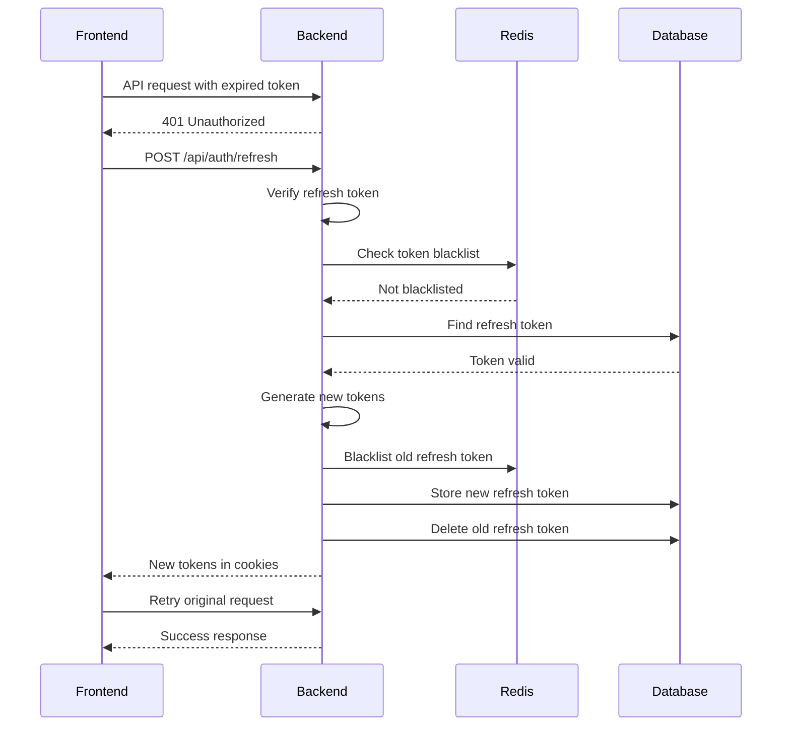

---

## Request/Response Cycle

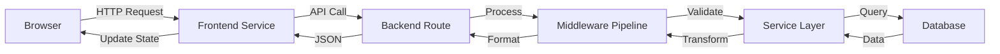

---

## Middleware Pipeline

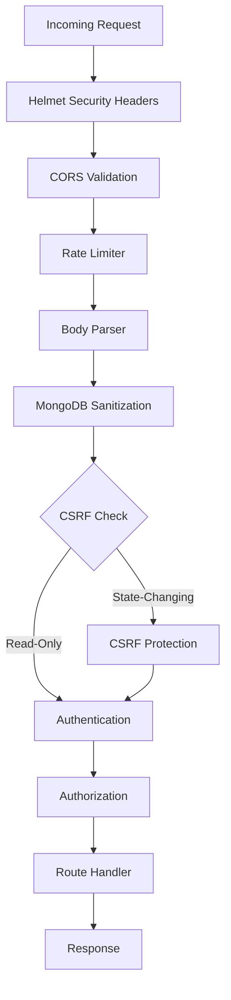

---

## Database Schema Relationships

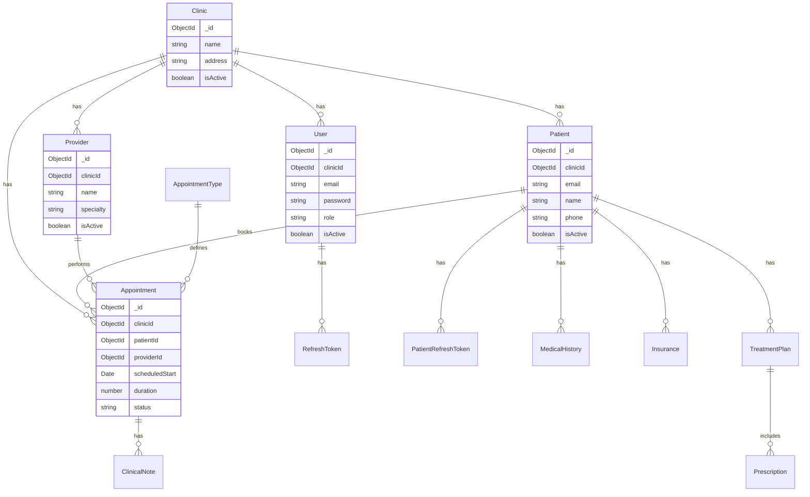

---

## Component Hierarchy (Frontend)

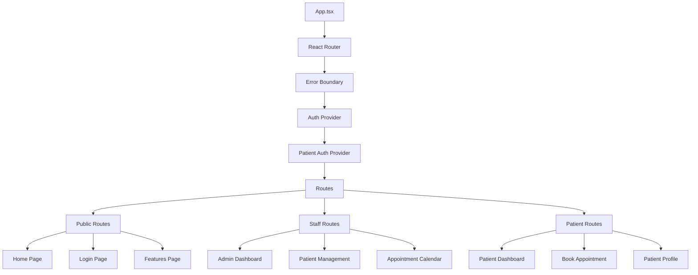

---

## Service Layer Architecture (Backend)

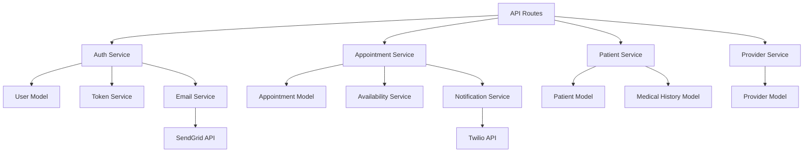

---

## Deployment Architecture

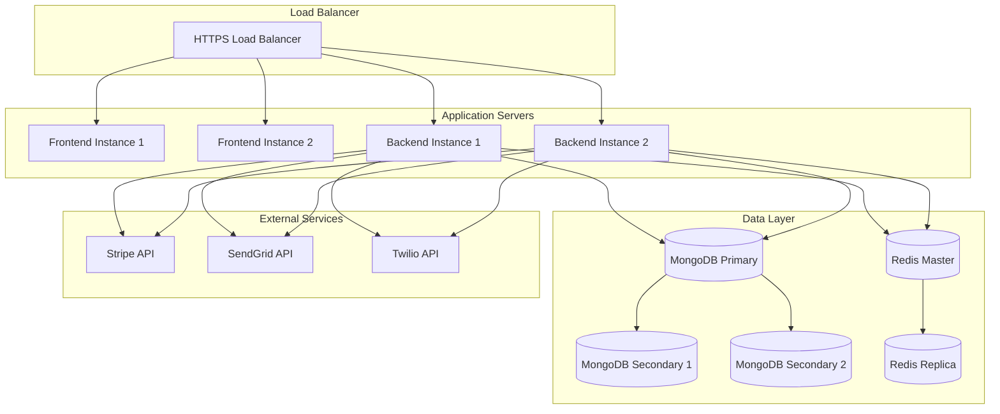

---

## CI/CD Pipeline

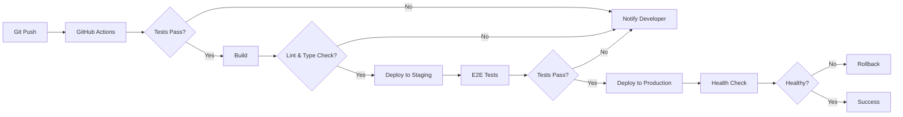

---

## State Management Flow (Frontend)

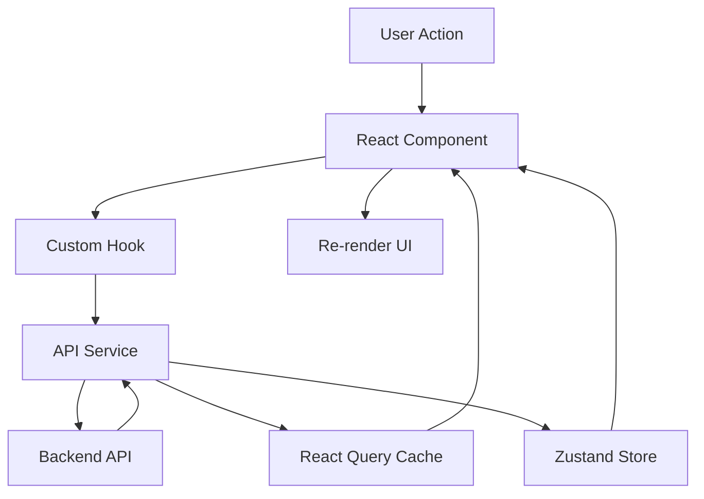

---

## Error Handling Flow

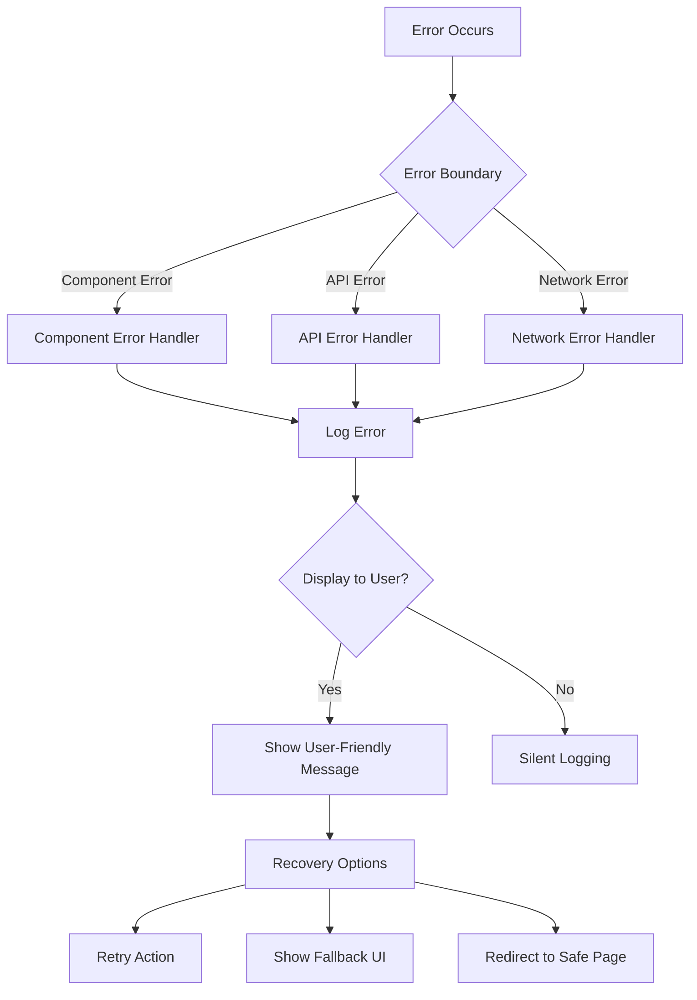

---

## Appointment Booking Flow

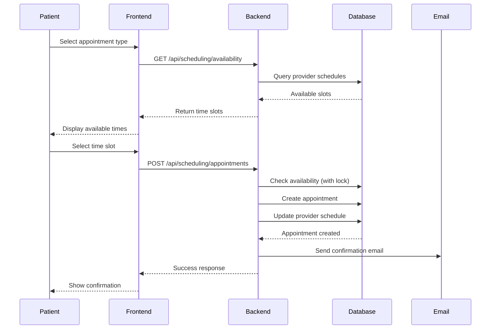

---

## Multi-Tenant Data Isolation

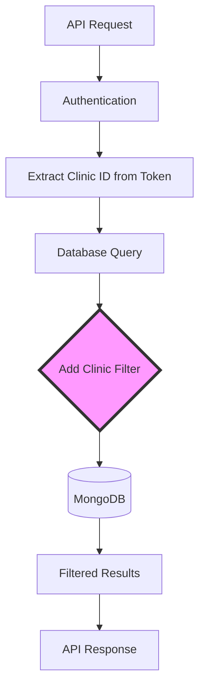

---

## Caching Strategy

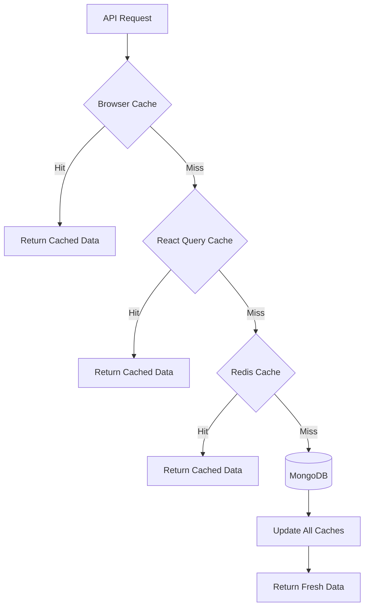

---

## How to Use These Diagrams

1. **Copy Mermaid Code**: Copy the code blocks above
2. **Paste in Markdown**: Use in any markdown file
3. **View in GitHub**: GitHub renders Mermaid automatically
4. **Use Mermaid Live Editor**: https://mermaid.live for editing
5. **Export as Images**: Use Mermaid CLI or online tools

---

## Diagram Legend

- **Rectangles**: Processes or components
- **Cylinders**: Databases
- **Diamonds**: Decision points
- **Arrows**: Data flow or relationships
- **Subgraphs**: Logical groupings

---

**Note:** These diagrams are living documents and should be updated as the system evolves.
