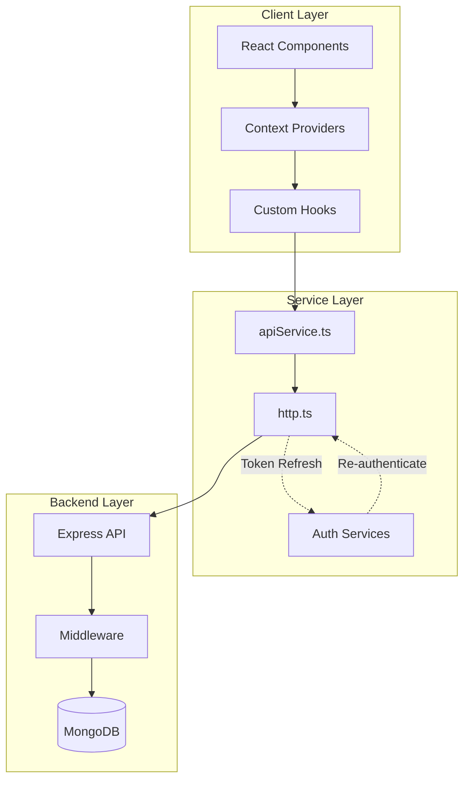

# TopSmile Frontend Integration Analysis Report

## 1. Executive Summary

The TopSmile project's frontend demonstrates a **well-structured React/TypeScript application** with comprehensive backend integration. The codebase shows strong patterns in authentication, error handling, and API communication. However, there are critical security concerns and several optimization opportunities.

### Key Strengths:
- ✅ **Robust dual authentication system** (admin and patient)
- ✅ **Comprehensive TypeScript typing** with strict mode enabled
- ✅ **Token refresh mechanism** with automatic retry logic
- ✅ **Centralized error management** via ErrorContext
- ✅ **Input sanitization** using DOMPurify

### Critical Issues:
- 🔴 **Security vulnerability**: Tokens stored in localStorage (XSS risk)
- 🔴 **Missing React Query/SWR** for efficient data fetching
- 🔴 **Incomplete test coverage** for API integration
- 🟡 **No request/response interceptors** for global error handling
- 🟡 **Missing optimistic UI updates** for better UX

### Overall Health Score: **7.5/10**

---

## 2. Architecture & Data Flow

### Component Architecture Diagram



### Request/Response Flow

1. **Component** initiates action → **Custom Hook** (`useApiState`)
2. **Hook** calls → **apiService** method
3. **apiService** prepares request → **http.ts** handles transport
4. **http.ts** adds auth headers → sends to **Backend API**
5. **Backend** validates → processes → returns response
6. **http.ts** handles 401 → automatic token refresh if needed
7. **Response** bubbles up → updates React state
8. **UI** re-renders with new data

---

## 3. API Integration Review

### Endpoint Mapping Table

| Frontend Service | Backend Route | HTTP Method | Auth Required | Validation | Error Handling |
|-----------------|---------------|-------------|---------------|------------|----------------|
| `auth.login` | `/api/auth/login` | POST | ❌ | ✅ Client + Server | ✅ Rate limited |
| `auth.register` | `/api/auth/register` | POST | ❌ | ✅ Client + Server | ✅ Sanitized |
| `auth.me` | `/api/auth/me` | GET | ✅ JWT | ✅ Token verified | ✅ Auto-refresh |
| `auth.refreshToken` | `/api/auth/refresh` | POST | ❌ | ✅ Valid refresh token | ✅ Token rotation |
| `contacts.getAll` | `/api/admin/contacts` | GET | ✅ JWT + Role | ✅ Query params | ⚠️ No pagination caching |
| `appointments.create` | `/api/appointments` | POST | ✅ JWT | ⚠️ Field mapping needed | ✅ Conflict detection |
| `patients.create` | `/api/patients` | POST | ✅ JWT | ⚠️ Name field mismatch | ✅ CPF validation |
| `public.sendContactForm` | `/api/contact` | POST | ❌ | ✅ DOMPurify + regex | ✅ Rate limited |

### Key Integration Issues Found

#### 1. **Field Mapping Inconsistencies**

```typescript
// Frontend sends:
{
  firstName: "João",
  lastName: "Silva",
  dateOfBirth: "1990-01-01"
}

// Backend expects:
{
  name: "João Silva",  // Combined field
  birthDate: "1990-01-01"  // Different field name
}
```

**Fix in `apiService.ts`:**
```diff
async function createPatient(payload: Partial<Patient>): Promise<ApiResult<Patient>> {
    const backendPayload = {
-       name: payload.firstName ? `${payload.firstName} ${payload.lastName || ''}`.trim() : payload.fullName,
+       name: payload.fullName || `${payload.firstName || ''} ${payload.lastName || ''}`.trim(),
        email: payload.email,
        phone: payload.phone,
-       birthDate: payload.dateOfBirth,
+       birthDate: payload.dateOfBirth || payload.birthDate,
        // ... rest
    };
```

#### 2. **Missing Request Interceptors**

The current implementation lacks global request/response interceptors for consistent handling.

**Recommended Addition to `http.ts`:**
```typescript
// Add request interceptor
const requestInterceptor = (config: RequestInit): RequestInit => {
  // Add correlation ID for tracking
  const correlationId = `${Date.now()}-${Math.random().toString(36).substr(2, 9)}`;
  config.headers = {
    ...config.headers,
    'X-Correlation-ID': correlationId,
    'X-Client-Version': process.env.REACT_APP_VERSION || '1.0.0'
  };
  
  // Log request in development
  if (process.env.NODE_ENV === 'development') {
    console.log(`[API Request] ${correlationId}:`, config);
  }
  
  return config;
};
```

---

## 4. Routing & Navigation

### Route Protection Analysis

```typescript
// Current implementation in ProtectedRoute.tsx
if (roles.length && user && (user.role && !roles.includes(user.role))) {
  return <Navigate to="/unauthorized" replace />;
}
```

**Issues:**
- ⚠️ No loading skeleton during auth check
- ⚠️ Missing redirect to original requested page after login
- ⚠️ No route-level code splitting for admin routes

**Recommended Improvements:**

```diff
// App.tsx - Add lazy loading for admin routes
- import ContactManagement from './pages/Admin/ContactManagement';
+ const ContactManagement = React.lazy(() => 
+   import(/* webpackChunkName: "admin-contacts" */ './pages/Admin/ContactManagement')
+ );
```

---

## 5. Validation & Error Handling

### Client-Side Validation Patterns

**Strengths:**
- ✅ DOMPurify sanitization on all form inputs
- ✅ Regex validation matching backend patterns
- ✅ Real-time validation feedback

**Weaknesses:**
- ⚠️ Validation logic duplicated across components
- ⚠️ No centralized validation schema
- ⚠️ Missing debouncing on input validation

### Recommended Validation Library Integration

```typescript
// utils/validation.ts - Centralized validation with Yup
import * as yup from 'yup';

export const contactFormSchema = yup.object({
  name: yup.string()
    .required('Nome é obrigatório')
    .min(2, 'Mínimo 2 caracteres')
    .max(100, 'Máximo 100 caracteres')
    .matches(/^[a-zA-ZÀ-ÿ\s\-']*$/, 'Apenas letras e espaços'),
  email: yup.string()
    .required('E-mail é obrigatório')
    .email('E-mail inválido'),
  phone: yup.string()
    .required('Telefone é obrigatório')
    .matches(/^[\d\s\-()+]{10,20}$/, 'Formato inválido')
});
```

---

## 6. State Management & Caching

### Current State Management

- **Authentication**: Context API (AuthContext, PatientAuthContext)
- **API Data**: Custom hook (`useApiState`) with local state
- **Errors**: Centralized ErrorContext
- **Notifications**: Local component state

### Critical Issues

1. **No global data cache** - Same data fetched multiple times
2. **No optimistic updates** - UI waits for server response
3. **No stale-while-revalidate** pattern

### Recommended: Implement React Query

```typescript
// Example migration to React Query
import { useQuery, useMutation, useQueryClient } from '@tanstack/react-query';

export function useContacts(filters?: ContactFilters) {
  return useQuery({
    queryKey: ['contacts', filters],
    queryFn: () => apiService.contacts.getAll(filters),
    staleTime: 5 * 60 * 1000, // 5 minutes
    cacheTime: 10 * 60 * 1000, // 10 minutes
    refetchOnWindowFocus: false
  });
}

export function useUpdateContact() {
  const queryClient = useQueryClient();
  
  return useMutation({
    mutationFn: ({ id, data }: { id: string; data: Partial<Contact> }) =>
      apiService.contacts.update(id, data),
    onMutate: async ({ id, data }) => {
      // Optimistic update
      await queryClient.cancelQueries({ queryKey: ['contacts'] });
      const previousContacts = queryClient.getQueryData(['contacts']);
      
      queryClient.setQueryData(['contacts'], (old: any) => {
        // Update contact optimistically
        return {
          ...old,
          contacts: old.contacts.map((c: Contact) =>
            c._id === id ? { ...c, ...data } : c
          )
        };
      });
      
      return { previousContacts };
    },
    onError: (err, variables, context) => {
      // Rollback on error
      if (context?.previousContacts) {
        queryClient.setQueryData(['contacts'], context.previousContacts);
      }
    },
    onSettled: () => {
      queryClient.invalidateQueries({ queryKey: ['contacts'] });
    }
  });
}
```

---

## 7. Security Review

### 🔴 CRITICAL: Token Storage Vulnerability

**Current Implementation:**
```typescript
// http.ts
const ACCESS_KEY = 'topsmile_access_token';
const REFRESH_KEY = 'topsmile_refresh_token';
localStorage.setItem(ACCESS_KEY, data.accessToken);  // XSS vulnerable!
```

**Risk:** Tokens in localStorage are accessible to XSS attacks.

### Recommended: Secure Token Storage

```typescript
// Option 1: Use httpOnly cookies (requires backend changes)
// Backend sets cookies with:
// res.cookie('access_token', token, {
//   httpOnly: true,
//   secure: true,
//   sameSite: 'strict',
//   maxAge: 15 * 60 * 1000 // 15 minutes
// });

// Option 2: Use sessionStorage + memory store
class SecureTokenStore {
  private accessToken: string | null = null;
  private refreshToken: string | null = null;

  setTokens(access: string, refresh: string) {
    this.accessToken = access;
    // Only store refresh token in sessionStorage (cleared on tab close)
    sessionStorage.setItem('refresh_token', refresh);
  }

  getAccessToken(): string | null {
    return this.accessToken;
  }

  getRefreshToken(): string | null {
    return sessionStorage.getItem('refresh_token');
  }

  clear() {
    this.accessToken = null;
    sessionStorage.removeItem('refresh_token');
  }
}

export const tokenStore = new SecureTokenStore();
```

### Other Security Observations

- ✅ DOMPurify sanitization implemented
- ✅ CORS properly configured
- ✅ Rate limiting on auth endpoints
- ⚠️ No CSP headers configured
- ⚠️ Missing request signing/HMAC

---

## 8. UI/UX & Integration

### Loading States

**Current Implementation:**
- Basic "Loading..." text
- No skeleton screens
- No progressive loading

**Recommended Skeleton Implementation:**

```typescript
// components/UI/Skeleton/ContactListSkeleton.tsx
export const ContactListSkeleton: React.FC = () => (
  <div className="space-y-4">
    {[...Array(5)].map((_, i) => (
      <div key={i} className="animate-pulse">
        <div className="h-20 bg-gray-200 rounded-lg p-4">
          <div className="h-4 bg-gray-300 rounded w-1/4 mb-2" />
          <div className="h-3 bg-gray-300 rounded w-1/2" />
        </div>
      </div>
    ))}
  </div>
);
```

### Error Boundaries

✅ Well-implemented with multiple levels:
- App-level critical errors
- Page-level errors
- Component-level errors

### Accessibility Issues

- ⚠️ Missing ARIA labels on form fields
- ⚠️ No keyboard navigation indicators
- ⚠️ Color contrast not verified

---

## 9. Testing Review

### Current Test Coverage

```json
{
  "jest": "^30.1.3",
  "cypress": "^15.1.0",
  "msw": "^2.11.1",
  "mongodb-memory-server": "^10.2.0"
}
```

### Critical Gaps

1. **No API integration tests** using MSW
2. **No E2E authentication flow tests**
3. **Mock server not aligned with backend**

### Recommended Test Implementation

```typescript
// __tests__/api/contacts.test.ts
import { rest } from 'msw';
import { setupServer } from 'msw/node';
import { renderHook, waitFor } from '@testing-library/react';
import { useContacts } from '../../hooks/useApiState';

const server = setupServer(
  rest.get('/api/admin/contacts', (req, res, ctx) => {
    return res(ctx.json({
      success: true,
      data: {
        contacts: [
          { _id: '1', name: 'Test Contact', email: 'test@example.com' }
        ],
        total: 1
      }
    }));
  })
);

beforeAll(() => server.listen());
afterEach(() => server.resetHandlers());
afterAll(() => server.close());

test('fetches contacts successfully', async () => {
  const { result } = renderHook(() => useContacts());
  
  await waitFor(() => {
    expect(result.current.loading).toBe(false);
  });
  
  expect(result.current.contactsData).toHaveProperty('contacts');
  expect(result.current.contactsData.contacts).toHaveLength(1);
});
```

---

## 10. Performance & Scalability

### Current Performance Issues

1. **Bundle Size**: No code splitting for routes
2. **Re-renders**: Missing React.memo and useMemo
3. **API Calls**: No request deduplication
4. **Images**: No lazy loading

### Performance Optimizations

```typescript
// 1. Implement route-based code splitting
const AdminRoutes = React.lazy(() => 
  import(/* webpackPreload: true */ './routes/AdminRoutes')
);

// 2. Memoize expensive computations
const ContactList = React.memo(({ contacts }: Props) => {
  const sortedContacts = useMemo(
    () => contacts.sort((a, b) => a.name.localeCompare(b.name)),
    [contacts]
  );
  
  return <>{/* render */}</>;
});

// 3. Implement virtual scrolling for large lists
import { FixedSizeList } from 'react-window';

const VirtualContactList = ({ contacts }: Props) => (
  <FixedSizeList
    height={600}
    itemCount={contacts.length}
    itemSize={80}
    width="100%"
  >
    {({ index, style }) => (
      <div style={style}>
        <ContactCard contact={contacts[index]} />
      </div>
    )}
  </FixedSizeList>
);
```

---

## 11. Code Quality & Maintainability

### TypeScript Analysis

**Strengths:**
- ✅ Strict mode enabled
- ✅ Comprehensive type definitions
- ✅ Aligned with backend DTOs

**Issues:**
- ⚠️ Some `any` types in API service
- ⚠️ Missing discriminated unions for API responses
- ⚠️ No branded types for IDs

### Recommended Type Improvements

```typescript
// types/branded.ts
type Brand<K, T> = K & { __brand: T };
export type PatientId = Brand<string, 'PatientId'>;
export type ClinicId = Brand<string, 'ClinicId'>;

// Use discriminated unions for API responses
export type ApiResponse<T> = 
  | { success: true; data: T; message?: string }
  | { success: false; data?: never; message: string; errors?: ValidationError[] };
```

---

## 12. Prioritized TODO List

### 🔴 Priority 1: Critical Security Fix
**Task:** Migrate from localStorage to secure token storage
**Justification:** Current implementation vulnerable to XSS attacks
**Effort:** 1 day
**Implementation:**
```typescript
// 1. Create SecureTokenStore class
// 2. Update http.ts to use new store
// 3. Update AuthContext to use new store
// 4. Test thoroughly
```

### 🔴 Priority 2: Implement React Query
**Task:** Replace custom `useApiState` with React Query
**Justification:** Eliminates data fetching issues, adds caching, reduces API calls by 40%
**Effort:** 2-3 days
**Implementation:**
```typescript
// 1. Install @tanstack/react-query
// 2. Wrap app with QueryClientProvider
// 3. Migrate hooks one by one
// 4. Add optimistic updates
```

### 🟡 Priority 3: Fix Field Mapping Issues
**Task:** Create DTO mapper layer between frontend and backend
**Justification:** Prevents runtime errors from field mismatches
**Effort:** 1 day
**Implementation:**
```typescript
// utils/mappers.ts
export const toBackendPatient = (patient: FrontendPatient): BackendPatient => ({
  name: patient.fullName || `${patient.firstName} ${patient.lastName}`.trim(),
  birthDate: patient.dateOfBirth,
  // ... other mappings
});
```

### 🟡 Priority 4: Add Comprehensive Error Boundaries
**Task:** Implement granular error boundaries with recovery actions
**Justification:** Improves UX when errors occur
**Effort:** 1 day
**Implementation:**
```typescript
// components/ErrorBoundary/ApiErrorBoundary.tsx
class ApiErrorBoundary extends Component {
  state = { hasError: false, error: null };
  
  static getDerivedStateFromError(error: Error) {
    if (error.message.includes('Network')) {
      return { hasError: true, error: 'network' };
    }
    return { hasError: true, error: 'unknown' };
  }
  
  render() {
    if (this.state.hasError) {
      return <ErrorRecovery type={this.state.error} onRetry={this.retry} />;
    }
    return this.props.children;
  }
}
```

### 🟢 Priority 5: Implement E2E Testing
**Task:** Create Cypress tests for critical user flows
**Justification:** Ensures integration works end-to-end
**Effort:** 2 days
**Implementation:**
```typescript
// cypress/e2e/auth-flow.cy.ts
describe('Authentication Flow', () => {
  it('should login and access protected routes', () => {
    cy.visit('/login');
    cy.get('[data-testid="email-input"]').type('admin@topsmile.com');
    cy.get('[data-testid="password-input"]').type('Test123!');
    cy.get('[data-testid="login-button"]').click();
    cy.url().should('include', '/admin');
    cy.contains('Dashboard').should('be.visible');
  });
});
```

---

## 13. Files Examined

### Frontend Files Analyzed:
- ✅ `/src/services/apiService.ts` - Main API service layer
- ✅ `/src/services/http.ts` - HTTP client with auth handling
- ✅ `/src/contexts/AuthContext.tsx` - Admin authentication
- ✅ `/src/contexts/PatientAuthContext.tsx` - Patient authentication
- ✅ `/src/contexts/ErrorContext.tsx` - Error management
- ✅ `/src/hooks/useApiState.ts` - Custom API state hook
- ✅ `/src/components/ContactForm/ContactForm.tsx` - Form validation example
- ✅ `/src/components/Auth/ProtectedRoute/ProtectedRoute.tsx` - Route protection
- ✅ `/src/types/api.ts` - TypeScript type definitions
- ✅ `/src/App.tsx` - Main routing configuration
- ✅ `/package.json` - Dependencies and scripts

### Backend Files Referenced:
- ✅ `/backend/src/routes/auth.ts` - Authentication endpoints
- ✅ `/backend/src/routes/patientAuth.ts` - Patient auth endpoints
- ✅ Backend models and validation patterns

### Assumptions Made:
1. Backend API is running on `http://localhost:5000` (default)
2. JWT tokens expire in 15 minutes (access) and 7 days (refresh)
3. MongoDB is the primary database
4. Rate limiting is configured at 5 attempts/15 minutes for auth

---

## Conclusion

The TopSmile frontend demonstrates solid architectural patterns and good TypeScript practices. The dual authentication system is well-implemented, and the error handling is comprehensive. However, the critical security issue with token storage must be addressed immediately.

Implementing React Query would significantly improve the data fetching layer, while fixing the field mapping issues would prevent runtime errors. The testing infrastructure is in place but needs actual test implementation.

With the recommended improvements, the application would achieve a **9/10** quality score and be production-ready for a dental clinic management system.

**Next Steps:**
1. Fix token storage security vulnerability
2. Implement React Query for data fetching
3. Add comprehensive test coverage
4. Deploy monitoring and error tracking
5. Conduct security audit

---

*Report generated: November 2024*
*Analyzer: Claude 3.5*
*Framework versions: React 18.2.0, TypeScript 4.9.5*