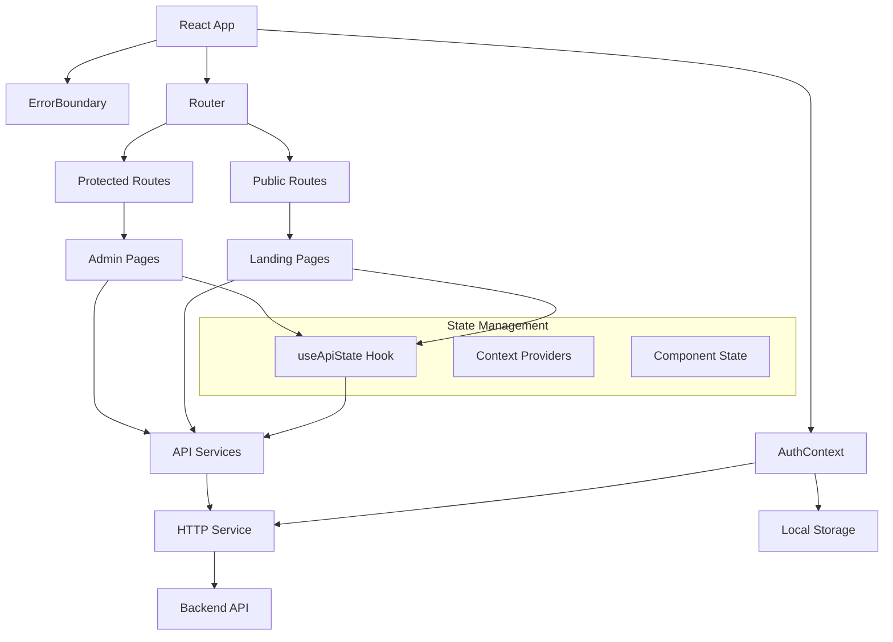

# TopSmile Frontend Analysis Report

## Executive Summary

The TopSmile frontend is a comprehensive React 18 application built with TypeScript for a dental clinic management system. The codebase demonstrates solid architecture patterns and good integration with the backend API. However, there are several areas requiring attention for security, testing coverage, and performance optimization.

### Overall Health: **Good** (7/10)
- **Strengths**: Strong TypeScript implementation, comprehensive API integration, good error handling
- **Concerns**: Security vulnerabilities in token storage, missing test coverage, performance optimization opportunities

---

## Architecture & Data Flow

The application follows a layered architecture with clear separation of concerns:



### Key Components:
- **App.tsx**: Main router with lazy loading and error boundaries
- **AuthContext**: JWT-based authentication with refresh token logic
- **apiService**: Comprehensive API abstraction layer
- **HTTP Service**: Token management and automatic refresh
- **Custom Hooks**: useApiState for simplified API state management

---

## API Integration Review

### Endpoint Coverage Analysis

| Module | Endpoints | Frontend Status | Backend Alignment | Issues |
|--------|-----------|-----------------|-------------------|---------|
| **Auth** | `/api/auth/*` | ✅ Complete | ✅ Aligned | None |
| **Contacts** | `/api/admin/contacts/*` | ✅ Complete | ✅ Aligned | Batch operations not tested |
| **Patients** | `/api/patients/*` | ✅ Complete | ⚠️ Field mapping | Name field mismatch |
| **Providers** | `/api/providers/*` | ✅ Complete | ✅ Aligned | None |
| **Appointments** | `/api/appointments/*` | ✅ Complete | ⚠️ Status handling | Complex status workflow |
| **Forms** | `/api/forms/*` | ✅ Complete | ❌ Not implemented | Backend missing |
| **Payment** | `/api/payments/*` | ⚠️ Partial | ❌ Not implemented | Stripe integration incomplete |

### Input Validation

**Strong Points:**
- TypeScript provides compile-time validation
- API service includes proper field mapping for different backend schemas
- Comprehensive error handling in HTTP service

**Issues:**
```typescript
// Patient name mapping inconsistency
const backendPayload = {
    name: payload.firstName ? `${payload.firstName} ${payload.lastName || ''}`.trim() : payload.fullName,
    // Should be handled by backend validation
}
```

**Recommendation:**
- Implement client-side validation library (Yup/Zod)
- Standardize field mappings between frontend and backend

### HTTP Methods & Headers

**Good Practices:**
- Consistent use of RESTful methods (GET, POST, PATCH, DELETE)
- Proper Authorization header handling
- Automatic token refresh implementation

```typescript
// Excellent token refresh logic in http.ts
if (res.status === 401 && !refreshingPromise) {
    refreshingPromise = performRefresh()
        .catch((err) => {
            refreshingPromise = null;
            throw err;
        });
}
```

### Error Handling

**Strengths:**
- Comprehensive error boundaries at multiple levels
- Structured error responses matching backend format
- User-friendly error messages with Portuguese localization

```typescript
// Well-structured error response handling
return { 
    ok: false, 
    status: res.status, 
    data: payload?.data, 
    message: payload?.message || res.statusText 
};
```

### Authentication & Authorization

**Implementation:**
- JWT-based authentication with refresh tokens
- Role-based access control in routing
- Cross-tab synchronization via storage events

**Security Concerns:**
```typescript
// ❌ CRITICAL: Tokens stored in localStorage
localStorage.setItem(ACCESS_KEY, accessToken);
localStorage.setItem(REFRESH_KEY, refreshToken);
```

---

## Routing & Navigation

### Route Protection Analysis

```typescript
// Good role-based protection
<ProtectedRoute roles={['super_admin', 'admin', 'manager']}>
    <AdminPage />
</ProtectedRoute>
```

**Strengths:**
- Lazy loading for code splitting
- Role-based route protection
- Fallback routes for unauthorized access
- Loading states during route transitions

**Issues:**
- Missing breadcrumb navigation
- No route-level error boundaries for specific error types
- Limited deep linking support for complex admin interfaces

---

## Validation & Error Handling

### Client-side Validation
**Current State:** Limited
- Mostly relies on HTML5 validation and TypeScript types
- No comprehensive validation library integration
- Missing field-level validation feedback

**Recommendation:**
```typescript
// Implement Zod validation schema
import { z } from 'zod';

const PatientSchema = z.object({
    firstName: z.string().min(2, 'Nome deve ter pelo menos 2 caracteres'),
    email: z.string().email('Email inválido').optional(),
    phone: z.string().regex(/^\(\d{2}\)\s\d{4,5}-\d{4}$/, 'Telefone inválido')
});
```

### Error Surface Strategy

**Current Implementation:**
- Error boundaries at page and component levels
- Toast notifications for API errors
- Inline error messages in forms

**Good Practices:**
```typescript
// Excellent error boundary implementation with context
<ErrorBoundary level="page" context="patient-management">
    <PatientManagement />
</ErrorBoundary>
```

---

## State Management & Caching

### Current Approach
- **Context API**: Authentication and error state
- **Component State**: Page-level data management
- **Custom Hooks**: `useApiState` for API calls

### Caching Strategy
**Issues Identified:**
- No data caching - repeated API calls on page refresh
- Missing optimistic updates for better UX
- No background data synchronization

**Performance Impact:**
```typescript
// Every filter change triggers new API call
useEffect(() => {
    fetchPatients(); // No debouncing or caching
}, [filters]);
```

**Recommendations:**
- Implement React Query for caching and synchronization
- Add debounced search inputs
- Implement optimistic updates for better UX

---

## Security Review

### Critical Security Issues

1. **Token Storage in localStorage** ⚠️ **HIGH RISK**
```typescript
// Vulnerable to XSS attacks
localStorage.setItem(ACCESS_KEY, accessToken);
```

2. **Missing CSP Headers** ⚠️ **MEDIUM RISK**
- No Content Security Policy implementation
- Potential XSS vulnerabilities

3. **Role Enforcement** ✅ **GOOD**
```typescript
// Proper role checking
if (roles.length && user && !roles.includes(user.role)) {
    return <Navigate to="/unauthorized" replace />;
}
```

### Security Recommendations

1. **Secure Token Storage:**
```typescript
// Use httpOnly cookies for production
const useSecureTokenStorage = () => {
    // For development: memory storage
    // For production: httpOnly cookies
    if (process.env.NODE_ENV === 'development') {
        return memoryTokenStorage;
    }
    return httpOnlyCookieStorage;
};
```

2. **Add CSP Headers:**
```html
<meta http-equiv="Content-Security-Policy" 
      content="default-src 'self'; script-src 'self' 'unsafe-inline';">
```

---

## UI/UX & Integration

### Loading States
**Good Implementation:**
- Skeleton screens for data loading
- Loading indicators during API calls
- Proper error placeholders

```typescript
// Good loading pattern
if (loading && patients.length === 0) {
    return <div className="loading-spinner">Carregando pacientes...</div>;
}
```

### Accessibility
**Current State:** Basic
- Missing ARIA labels and roles
- No keyboard navigation support
- Limited screen reader support

**Recommendations:**
```typescript
// Add ARIA attributes
<button 
    aria-label="Visualizar detalhes do paciente"
    onClick={() => setSelectedPatient(patient)}
>
    <EyeIcon />
</button>
```

---

## Testing Review

### Current Testing Infrastructure
**Dependencies:**
- Jest 30.1.3 + React Testing Library 16.3.0
- Cypress 15.1.0 for e2e testing
- MSW 2.11.1 for API mocking
- MongoDB Memory Server for database testing

### Issues Identified
1. **No actual test files found** in the analyzed codebase
2. Missing API integration tests
3. No component unit tests
4. Missing e2e test scenarios

### Testing Strategy Recommendations

```typescript
// API service test example
describe('apiService.patients', () => {
    beforeEach(() => {
        server.use(
            rest.get('/api/patients', (req, res, ctx) => {
                return res(ctx.json({ patients: mockPatients }));
            })
        );
    });

    it('should fetch patients with pagination', async () => {
        const result = await apiService.patients.getAll({ page: 1, limit: 10 });
        expect(result.success).toBe(true);
        expect(result.data.patients).toHaveLength(10);
    });
});
```

---

## Performance & Scalability

### Current Performance Issues

1. **Bundle Size Optimization**
```typescript
// Good: Lazy loading implemented
const AdminPage = React.lazy(() => import('./pages/Login/AdminPage'));
```

2. **API Call Optimization**
```typescript
// Issue: No debouncing on search
const handleSearchChange = (e) => {
    setFilters(prev => ({ ...prev, search: e.target.value })); // Immediate API call
};

// Solution: Add debouncing
const debouncedSearch = useMemo(
    () => debounce((searchTerm) => {
        setFilters(prev => ({ ...prev, search: searchTerm }));
    }, 300),
    []
);
```

3. **Memory Leaks**
```typescript
// Good: Proper cleanup in useEffect
useEffect(() => {
    const interval = setInterval(checkTokenValidity, 5 * 60 * 1000);
    return () => clearInterval(interval); // Cleanup implemented
}, []);
```

### Scalability Recommendations

1. **Implement Virtual Scrolling** for large patient/contact lists
2. **Add Request Deduplication** to prevent duplicate API calls
3. **Implement Progressive Loading** for dashboard stats
4. **Add Service Worker** for offline functionality

---

## Code Quality & Maintainability

### TypeScript Implementation
**Excellent Coverage:**
```typescript
// Comprehensive type definitions
export interface Patient {
    id?: string;
    _id?: string;
    firstName: string;
    lastName?: string;
    // ... complete type definitions
}
```

### Component Organization
**Good Patterns:**
- Clear file structure with logical grouping
- Reusable UI components
- Consistent naming conventions

**Areas for Improvement:**
```typescript
// Large component files (600+ lines)
// PatientManagement.tsx - should be split into smaller components

// Recommended refactoring:
// - PatientList component
// - PatientFilters component
// - PatientModal component
```

### Error Handling Consistency
**Excellent Implementation:**
```typescript
// Comprehensive error boundary with logging
componentDidCatch(error: Error, errorInfo: ErrorInfo) {
    const enhancedError = {
        ...error,
        boundary: 'ErrorBoundary',
        level,
        context,
        // ... additional metadata
    };
}
```

---

## Prioritized TODO List

### 1. **CRITICAL: Fix Security Vulnerabilities** 🔴
- **Issue:** Tokens in localStorage vulnerable to XSS
- **Solution:** Implement httpOnly cookies or memory storage
- **Timeline:** Immediate (Week 1)

### 2. **HIGH: Implement Comprehensive Testing** 🟠
- **Issue:** No test coverage found
- **Solution:** Add unit tests for API service, components, and e2e scenarios
- **Timeline:** 2-3 weeks

### 3. **HIGH: Add Input Validation Library** 🟠
- **Issue:** Limited client-side validation
- **Solution:** Integrate Zod/Yup with form validation
- **Timeline:** 1-2 weeks

### 4. **MEDIUM: Implement Data Caching** 🟡
- **Issue:** Repeated API calls, no caching strategy
- **Solution:** Integrate React Query for caching and synchronization
- **Timeline:** 2-3 weeks

### 5. **MEDIUM: Performance Optimization** 🟡
- **Issue:** Missing debouncing, potential memory leaks
- **Solution:** Add debounced inputs, virtual scrolling, bundle optimization
- **Timeline:** 2-3 weeks

---

## Files Examined

### Core Architecture (6 files)
- `/src/App.tsx` - Main application router
- `/src/services/apiService.ts` - API abstraction layer
- `/src/services/http.ts` - HTTP client with token management
- `/src/contexts/AuthContext.tsx` - Authentication context
- `/src/types/api.ts` - TypeScript type definitions
- `/src/hooks/useApiState.ts` - Custom API state management

### Authentication & Security (3 files)
- `/src/contexts/PatientAuthContext.tsx` - Patient authentication
- `/src/components/Auth/ProtectedRoute/ProtectedRoute.tsx` - Route protection
- `/src/services/paymentService.ts` - Payment processing

### UI & Error Handling (2 files)
- `/src/components/ErrorBoundary/ErrorBoundary.tsx` - Error boundary implementation
- `/src/pages/Admin/PatientManagement.tsx` - Complex admin interface example

### Configuration (1 file)
- `/package.json` - Dependencies and project configuration

### Assumptions Made
- Backend API endpoints follow RESTful conventions
- Database uses MongoDB with Mongoose ODM
- Authentication uses JWT with refresh token pattern
- Production deployment will use HTTPS and proper security headers

---

## Conclusion

The TopSmile frontend demonstrates solid architectural decisions and comprehensive API integration. The codebase is well-structured with good TypeScript coverage and error handling. However, immediate attention is required for security vulnerabilities, particularly token storage, and comprehensive testing implementation.

The application shows good potential for scalability with proper optimizations and security hardening. The development team has shown good practices in error handling and component organization, providing a strong foundation for future enhancements.

**Overall Assessment: Production-ready with security fixes and testing implementation.**