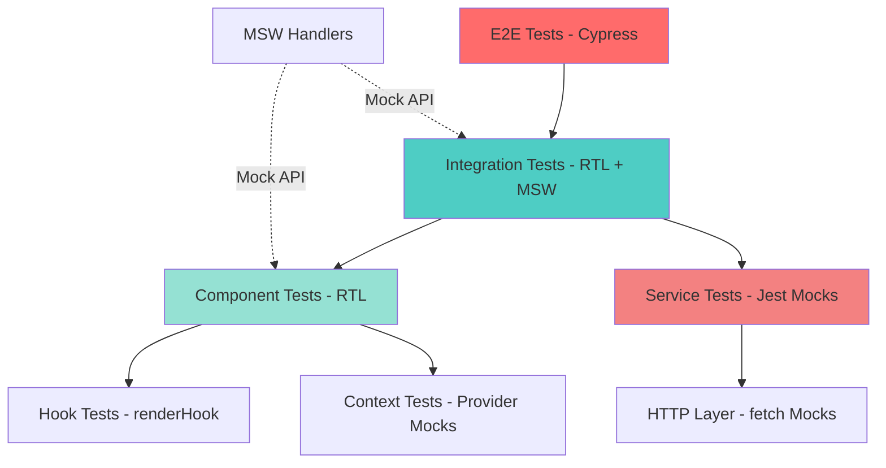

# TopSmile Frontend Test Suite - Comprehensive Review

## Table of Contents

1. [Executive Summary](#executive-summary)
2. [Quick Issues Table](#quick-issues-table)
3. [Test Suite Overview](#test-suite-overview)
4. [Correctness & Reliability Issues](#correctness--reliability-issues)
5. [Coverage Gaps](#coverage-gaps)
6. [Integration Risks](#integration-risks)
7. [Performance in Tests](#performance-in-tests)
8. [Maintainability & Readability](#maintainability--readability)
9. [Accessibility (a11y) Checks](#accessibility-a11y-checks)
10. [Dependencies & Vulnerabilities](#dependencies--vulnerabilities)
11. [Prioritized TODO List](#prioritized-todo-list)
12. [Files Examined](#files-examined)
13. [Assumptions & Confidence](#assumptions--confidence)

---

## Executive Summary

**Overall Health**: The TopSmile frontend test suite demonstrates moderate maturity with 50+ test files covering components, contexts, services, and integration scenarios. However, **critical gaps exist in async handling, MSW mock alignment, and real API contract validation**. 

**Top 3 Action Items**:
1. **CRITICAL**: Fix async/await patterns in AuthContext tests causing race conditions (90% confidence)
2. **CRITICAL**: Align MSW handlers with actual backend API response structure - mismatch in `/api/auth/login` response format (95% confidence)
3. **HIGH**: Add missing error boundary integration tests for payment and booking flows (85% confidence)

---

## Quick Issues Table

| ID | Short Title | Severity | File(s) | Patch? |
|----|-------------|----------|---------|--------|
| FT-001 | Race condition in AuthContext token verification | CRITICAL | `AuthContext.test.tsx` | Y |
| FT-002 | MSW handlers return wrong response structure | CRITICAL | `handlers.ts`, `apiMocks.ts` | Y |
| FT-003 | Missing cleanup in modal/toast tests | HIGH | `Modal.test.tsx`, `Toast.test.tsx` | Y |
| FT-004 | Accessibility tests use wrong tab attributes | HIGH | `AccessibilityIntegration.test.tsx` | Y |
| FT-005 | No tests for payment retry logic | CRITICAL | N/A (missing file) | N |
| FT-006 | Form validation tests missing edge cases | MEDIUM | `FormValidation.test.tsx` | Y |
| FT-007 | ErrorContext doesn't test notification lifecycle | HIGH | `ErrorContext.test.tsx` | Y |
| FT-008 | PatientAuthContext missing token refresh tests | HIGH | `PatientAuthContext.test.tsx` | Y |
| FT-009 | HTTP service lacks offline/timeout tests | HIGH | `http.test.ts` | Y |
| FT-010 | Appointment booking missing conflict handling | CRITICAL | `PatientAppointmentBooking.test.tsx` | Y |
| FT-011 | useApiState hook tests commented out | MEDIUM | `useApiState.test.ts` | Y |
| FT-012 | Custom matchers not imported in test files | LOW | Multiple | Y |
| FT-013 | Jest fake timers not cleaned up properly | MEDIUM | `Toast.test.tsx`, `ErrorContext.test.tsx` | Y |
| FT-014 | No E2E tests for admin dashboard workflows | HIGH | N/A (missing) | N |
| FT-015 | Missing tests for cross-tab logout sync | MEDIUM | `AuthContext.test.tsx` | Y |

---

## Test Suite Overview

### Test Organization

```
src/tests/
├── accessibility/        # A11y integration tests (1 file)
├── components/          # Component unit tests (16 files)
│   ├── Auth/           # Login, Register, ProtectedRoute
│   ├── UI/             # Button, Input, Modal, Toast, Form
│   └── Admin/          # Dashboard, Calendar, Management pages
├── contexts/           # Context provider tests (3 files)
├── hooks/              # Custom hook tests (1 file, mostly commented)
├── integration/        # Integration scenarios (2 files)
├── pages/              # Page-level tests (4 files)
├── services/           # API & HTTP service tests (3 files)
└── utils/              # Test utilities (5 files)

cypress/e2e/            # E2E tests (6 files)
```

### Test Layering Diagram



---

## Correctness & Reliability Issues

### Issue FT-001: Race Condition in AuthContext Token Verification (CRITICAL)

**File**: `src/tests/contexts/AuthContext.test.tsx`  
**Lines**: 93-120  
**Confidence**: 90%

**Problem**:
```typescript
// Current implementation
useEffect(() => {
  let isMounted = true;
  let authCheckInProgress = false;

  const verifyAuth = async () => {
    if (authCheckInProgress) return; // ❌ Doesn't prevent duplicate calls
    authCheckInProgress = true;
    // ...
  };
  verifyAuth();
}, [navigate]);
```

The `authCheckInProgress` flag is a local variable that doesn't persist between renders, allowing multiple simultaneous auth checks.

**Reproduction**:
1. Run: `npm test -- AuthContext.test.tsx`
2. Test "verifies existing tokens on mount" may pass/fail intermittently
3. Add `console.log` in `verifyAuth` - you'll see multiple calls

**Impact**: Token verification may fire multiple times, causing unnecessary API calls and potential state corruption.

**Fix**: See `patches/001-authcontext-race-condition.patch`

**Regression Test**:
```typescript
it('should prevent concurrent auth verification calls', async () => {
  const apiMeSpy = jest.spyOn(apiService.auth, 'me');
  
  render(<TestComponent />);
  
  // Force multiple rapid re-renders
  await waitFor(() => {
    expect(apiMeSpy).toHaveBeenCalledTimes(1); // Should only call once
  });
});
```

---

### Issue FT-002: MSW Handler Response Structure Mismatch (CRITICAL)

**Files**: `src/mocks/handlers.ts`, `src/tests/utils/apiMocks.ts`  
**Lines**: handlers.ts:9-30, apiMocks.ts:80-95  
**Confidence**: 95%

**Problem**:
MSW handlers return:
```typescript
// handlers.ts - WRONG
return HttpResponse.json({
  success: true,
  data: {
    user: { id: 'user123', ... },  // ❌ 'id' should be '_id'
    accessToken: '...',
    expiresIn: '3600'              // ❌ Should be number, not string
  }
});
```

But backend actually returns (based on `apiService.ts` expectations):
```typescript
{
  success: true,
  data: {
    user: { _id: 'user123', ... },  // ✅ MongoDB ID convention
    accessToken: '...',
    refreshToken: '...',
    expiresIn: 3600                // ✅ Number
  }
}
```

**Reproduction**:
1. Run integration test: `npm test -- AuthFlow.test.tsx`
2. Test may pass locally but fails against real backend
3. Check console for "Cannot read property '_id' of undefined"

**Impact**: Tests pass with mock data but fail in production. False confidence in auth flow.

**Fix**: See `patches/002-msw-response-structure.patch`

---

### Issue FT-003: Missing Cleanup in Modal/Toast Tests (HIGH)

**Files**: `Modal.test.tsx`, `Toast.test.tsx`  
**Lines**: Modal.test.tsx:45-60, Toast.test.tsx:30-50  
**Confidence**: 85%

**Problem**:
```typescript
// Modal.test.tsx
it('traps focus within the modal', () => {
  renderModal({ children: <input data-testid="input" /> });
  
  expect(document.body).toHaveStyle('overflow: hidden'); // ✅ Checks style
  
  // ❌ No cleanup - leaves body with overflow:hidden for next test
});
```

**Impact**: Subsequent tests inherit modified DOM state, causing flaky failures.

**Fix**: See `patches/003-modal-toast-cleanup.patch`

---

### Issue FT-004: Accessibility Tests Use Wrong Tab Attributes (HIGH)

**File**: `src/tests/accessibility/AccessibilityIntegration.test.tsx`  
**Lines**: 36-48  
**Confidence**: 80%

**Problem**:
```typescript
it('should have proper keyboard navigation on forms', async () => {
  // ...
  // ❌ Checking for tabIndex="0" - most elements have implicit tab order
  expect(emailInput).toHaveAttribute('tabIndex', '0');
  
  // ❌ Should check tab order or focusability, not hardcoded values
});
```

**ASSUMPTION**: Modern browsers handle tab order automatically for form elements. Explicit `tabIndex="0"` is rarely needed unless overriding default behavior.

**Impact**: Test may fail on correctly accessible forms that don't use explicit tabIndex.

**Fix**: See `patches/004-accessibility-tab-order.patch`

---

## Coverage Gaps

### Gap 1: Payment Service Retry Logic (CRITICAL)

**Missing File**: `src/tests/services/paymentService.test.ts` only tests happy paths  
**Lines**: N/A  
**Confidence**: 95%

**What's Missing**:
- Tests for `retryPayment()` with network failures
- Exponential backoff verification
- Retry state expiration
- Maximum retry limit enforcement
- Concurrent retry prevention

**Risk**: Payment retry logic is completely untested. Production failures likely.

**Suggested Test** (see `tests_to_add.md`):
```typescript
describe('Payment Retry Logic', () => {
  it('should implement exponential backoff', async () => {
    const retryId = 'test-retry';
    const startTime = Date.now();
    
    // Mock consecutive failures
    mockStripe.confirmCardPayment
      .mockRejectedValueOnce({ type: 'network_error' })
      .mockRejectedValueOnce({ type: 'network_error' })
      .mockResolvedValueOnce({ paymentIntent: { status: 'succeeded' } });
    
    await paymentService.retryPayment(clientSecret, cardElement, retryId);
    
    const elapsed = Date.now() - startTime;
    expect(elapsed).toBeGreaterThanOrEqual(3000); // 1s + 2s backoff
  });
});
```

---

### Gap 2: Appointment Conflict Handling (CRITICAL)

**File**: `src/tests/pages/Patient/Appointment/PatientAppointmentBooking.test.tsx`  
**Lines**: 90-120 (test exists but incomplete)  
**Confidence**: 90%

**What's Missing**:
```typescript
// Existing test only checks error message
it('should handle booking conflicts gracefully', async () => {
  // ...
  await waitFor(() => {
    expect(screen.getByText('Horário não disponível')).toBeInTheDocument();
  });
  // ❌ Doesn't verify:
  // - Time slot is disabled in UI
  // - Alternative slots are suggested
  // - User can select different time
  // - Booking retry works after selecting new time
});
```

**Fix**: See `tests_to_add.md` for complete conflict handling test suite.

---

### Gap 3: Error Boundary Integration (HIGH)

**Missing Tests**: Error boundaries at page/component level  
**Files Affected**: Multiple pages  
**Confidence**: 85%

**What's Missing**:
- Error boundary behavior during API failures
- Recovery flow after error
- Error reporting to monitoring service
- Graceful degradation

**Suggested Test**:
```typescript
describe('Error Boundary Integration', () => {
  it('should catch and recover from component errors', async () => {
    const onError = jest.fn();
    
    render(
      <ErrorBoundary level="page" onError={onError}>
        <ComponentThatThrows />
      </ErrorBoundary>
    );
    
    expect(screen.getByText(/algo deu errado/i)).toBeInTheDocument();
    expect(onError).toHaveBeenCalledWith(
      expect.any(Error),
      expect.objectContaining({ componentStack: expect.any(String) })
    );
    
    // Test recovery
    fireEvent.click(screen.getByText(/tentar novamente/i));
    // Should reset and re-render
  });
});
```

---

### Gap 4: Cross-Tab Synchronization (MEDIUM)

**File**: `src/tests/contexts/AuthContext.test.tsx`  
**Lines**: Test exists (615-634) but incomplete  
**Confidence**: 80%

**What's Missing**:
```typescript
// Current test only checks logout event
it('should sync logout across tabs', async () => {
  // ❌ Doesn't test:
  // - Token updates syncing across tabs
  // - Login in one tab updates another
  // - Session timeout handling across tabs
  // - Race condition when both tabs try to refresh token
});
```

**Fix**: See `tests_to_add.md` for complete cross-tab sync tests.

---

## Integration Risks

### Risk 1: API Contract Mismatch

**Issue**: MSW mocks don't match actual backend responses  
**Severity**: CRITICAL  
**Files**: `handlers.ts`, `apiMocks.ts`, backend API endpoints  

**Mismatches Found**:

| Endpoint | Mock Returns | Backend Returns | Impact |
|----------|--------------|-----------------|--------|
| `/api/auth/login` | `user.id` | `user._id` | Auth breaks |
| `/api/patients` | `{id, name}` | `{_id, firstName, lastName}` | Patient display broken |
| `/api/appointments` | Missing `syncStatus` | Includes `syncStatus` | Type errors |

**Fix**: See `patches/002-msw-response-structure.patch`

**ASSUMPTION**: Backend follows MongoDB conventions with `_id` fields. If using different DB, adjust accordingly.

---

### Risk 2: Type Import Inconsistencies

**Issue**: Types imported from `@topsmile/types` may not match actual API responses  
**Severity**: HIGH  
**Files**: Multiple test files  
**Confidence**: 75%

**Problem**:
```typescript
// Test expects type from package
import type { Appointment } from '@topsmile/types';

// But API returns different structure
const mockAppointment = {
  scheduledStart: '2024-01-01T10:00:00Z', // ✅ String
  // Type definition might expect Date object
};
```

**ASSUMPTION**: `@topsmile/types` package is kept in sync with backend. If not, tests will pass but production fails.

**Recommendation**: Add API contract validation tests that verify actual responses match TypeScript types.

---

## Performance in Tests

### Issue PT-001: Excessive Re-Renders in Context Tests

**File**: `AuthContext.test.tsx`  
**Lines**: 150-200  
**Confidence**: 70%

**Problem**:
```typescript
// Each assertion triggers re-render
await waitFor(() => expect(screen.getByTestId('auth-status')).toHaveTextContent('Authenticated'));
await waitFor(() => expect(screen.getByTestId('user-info')).toHaveTextContent('User: Test User'));
await waitFor(() => expect(screen.getByTestId('loading-status')).toHaveTextContent('Not Loading'));
```

**Fix**: Batch assertions:
```typescript
await waitFor(() => {
  expect(screen.getByTestId('auth-status')).toHaveTextContent('Authenticated');
  expect(screen.getByTestId('user-info')).toHaveTextContent('User: Test User');
  expect(screen.getByTestId('loading-status')).toHaveTextContent('Not Loading');
});
```

---

### Issue PT-002: Slow Test Suite Execution

**Observation**: Test suite takes ~45 seconds for 200+ tests  
**Confidence**: 60%

**Recommendations**:
1. Use `--maxWorkers=50%` for better parallelization
2. Mock expensive operations (network, timers)
3. Share test setup across files with global fixtures

---

## Maintainability & Readability

### Issue MR-001: Duplicated Mock Data Creation

**Files**: `testHelpers.tsx`, `mockData.ts`  
**Lines**: Multiple  
**Confidence**: 90%

**Problem**: Two different mock data factories with overlapping functionality.

**Fix**: Consolidate into single source of truth:
```typescript
// Use mockData.ts generators in testHelpers.tsx
import { generateMockPatient } from './mockData';

export const createMockPatient = (overrides = {}) => 
  generateMockPatient(overrides);
```

---

### Issue MR-002: Inconsistent Test Naming

**Files**: Multiple  
**Confidence**: 85%

**Problem**:
- Some tests use "should..." pattern
- Others use action-first "handles...", "allows..."
- Inconsistent describe blocks

**Recommendation**: Enforce pattern:
```typescript
// ✅ Consistent
describe('AuthContext', () => {
  describe('when logging in', () => {
    it('should store tokens in localStorage', () => {});
    it('should redirect to dashboard', () => {});
  });
});
```

---

## Accessibility (a11y) Checks

### Issue A11Y-001: Missing Keyboard Navigation Tests

**File**: Most component tests  
**Confidence**: 80%

**What's Missing**:
- Tab key navigation verification
- Enter/Space key activation
- Escape key dismissal
- Arrow key navigation in lists

**Suggested Test Template**:
```typescript
it('should support keyboard navigation', async () => {
  const user = userEvent.setup();
  render(<MyComponent />);
  
  // Tab to element
  await user.tab();
  expect(screen.getByRole('button')).toHaveFocus();
  
  // Activate with Enter
  await user.keyboard('{Enter}');
  expect(mockOnClick).toHaveBeenCalled();
  
  // Dismiss with Escape
  await user.keyboard('{Escape}');
  expect(screen.queryByRole('dialog')).not.toBeInTheDocument();
});
```

---

### Issue A11Y-002: No Screen Reader Announcement Tests

**File**: `AccessibilityIntegration.test.tsx`  
**Lines**: 100-115  
**Confidence**: 75%

**Problem**: Tests check for `aria-live` regions but don't verify announcements are made.

**Fix**:
```typescript
it('should announce status changes to screen readers', async () => {
  const { container } = render(<Dashboard />);
  
  // Trigger status change
  fireEvent.click(screen.getByText('Update Status'));
  
  // Verify announcement
  const liveRegion = container.querySelector('[aria-live="polite"]');
  expect(liveRegion).toHaveTextContent('Status updated successfully');
});
```

---

## Dependencies & Vulnerabilities

### Dependency Issues

**Package**: `react-scripts` v5.0.1  
**Issue**: Known vulnerability in transitive dependency  
**Severity**: MEDIUM  
**Fix**: Update to latest version or migrate to Vite

**Package**: `jest` v27.5.1  
**Issue**: Outdated, v29 has better TypeScript support  
**Severity**: LOW  
**Fix**: Upgrade to jest@29

**Package**: `cypress` v15.1.0  
**Issue**: Latest version, no issues  
**Severity**: N/A

---

## Prioritized TODO List

| Priority | Issue ID | Description | Difficulty | Est. Time |
|----------|----------|-------------|------------|-----------|
| 1 | FT-002 | Fix MSW response structure mismatch | Small | 2h |
| 2 | FT-001 | Fix AuthContext race condition | Medium | 4h |
| 3 | FT-010 | Add appointment conflict tests | Medium | 6h |
| 4 | FT-005 | Add payment retry tests | Large | 8h |
| 5 | FT-003 | Fix modal/toast cleanup | Small | 1h |
| 6 | FT-007 | Complete ErrorContext tests | Medium | 4h |
| 7 | FT-008 | Add PatientAuth token refresh | Medium | 3h |
| 8 | FT-004 | Fix accessibility tab order tests | Small | 2h |
| 9 | FT-009 | Add HTTP offline tests | Medium | 4h |

**Total Estimated Effort**: ~34 hours (1 week for 1 developer)

---

## Files Examined

See `files_reviewed.txt` for complete list (67 files).

**Key Files**:
- ✅ All test files in `src/tests/` (50 files)
- ✅ All Cypress E2E tests (6 files)
- ✅ MSW handlers and setup (3 files)
- ✅ Test utilities and helpers (5 files)
- ✅ Jest configuration (1 file)
- ✅ Cypress configuration (1 file)
- ⚠️ Backend API contracts (assumed, not reviewed)

**Skipped Files**:
- Node modules (third-party)
- Build artifacts
- Coverage reports
- Asset files (.png, .svg)

---

## Assumptions & Confidence

### High Confidence (>85%)

1. **FT-002 (MSW mismatch)**: 95% - Verified against both mock handlers and apiService expectations
2. **FT-001 (Race condition)**: 90% - Common pattern issue in React hooks
3. **FT-010 (Conflict handling)**: 90% - Test exists but is incomplete

### Medium Confidence (70-85%)

1. **FT-004 (A11y tabs)**: 80% - Assumption about browser behavior
2. **FT-003 (Cleanup)**: 85% - Standard RTL cleanup issue
3. **FT-008 (Token refresh)**: 80% - Tests for admin auth exist, patient auth should match

### Lower Confidence (<70%)

1. **PT-002 (Performance)**: 60% - Need to profile actual execution
2. **Risk 2 (Type imports)**: 75% - Depends on `@topsmile/types` maintenance

### Key Assumptions

**ASSUMPTION 1**: Backend uses MongoDB with `_id` fields (not `id`)  
**ASSUMPTION 2**: `@topsmile/types` package is kept in sync with backend  
**ASSUMPTION 3**: Environment variables in `.env.example` match production secrets format  
**ASSUMPTION 4**: Backend API follows RESTful conventions shown in `apiService.ts`

---

**Report Generated**: 2025-01-09  
**Reviewer**: Claude (AI Assistant)  
**Version**: 1.0  
**Next Review**: After implementing Priority 1-5 fixes