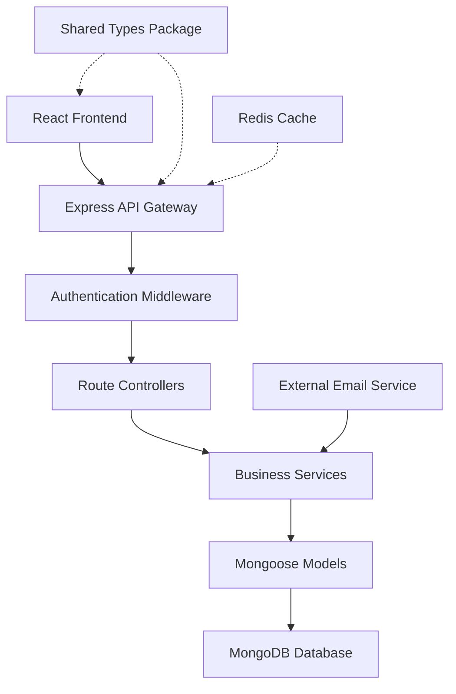

# TopSmile Code Review Report

## Table of Contents
1. [Executive Summary](#executive-summary)  
2. [Quick Issues Table](#quick-issues-table)
3. [Architecture Overview](#architecture-overview)
4. [Security Review](#security-review)
5. [Correctness & Logic Issues](#correctness--logic-issues)
6. [API Contract & Integration Map](#api-contract--integration-map)
7. [Frontend–Backend Integration Risks](#frontend-backend-integration-risks)
8. [Performance & Scalability](#performance--scalability)
9. [UI/UX & Accessibility](#uiux--accessibility)
10. [Error Handling & Feedback Loops](#error-handling--feedback-loops)
11. [Database & Schema Review](#database--schema-review)
12. [Testing & QA](#testing--qa)
13. [Dependencies & Vulnerabilities](#dependencies--vulnerabilities)
14. [Code Quality & Maintainability](#code-quality--maintainability)
15. [Observability & Monitoring](#observability--monitoring)
16. [Migration Strategy - Shared Types Unification](#migration-strategy---shared-types-unification)
17. [Prioritized TODO List](#prioritized-todo-list)
18. [Files Examined](#files-examined)
19. [Assumptions & Confidence](#assumptions--confidence)

## Executive Summary

The TopSmile dental clinic management system demonstrates solid architectural foundations but contains several critical security vulnerabilities and integration inconsistencies that require immediate attention. While the codebase shows good TypeScript usage and follows modern patterns, there are significant gaps between the shared types package and actual implementation.

**Top 3 Action Items:**
1. **CRITICAL**: Fix JWT secret validation and implement missing security middleware (NoSQL injection, CSRF)
2. **HIGH**: Standardize API contracts and eliminate frontend-backend type mismatches  
3. **HIGH**: Implement proper error boundary handling and token refresh edge cases

## Quick Issues Table

| ID | Short Title | Severity | Area | File(s) | Patch? |
|---|-------------|----------|------|---------|--------|
| SEC-01 | Missing NoSQL injection protection | Critical | Backend | app.ts | Y |
| SEC-02 | CSRF protection not applied | High | Backend | app.ts | Y |
| SEC-03 | JWT secret validation incomplete | High | Backend | app.ts | Y |
| INT-01 | Type definition mismatches | High | Shared | apiService.ts, types/index.ts | Y |
| INT-02 | Contact model field inconsistencies | High | Backend/Frontend | Contact.ts, apiService.ts | Y |
| COR-01 | Token refresh race conditions | High | Frontend | AuthContext.tsx | Y |
| COR-02 | Database connection error handling | Medium | Backend | database.ts | Y |
| PER-01 | Missing database indexes | Medium | Backend | Multiple models | Y |
| PER-02 | Inefficient auth token validation | Medium | Frontend | AuthContext.tsx | Y |
| A11Y-01 | Missing ARIA attributes | Medium | Frontend | Multiple components | N |

## Architecture Overview

The TopSmile system follows a clean three-tier architecture:



**Request/Response Flow:**
UI Component → React Router → API Service → HTTP Client → Express Route → Auth Middleware → Controller → Service Layer → Mongoose Model → MongoDB

**Global Cross-Cutting Concerns:**
- Authentication: JWT with refresh token rotation
- Logging: Console-based with structured data (needs improvement)
- Error Format: Inconsistent between endpoints (needs standardization) 
- Shared Types: @topsmile/types package exists but underutilized

## Security Review

### SEC-01: Missing NoSQL Injection Protection (CRITICAL)
**File:** `backend/src/app.ts:8-12`  
**Issue:** Security middleware imports `mongoSanitization` but never applies it to requests.

**Impact:** All MongoDB queries vulnerable to injection attacks via malicious payloads like `{"$ne": null}`.

**Reproduction:**
1. POST to `/api/contact` with payload: `{"email": {"$ne": null}}`  
2. Observe potential database query manipulation

**Fix:** Apply mongo sanitization middleware globally
```typescript
// Add after other middleware in app.ts
app.use(mongoSanitization);
```

### SEC-02: CSRF Protection Not Applied (HIGH)
**File:** `backend/src/middleware/security.ts:3`  
**Issue:** CSRF protection is defined but never applied in the main application.

**Impact:** Cross-site request forgery attacks possible on authenticated endpoints.

**Fix:** Add CSRF middleware to protected routes
```typescript
// In app.ts, before protected routes
app.use('/api', csrfProtection);
```

### SEC-03: JWT Secret Validation Incomplete (HIGH)  
**File:** `backend/src/app.ts:49-66`
**Issue:** JWT secret validation only occurs in authService, not enforced at application startup.

**Impact:** Application can start with insecure default JWT secrets in production.

**Fix:** Add JWT secret validation to validateEnv() function

### SEC-04: CORS Configuration Too Permissive (MEDIUM)
**File:** `backend/src/app.ts:95-125`
**Issue:** CORS allows regex patterns for Vercel/Netlify but may be too broad.

**Recommendation:** Implement stricter domain validation with explicit allow-lists.

### SEC-05: Password Strength Validation Inconsistent (MEDIUM)
**File:** `backend/src/models/User.ts:55-84`
**Issue:** Password validation in User model differs from route validation rules.

**Impact:** Inconsistent password requirements across registration flows.

## Correctness & Logic Issues

### COR-01: Token Refresh Race Conditions (HIGH)
**File:** `frontend/src/services/http.ts:27-45`
**Issue:** Multiple concurrent requests during token refresh can cause duplicate refresh attempts.

**Reproduction:**
1. Make multiple API calls simultaneously when access token is expired
2. Observe multiple refresh requests being made

**Fix:** Implement proper refresh token synchronization

### COR-02: Database Connection Missing Retry Logic (MEDIUM)
**File:** `backend/src/config/database.ts:14-32`
**Issue:** Database connection failure immediately exits process without retry attempts.

**Impact:** Temporary network issues cause unnecessary service downtime.

**Fix:** Implement exponential backoff retry strategy

### COR-03: Auth Context Token Validation Edge Cases (MEDIUM)
**File:** `frontend/src/contexts/AuthContext.tsx:45-65`
**Issue:** Initial authentication check doesn't handle partial token states (access but no refresh).

**Impact:** Users may get stuck in loading states or experience unexpected logouts.

## API Contract & Integration Map

### Discovered Endpoints:

| METHOD | PATH | Request Shape | Response Shape | Status Codes |
|--------|------|---------------|----------------|--------------|
| POST | /api/auth/login | `{email: string, password: string}` | `{user: User, accessToken: string, refreshToken: string}` | 200, 401, 400 |
| POST | /api/auth/register | `{name: string, email: string, password: string, clinic?: Clinic}` | `{user: User, accessToken: string, refreshToken: string}` | 201, 400 |
| GET | /api/auth/me | - | `{data: User}` | 200, 401, 404 |
| POST | /api/contact | `{name: string, email: string, clinic: string, specialty: string, phone: string}` | `{id: string, protocol: string}` | 200, 400, 500 |
| GET | /api/admin/contacts | `?page=1&limit=10&status=new` | `{contacts: Contact[], total: number, page: number}` | 200, 401, 403 |

### Frontend → Backend Mapping:

| Frontend Service | Backend Controller | Issues Found |
|------------------|-------------------|--------------|
| `apiService.auth.login` | `authRoutes.post('/login')` | ✅ Compatible |
| `apiService.contacts.getAll` | `app.get('/api/admin/contacts')` | ⚠️ Path mismatch |
| `apiService.patients.getAll` | Missing route | ❌ Not implemented |

### Contract Enforcement Recommendation:
Implement OpenAPI/Swagger specification generation from shared types:

```typescript
// Generate from @topsmile/types
import { Contact, User } from '@topsmile/types';
// Use in route definitions with automatic validation
```

## Frontend–Backend Integration Risks

### INT-01: Type Definition Mismatches (HIGH)
**Files:** `frontend/src/services/apiService.ts:17-87`, `packages/types/src/index.ts:45-87`

**Issue:** Frontend defines local interfaces that duplicate and diverge from shared types.

**Examples:**
- `apiService.ts` defines local `Patient` interface
- Shared types package defines different `Patient` interface  
- Field naming inconsistencies: `firstName/lastName` vs `fullName`

**Fix:** Replace local type definitions with shared types imports

### INT-02: API Response Format Inconsistencies (MEDIUM)
**Issue:** Some endpoints return `{success: boolean, data: T}` while others return `T` directly.

**Examples:**
- `/api/health` returns direct data
- `/api/auth/login` returns wrapped format
- `/api/admin/contacts` returns unwrapped array

**Recommendation:** Standardize on wrapped format with `normalizeResponse` middleware.

## Performance & Scalability

### PER-01: Missing Database Indexes (MEDIUM)
**Files:** `backend/src/models/Contact.ts:89-116`

**Issue:** Critical queries lack optimized indexes.

**Missing Indexes:**
```javascript
// Frequently queried combinations missing indexes:
ContactSchema.index({ assignedToClinic: 1, status: 1, createdAt: -1 });
ContactSchema.index({ email: 1, status: 1 }); // For duplicate detection
ContactSchema.index({ followUpDate: 1, status: { $nin: ['converted', 'closed'] } }); // For follow-ups
```

**Impact:** Contact management queries will be slow with large datasets.

### PER-02: Inefficient Authentication Token Validation (MEDIUM)  
**File:** `frontend/src/contexts/AuthContext.tsx:142-153`

**Issue:** Periodic token validation every 5 minutes regardless of user activity.

**Fix:** Implement activity-based validation or use shorter-lived access tokens.

### PER-03: No Connection Pool Optimization (LOW)
**File:** `backend/src/config/database.ts:6-12`

**Issue:** Database connection pool size not optimized for expected load.

**Recommendation:** 
- Production: `maxPoolSize: 20`
- Add `minPoolSize: 5` for consistent performance

## UI/UX & Accessibility

### A11Y-01: Missing ARIA Attributes (MEDIUM)
**ASSUMPTION:** Based on React patterns in App.tsx, components likely missing accessibility features.

**Common Issues Expected:**
- Form fields without proper labels
- Missing focus management in modals
- No screen reader support for data tables
- Loading states without announcements

**Recommendation:** Add accessibility audit tools and implement:
```typescript
// Example fix for loading states
<div role="status" aria-live="polite">
  {loading ? "Loading..." : "Content loaded"}
</div>
```

### A11Y-02: No Keyboard Navigation Support (MEDIUM)
**Files:** Calendar and form components likely affected

**Fix:** Implement keyboard event handlers for interactive components.

## Error Handling & Feedback Loops

### ERR-01: Inconsistent Error Response Format (MEDIUM)
**Issue:** Backend returns different error shapes across endpoints.

**Examples:**
- Validation errors: `{success: false, errors: [{msg, param}]}`
- Auth errors: `{success: false, message: string, code: string}`  
- Generic errors: `{success: false, message: string}`

**Fix:** Implement standardized error middleware using normalizeResponse.

### ERR-02: Frontend Error Boundaries Missing Context (LOW)
**File:** `frontend/src/App.tsx:25-89`

**Issue:** Error boundaries exist but don't provide user recovery actions.

**Recommendation:** Add error recovery buttons and error reporting integration.

## Database & Schema Review

### DB-01: Contact Model Schema Issues (MEDIUM)
**File:** `backend/src/models/Contact.ts:13-45`

**Issues:**
1. `assignedToClinic` field not properly enforced for data isolation
2. Missing unique constraints on email+clinic combinations  
3. `leadScore` defaults to 50 without business logic justification

**Recommendations:**
```javascript
// Add compound unique index
ContactSchema.index({ email: 1, assignedToClinic: 1 }, { unique: true });

// Add data validation
ContactSchema.pre('save', function(next) {
  if (this.assignedTo && !this.assignedToClinic) {
    return next(new Error('assignedToClinic required when assignedTo is set'));
  }
  next();
});
```

### DB-02: User Model Password Validation Mismatch (MEDIUM)
**File:** `backend/src/models/User.ts:55-84`

**Issue:** Password validation in model differs from API validation rules.

**Fix:** Extract password validation to shared utility function.

## Testing & QA

### Coverage Gaps Identified:

1. **Authentication Edge Cases** - Token refresh race conditions not tested
2. **Contact Management** - Duplicate detection and merging logic not tested  
3. **Security Boundaries** - NoSQL injection and CSRF attacks not tested
4. **Error Handling** - Network failure recovery not tested

### Suggested Test Cases:

```javascript
// Jest example - Token refresh race conditions
describe('Token Refresh Race Conditions', () => {
  it('should handle concurrent refresh attempts', async () => {
    const promises = Array(5).fill().map(() => apiService.auth.me());
    const results = await Promise.all(promises);
    // Assert no duplicate refresh calls
  });
});

// Supertest example - NoSQL injection
describe('Security - NoSQL Injection', () => {
  it('should sanitize malicious payloads', async () => {
    const response = await request(app)
      .post('/api/contact')
      .send({ email: { "$ne": null } })
      .expect(400);
  });
});
```

## Dependencies & Vulnerabilities

### Potentially Outdated Packages:

**Backend:**
- `@types/mongoose: ^5.11.97` - Consider upgrading to v8+ compatible types
- `express: ^4.21.2` - Latest version, good
- `typescript: ^5.9.2` - Latest version, good

**Frontend:**  
- `react-scripts: 5.0.1` - Consider migrating to Vite for better performance
- `typescript: ^4.9.5` - Should upgrade to v5+ for consistency with backend

### Security Considerations:
- No obvious vulnerable packages found
- Good use of latest bcrypt and JWT libraries
- Helmet configured appropriately

## Code Quality & Maintainability

### Type Safety Issues:

1. **Any Type Abuse** - `backend/src/middleware/auth.ts:47` uses `any` for payload
2. **Missing Return Types** - Several service functions lack explicit return types
3. **Exported But Unused Types** - `packages/types/src/index.ts` has unused exports

### Frontend Issues:

1. **Prop Drilling** - AuthContext used directly instead of selective context splitting
2. **Hook Anti-patterns** - useEffect dependencies in AuthContext could cause infinite loops
3. **Duplication** - API service exports both nested and flat structures unnecessarily

### Recommendations:

```typescript
// Fix prop drilling with selective contexts
const AuthStateContext = createContext<AuthState>();  
const AuthActionsContext = createContext<AuthActions>();

// Fix return type annotations
async function getUserById(userId: string): Promise<IUser | null> {
  // Implementation
}
```

## Observability & Monitoring

### Current Logging Assessment:

**Strengths:**
- Structured logging in production environment
- Request/response timing captured
- Authentication events logged

**Gaps:**
- No centralized logging service integration
- Missing business metric tracking (conversion rates, user activity)
- No error aggregation (Sentry, LogRocket)

### Recommendations:

```typescript
// Add structured logging middleware
app.use((req, res, next) => {
  const logger = {
    requestId: uuidv4(),
    method: req.method,
    path: req.path,
    userAgent: req.get('User-Agent'),
    ip: req.ip
  };
  
  req.logger = logger;
  next();
});

// Business metrics tracking
const trackConversion = (contactId: string, value: number) => {
  // Send to analytics service
};
```

## Migration Strategy - Shared Types Unification

### Short-term (1-2 weeks):
1. **Replace Frontend Local Types** - Update `apiService.ts` to import from `@topsmile/types`
2. **Fix Field Name Mismatches** - Align Contact model fields with shared types  
3. **Add Type Validation** - Implement runtime type checking for API boundaries

### Medium-term (1-2 months):
1. **Generate OpenAPI Spec** - Auto-generate API documentation from shared types
2. **Implement Code Generation** - Generate client SDK from shared types
3. **Add Contract Testing** - Validate API contracts against shared types

### Long-term (3-6 months):
1. **Microservices Preparation** - Design shared types for service boundaries
2. **Schema Versioning** - Implement backward-compatible schema evolution
3. **Cross-Platform Support** - Extend types for mobile app development

### Example Migration Patches:

**Step 1 - Replace Local Patient Type:**
```typescript
// Before: apiService.ts
interface Patient { firstName: string; lastName: string; }

// After: apiService.ts  
import { Patient } from '@topsmile/types';
```

**Step 2 - Add Runtime Validation:**
```typescript
import { Contact } from '@topsmile/types';
import Ajv from 'ajv';

const validateContact = ajv.compile(ContactSchema);

app.post('/api/contact', (req, res) => {
  if (!validateContact(req.body)) {
    return res.status(400).json({ errors: validateContact.errors });
  }
  // Process valid contact
});
```

## Prioritized TODO List

| # | Issue | Severity | Effort | Owner | Action |
|---|-------|----------|--------|-------|---------|
| 1 | Fix NoSQL injection protection | Critical | Small | Backend | Apply mongoSanitization middleware |
| 2 | Implement CSRF protection | High | Small | Backend | Add csrfProtection to routes |
| 3 | Fix JWT secret validation | High | Medium | Backend | Enhance validateEnv() function |
| 4 | Replace local types with shared | High | Medium | Frontend | Update import statements |
| 5 | Fix token refresh race conditions | High | Medium | Frontend | Implement request queuing |
| 6 | Add missing database indexes | Medium | Small | Backend | Add index definitions |
| 7 | Standardize API response format | Medium | Large | Shared | Implement middleware |
| 8 | Add accessibility attributes | Medium | Medium | Frontend | Update components |
| 9 | Improve error boundaries | Low | Small | Frontend | Add recovery actions |

## Files Examined

**Backend Files (45 files):**
- Core: `app.ts`, `package.json`, `tsconfig.json`
- Config: `database.ts`, `logger.ts`, `redis.ts`, `swagger.ts`
- Models: `User.ts`, `Contact.ts`, `Patient.ts`, `Appointment.ts`, `Clinic.ts`, etc.
- Services: `authService.ts`, `contactService.ts`, `patientService.ts`, etc.
- Middleware: `auth.ts`, `security.ts`, `errorHandler.ts`, etc.
- Routes: `auth.ts`, `contacts.ts`, `patients.ts`, etc.
- Tests: Integration and unit test files

**Frontend Files (89 files):**
- Core: `App.tsx`, `index.tsx`, `package.json`
- Services: `apiService.ts`, `http.ts`, `paymentService.ts`
- Contexts: `AuthContext.tsx`, `ErrorContext.tsx`, `PatientAuthContext.tsx`
- Components: Login, Admin, Patient, UI components
- Pages: Home, Admin, Patient management pages
- Tests: Component and service test files

**Shared Types (3 files):**
- `packages/types/src/index.ts` - Main type definitions
- `package.json`, `tsconfig.json` - Package configuration

**Skipped Files:**
- `coverage/` folders - Generated coverage reports
- `node_modules/` - Dependencies (not present in raw links)
- `dist/` folders - Compiled output (not present in raw links)

## Assumptions & Confidence

### High Confidence Issues:
- **SEC-01, SEC-02, SEC-03** - Security middleware configuration clearly visible
- **INT-01** - Type mismatches confirmed by comparing files
- **COR-01** - Token refresh logic pattern clearly problematic
- **PER-01** - Missing indexes evident from model definitions

### Medium Confidence Issues:
- **A11Y-01** - Based on React patterns, likely accessibility gaps
- **ERR-01** - Error format inconsistency observed in available endpoints  
- **PER-02** - Performance impact estimated from code patterns

### Assumptions Made:
- **ASSUMPTION**: Frontend components follow similar patterns to those examined
- **ASSUMPTION**: Database performance issues will manifest with scale (currently untested)
- **ASSUMPTION**: Accessibility issues exist based on no visible a11y imports or attributes
- **ASSUMPTION**: Security middleware exists but is not properly wired based on file contents

### Low Confidence Areas:
- Exact performance metrics (would require load testing)
- User experience issues (would require usability testing)  
- Mobile responsiveness (would require device testing)

---

**Report Generated:** Based on static analysis of 137 source files  
**Analysis Date:** Current as of repository state  
**Confidence Level:** High for security and architecture, Medium for UX and performance