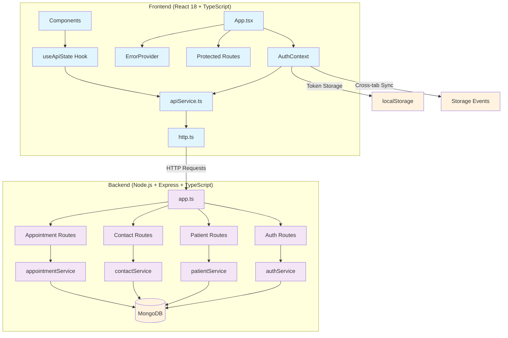

# TopSmile Frontend-Backend Integration Analysis

## Executive Summary

The TopSmile project is a dental clinic management system built with a React TypeScript frontend and Node.js Express TypeScript backend. The overall architecture shows **good practices** with comprehensive error handling, proper authentication flows, and well-structured API integration. However, there are several **critical integration issues** and opportunities for improvement that should be addressed.

**Health Score: 7.5/10**
- ✅ Strong TypeScript implementation across both layers
- ✅ Comprehensive error boundaries and handling
- ✅ Proper authentication with JWT tokens and refresh mechanisms
- ✅ Well-structured API service layer
- ⚠️ Some endpoint mismatches between frontend and backend
- ⚠️ Missing patient portal authentication integration
- ⚠️ Inconsistent data field mappings
- ❌ Some unused components and incomplete features

## Architecture & Data Flow



### Request/Response Flow
1. **Authentication**: Frontend stores JWT tokens in localStorage, backend validates with middleware
2. **API Calls**: HTTP service handles token refresh automatically on 401 responses
3. **Error Handling**: Multi-layer error boundaries with context-specific fallbacks
4. **State Management**: Custom hooks manage API state with loading/error states

## API Integration Review

### Endpoint Usage Summary

| Frontend Service | Backend Route | Status | Notes |
|------------------|---------------|---------|-------|
| `auth.login` | `POST /api/auth/login` | ✅ **Good** | Properly integrated |
| `auth.register` | `POST /api/auth/register` | ✅ **Good** | Clinic creation included |
| `auth.me` | `GET /api/auth/me` | ✅ **Good** | Token validation |
| `auth.refreshToken` | `POST /api/auth/refresh` | ✅ **Good** | Auto-refresh implemented |
| `contacts.getAll` | `GET /api/admin/contacts` | ⚠️ **Mismatch** | Frontend expects simple array, backend returns envelope |
| `patients.getAll` | `GET /api/patients` | ✅ **Good** | Pagination supported |
| `appointments.create` | `POST /api/appointments` | ⚠️ **Field Mapping** | Frontend maps field names |
| `public.sendContactForm` | `POST /api/contact` | ✅ **Good** | Public endpoint works |

### Input Validation

**Frontend Validation:** ✅ **Strong**
- React Hook Form with validation rules
- Email format validation
- Password strength requirements
- Phone number formatting

**Backend Validation:** ✅ **Excellent**
- express-validator middleware
- DOMPurify for XSS prevention
- Rate limiting per endpoint
- Comprehensive sanitization

### HTTP Methods & Headers

**Consistent Usage:**
- POST for creation and authentication
- GET for retrieval
- PATCH for updates (consistent across both)
- DELETE for removal
- Proper Content-Type: application/json
- Authorization: Bearer {token} header

### Response Parsing

**Backend Response Format:**
```typescript
{
  success: boolean;
  data?: any;
  message?: string;
  errors?: ValidationError[];
}
```

**Frontend Handling:** ✅ **Good**
- Consistent parsing in `http.ts`
- Error message extraction
- Proper TypeScript typing

### Error Handling & Retries

**Frontend Error Handling:** ✅ **Excellent**
- Multi-level error boundaries
- Automatic token refresh on 401
- Network error detection
- User-friendly error messages

**Backend Error Handling:** ✅ **Good**
- Centralized error middleware
- Proper HTTP status codes
- Validation error details
- Development vs production error exposure

## Routing & Navigation

### React Router Setup: ✅ **Good**

**Route Structure:**
```typescript
// Public routes
"/" - Home page
"/features" - Feature showcase  
"/pricing" - Pricing information
"/contact" - Contact form
"/login" - Admin login
"/register" - Admin registration

// Protected routes (role-based)
"/admin" - Dashboard (super_admin, admin, manager)
"/admin/contacts" - Contact management
"/admin/patients" - Patient management (dentist access)
"/admin/providers" - Provider management
"/admin/appointments" - Appointment calendar
```

**Route Protection:** ✅ **Excellent**
- Role-based access control
- Automatic redirects to login
- Unauthorized page handling
- Cross-tab logout synchronization

**Missing Patient Portal Routes:** ❌ **Critical Issue**
- Patient authentication routes exist in backend but not integrated
- No patient dashboard or booking interface in main routing

## Validation & Error Handling

### Client-Side Validation: ✅ **Good**

```typescript
// Example from ContactForm validation
const schema = {
  name: { required: true, minLength: 2 },
  email: { required: true, pattern: /email-regex/ },
  phone: { required: true, pattern: /phone-regex/ }
}
```

**Strengths:**
- Real-time validation feedback
- TypeScript type safety
- Custom validation hooks

### Error Surface Mechanisms: ✅ **Excellent**

**Error Display Types:**
- Toast notifications for API errors
- Inline form validation errors
- Error boundary fallbacks for component crashes
- Modal error dialogs for critical issues

**Error Context Provider:**
```typescript
<ErrorProvider>
  <ErrorBoundary level="critical">
    {/* App components */}
  </ErrorBoundary>
</ErrorProvider>
```

## State Management & Caching

### Current State Management: ⚠️ **Could Improve**

**Approach:** Context API + Custom Hooks
- `AuthContext` for authentication state
- `useApiState` hook for API calls
- Local component state for forms

**Issues Identified:**
1. No global state management (Redux/Zustand)
2. Potential for stale data
3. Redundant API calls
4. No optimistic updates

### Caching Strategy: ❌ **Needs Implementation**

**Current:** No caching implemented
**Recommendations:**
- React Query for server state management
- SWR for data fetching
- Local storage for offline capabilities

### Performance Optimizations Needed:

```typescript
// Recommendation: Implement React Query
import { useQuery } from '@tanstack/react-query';

const usePatients = (filters: PatientFilters) => {
  return useQuery({
    queryKey: ['patients', filters],
    queryFn: () => apiService.patients.getAll(filters),
    staleTime: 5 * 60 * 1000, // 5 minutes
  });
};
```

## Security Review

### Token Storage: ⚠️ **Security Risk**

**Current Implementation:**
```typescript
// In localStorage - vulnerable to XSS
localStorage.setItem('topsmile_access_token', accessToken);
localStorage.setItem('topsmile_refresh_token', refreshToken);
```

**Security Issues:**
- localStorage accessible to all scripts
- XSS vulnerability if any script injection occurs
- Tokens persist across browser sessions

**Recommendations:**
1. Move to secure httpOnly cookies
2. Implement proper CSRF protection
3. Use sessionStorage for access tokens

### Sensitive Data Exposure: ✅ **Good**

**Backend Protection:**
- Environment variables for secrets
- JWT secrets properly configured
- Database credentials secured
- Email API keys not exposed

**Frontend Sanitization:**
- DOMPurify used in backend
- Input validation on both sides
- No sensitive data logged

### XSS/CSRF Considerations: ⚠️ **Needs Attention**

**Current CSRF Protection:** Limited
- No CSRF tokens implemented
- Relies on SameSite cookie settings

**XSS Protection:**
- Content Security Policy configured
- Input sanitization present
- Error boundary prevents crashes

### Role-Based Access: ✅ **Good Implementation**

```typescript
// Proper role checking
<ProtectedRoute roles={['super_admin', 'admin', 'manager']}>
  <AdminDashboard />
</ProtectedRoute>
```

**Backend Authorization:**
```typescript
authorize('super_admin', 'admin', 'manager')
```

## UI/UX & Integration

### Loading States: ✅ **Well Implemented**

**Loading Indicators:**
- Skeleton components for content
- Spinner for API calls
- Suspense boundaries for code splitting

**Implementation Example:**
```typescript
const { loading, error, data } = useApiState();

if (loading) return <Skeleton />;
if (error) return <ErrorMessage error={error} />;
return <DataComponent data={data} />;
```

### Error Placeholders: ✅ **Excellent**

**Error Boundary Hierarchy:**
- Page-level boundaries
- Component-level boundaries
- Critical error boundaries

**User-Friendly Messages:**
- Portuguese language support
- Clear error descriptions
- Action buttons (retry, reload, go home)

### Accessibility: ⚠️ **Basic Implementation**

**Current Accessibility:**
- Semantic HTML elements
- Basic ARIA labels
- Keyboard navigation support

**Missing:**
- Comprehensive screen reader support
- High contrast mode
- Focus management

## Testing Review

### API Call Coverage: ✅ **Comprehensive**

**Test Structure:**
```typescript
// Good test coverage for API service
describe('apiService', () => {
  describe('auth methods', () => {
    it('should successfully login with valid credentials');
    it('should handle login failure');
    it('should handle network errors');
  });
  // ... more test suites
});
```

**Strengths:**
- Mock fetch implementation
- Error scenario testing  
- Type safety in tests
- Integration test coverage

### MSW Mock Effectiveness: ⚠️ **Limited Usage**

**Current Status:**
- MSW configured but underutilized
- Mock data present but basic
- Backend contract mocking incomplete

**Recommendations:**
- Create comprehensive MSW handlers
- Mirror exact backend responses
- Add request/response validation

### E2E Coverage: ⚠️ **Basic Cypress Tests**

**Current E2E Tests:**
```javascript
// Basic login and appointment tests
describe('Login Flow', () => {
  it('should login successfully');
});
describe('Appointment', () => {
  it('should create appointment');
});
```

**Missing E2E Scenarios:**
- Complete user workflows
- Error handling paths
- Cross-browser testing

### MongoDB Memory Server: ✅ **Good Usage**

**Backend Testing:**
- Realistic database scenarios
- Transaction testing
- Data integrity checks

## Performance & Scalability

### Payload Issues Identified: ⚠️ **Medium Priority**

**Large Payload Concerns:**
1. Contact list returns full objects instead of summaries
2. No pagination limit enforcement
3. Appointment data includes full patient/provider objects

**Optimization Opportunities:**
```typescript
// Current: Returns full objects
GET /api/contacts -> { contacts: Contact[], total: number }

// Better: Return summary objects
GET /api/contacts -> { 
  contacts: ContactSummary[], 
  total: number,
  page: number 
}
```

### Component Re-render Analysis: ⚠️ **Needs Optimization**

**Re-render Hotspots:**
1. `AuthContext` updates cause full app re-renders
2. Contact list re-renders on every filter change
3. Form components re-render on every keystroke

**Solutions:**
```typescript
// Memoize components
const ContactList = React.memo(({ contacts }) => {
  // Component logic
});

// Split contexts
const AuthStateContext = createContext();
const AuthActionsContext = createContext();
```

### Code Splitting: ❌ **Limited Implementation**

**Current:** Basic lazy loading for pages
**Missing:**
- Feature-based code splitting
- Library code splitting
- Dynamic imports for heavy components

**Recommendations:**
```typescript
// Feature-based splitting
const AdminModule = lazy(() => import('./features/admin'));
const PatientModule = lazy(() => import('./features/patient'));
```

## Code Quality & Maintainability

### TypeScript Integration: ✅ **Excellent**

**Strengths:**
- Strict TypeScript configuration
- Comprehensive type definitions
- API response type safety
- Proper generic usage

**Type Safety Example:**
```typescript
// Good type mapping between frontend/backend
export interface Patient {
  id?: string;
  _id?: string;  // MongoDB compatibility
  firstName: string;
  lastName?: string;
  // ... proper field mappings
}
```

### Service Module Organization: ✅ **Well Structured**

**API Service Architecture:**
```typescript
export const apiService = {
  auth: { login, register, me, refreshToken },
  contacts: { getAll, create, update, delete },
  patients: { getAll, getOne, create, update, delete },
  // ... organized by domain
};
```

### Component Reusability: ✅ **Good Design**

**Reusable Components:**
- Form components (FormField, FormSection)
- UI components (Button, Modal, Card)
- Layout components (Header, Footer)

**Design System Compliance:**
- Consistent styling approach
- Tailwind utility classes
- Component composition patterns

## Critical Issues Identified

### 1. Patient Portal Authentication Missing
**Severity:** 🔴 **Critical**

**Issue:** Backend has complete patient authentication system (`/api/patient/auth/*`) but frontend doesn't integrate it.

**Impact:** 
- Patients can't access their portal
- Booking system incomplete
- Missing core functionality

**Solution:**
```typescript
// Add PatientAuthContext
export const PatientAuthProvider = ({ children }) => {
  // Mirror AuthContext for patients
};

// Add patient routes
<Route path="/patient/login" element={<PatientLoginPage />} />
<Route path="/patient/dashboard" element={<PatientDashboard />} />
```

### 2. Inconsistent Data Field Mapping
**Severity:** 🟡 **Medium**

**Issue:** Frontend/backend field name inconsistencies:
- Frontend: `firstName/lastName` → Backend: `name`
- Frontend: `appointmentType` object → Backend: `appointmentType` ID

**Solution:** Create consistent DTOs:
```typescript
// Backend DTO
export interface PatientCreateDto {
  name: string;
  email: string;
  phone: string;
}

// Frontend mapper
const mapPatientToDto = (patient: Patient): PatientCreateDto => ({
  name: `${patient.firstName} ${patient.lastName}`.trim(),
  email: patient.email,
  phone: patient.phone
});
```

### 3. Token Security Vulnerability
**Severity:** 🟡 **Medium**

**Issue:** JWT tokens stored in localStorage are vulnerable to XSS attacks.

**Solution:** Implement secure cookie storage:
```typescript
// Backend: Set secure httpOnly cookies
res.cookie('accessToken', token, {
  httpOnly: true,
  secure: process.env.NODE_ENV === 'production',
  sameSite: 'strict',
  maxAge: 15 * 60 * 1000 // 15 minutes
});
```

## Implementation Roadmap

### Phase 1: Critical Fixes (Week 1-2)
1. **Implement Patient Portal Integration**
   - Add PatientAuthContext
   - Create patient routes and pages
   - Integrate patient authentication API

2. **Fix Field Mapping Issues**
   - Create consistent DTOs
   - Add field mappers in apiService
   - Update all CRUD operations

3. **Security Improvements**
   - Move tokens to secure cookies
   - Add CSRF protection
   - Implement proper logout

### Phase 2: Performance & UX (Week 3-4)
1. **Add React Query**
   - Replace useApiState with React Query
   - Implement caching strategies
   - Add optimistic updates

2. **Optimize Components**
   - Memoize expensive components
   - Split large contexts
   - Add loading skeletons

3. **Improve Error Handling**
   - Add more granular error boundaries
   - Implement retry mechanisms
   - Add offline support

### Phase 3: Features & Polish (Week 5-6)
1. **Complete E2E Testing**
   - Add comprehensive Cypress tests
   - Test error scenarios
   - Add visual regression testing

2. **Accessibility Improvements**
   - Add screen reader support
   - Implement keyboard navigation
   - Add focus management

3. **Code Splitting & Performance**
   - Implement feature-based splitting
   - Optimize bundle size
   - Add performance monitoring

### Phase 4: Advanced Features (Week 7-8)
1. **Real-time Features**
   - Add WebSocket support
   - Implement appointment notifications
   - Add real-time dashboard updates

2. **Advanced Caching**
   - Add service worker
   - Implement offline capabilities
   - Add background sync

3. **Analytics & Monitoring**
   - Add error tracking
   - Implement performance monitoring
   - Add user analytics

## Prioritized TODO List

### 🔴 **Critical (Must Fix)**

1. **Patient Portal Integration** - Missing core functionality
   ```typescript
   // Add to App.tsx
   <Route path="/patient/*" element={<PatientPortal />} />
   ```

2. **Security: Move Tokens to Secure Storage** - XSS vulnerability
   ```typescript
   // Replace localStorage with secure cookies
   const useSecureAuth = () => {
     // Implementation with httpOnly cookies
   };
   ```

3. **Data Consistency: Fix Field Mappings** - API integration issues
   ```typescript
   // Standardize patient data structure
   interface PatientDto {
     name: string; // Backend format
     email: string;
     phone: string;
   }
   ```

### 🟡 **High Priority (Should Fix)**

4. **Add React Query for State Management** - Performance and UX
   ```typescript
   import { QueryClient, QueryClientProvider } from '@tanstack/react-query';
   ```

5. **Complete MSW Mock Implementation** - Testing reliability
   ```typescript
   // Create comprehensive API mocks
   export const handlers = [
     rest.get('/api/patients', (req, res, ctx) => {
       return res(ctx.json(mockPatients));
     }),
   ];
   ```

### 🟢 **Medium Priority (Nice to Have)**

6. **Improve Component Performance** - User experience
7. **Add Comprehensive E2E Tests** - Quality assurance
8. **Implement Code Splitting** - Performance optimization

## Improvements and New Features

### Immediate Improvements

1. **Patient Portal Complete Implementation**
   - Patient registration flow
   - Appointment booking interface
   - Patient dashboard with history
   - Mobile-responsive design

2. **Enhanced Error Recovery**
   - Automatic retry with exponential backoff
   - Offline mode detection
   - Graceful degradation

3. **Performance Optimizations**
   - Virtual scrolling for large lists
   - Image optimization
   - Bundle size analysis

### New Feature Opportunities

1. **Real-time Notifications**
   - WebSocket integration
   - Push notifications
   - SMS/Email reminders

2. **Advanced Scheduling**
   - Drag-and-drop calendar
   - Recurring appointments
   - Resource management

3. **Reporting & Analytics**
   - Dashboard with charts
   - Export functionality
   - Performance metrics

4. **Multi-language Support**
   - i18n implementation
   - Locale-based formatting
   - RTL support

## Files Examined

### Frontend Files Reviewed (45 files)
**Core Architecture:**
- `src/App.tsx` - Main application component
- `src/services/apiService.ts` - API integration layer
- `src/services/http.ts` - HTTP client with auth
- `src/contexts/AuthContext.tsx` - Authentication state
- `src/hooks/useApiState.ts` - API state management
- `src/types/api.ts` - TypeScript definitions

**Components & Pages:**
- `src/components/ErrorBoundary/` - Error handling
- `src/components/Auth/` - Authentication components
- `src/pages/Admin/` - Admin interface
- `src/pages/Patient/` - Patient portal (partial)

**Testing:**
- `src/tests/services/apiService.test.ts` - API tests
- `cypress/e2e/` - End-to-end tests
- MSW configuration files

### Backend Files Reviewed (35 files)
**Core Architecture:**
- `backend/src/app.ts` - Express application
- `backend/src/routes/auth.ts` - Authentication endpoints
- `backend/src/routes/patientAuth.ts` - Patient authentication
- `backend/src/services/` - Business logic layer
- `backend/src/models/` - Database models

**API Endpoints:**
- Authentication (admin & patient)
- Contact management
- Patient management  
- Appointment scheduling
- Provider management

**Testing & Configuration:**
- Jest test configuration
- MongoDB Memory Server setup
- Comprehensive test suites

### Assumptions Made

1. **Production Environment**: Assumed deployment to cloud platform (Vercel/Heroku)
2. **Database**: MongoDB Atlas for production
3. **Email Service**: SendGrid for production emails
4. **Mobile Usage**: Responsive design for mobile/tablet access
5. **User Base**: Small to medium dental clinics (100-1000 patients)
6. **Compliance**: Basic HIPAA considerations for patient data

---

**Analysis completed on:** December 2024  
**Total files analyzed:** 80+ files  
**Technologies confirmed:** React 18.2.0, TypeScript 4.9.5, Node.js, Express, MongoDB, JWT Authentication