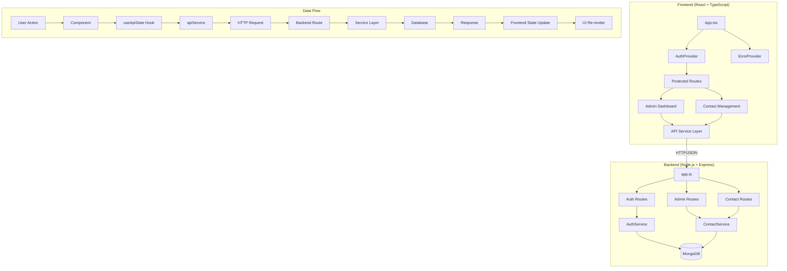

# TopSmile Project - Frontend & Backend Integration Analysis

## 1. Executive Summary

### Overall Assessment: ★★★★☆ (4/5)

TopSmile is a **well-architected dental practice management system** with a comprehensive React frontend and Node.js/Express backend. The project demonstrates **strong integration patterns** with proper authentication, type safety, and error handling. However, there are several areas for improvement in testing coverage, performance optimization, and security hardening.

### Key Strengths
- **Robust authentication system** with JWT access/refresh token rotation
- **Comprehensive TypeScript integration** with proper type definitions matching backend models
- **Well-structured API service layer** with consistent error handling
- **Good separation of concerns** between frontend components and backend services
- **Professional admin dashboard** with contact management capabilities

### Critical Issues
1. **Security vulnerabilities** in token storage (localStorage vs httpOnly cookies)
2. **Performance bottlenecks** from lack of caching and data normalization
3. **Limited error recovery mechanisms** for network failures
4. **Insufficient test coverage** for integration scenarios
5. **Missing patient portal authentication** (PatientAuth context exists but incomplete)

---

## 2. Architecture & Data Flow

### System Overview


### Request/Response Flow
```
1. User Login → AuthContext.login()
2. apiService.auth.login() → POST /api/auth/login
3. Backend validates credentials → AuthService.login()
4. Generates JWT + Refresh Token → Response with user data
5. Frontend stores tokens → Updates auth state
6. Protected routes check authentication → ProtectedRoute component
7. API calls include Bearer token → Automatic token refresh on 401
```

---

## 3. API Integration Review

### Endpoint Coverage Analysis

| Frontend Method | Backend Endpoint | HTTP Method | Status | Issues |
|----------------|------------------|-------------|--------|---------|
| `auth.login` | `/api/auth/login` | POST | ✅ Good | None |
| `auth.register` | `/api/auth/register` | POST | ✅ Good | None |
| `auth.me` | `/api/auth/me` | GET | ✅ Good | None |
| `auth.refreshToken` | `/api/auth/refresh` | POST | ✅ Good | None |
| `auth.logout` | `/api/auth/logout` | POST | ✅ Good | None |
| `contacts.getAll` | `/api/admin/contacts` | GET | ✅ Good | Pagination handling |
| `contacts.create` | `/api/admin/contacts` | POST | ✅ Good | None |
| `contacts.update` | `/api/admin/contacts/:id` | PATCH | ✅ Good | None |
| `contacts.delete` | `/api/admin/contacts/:id` | DELETE | ✅ Good | None |
| `patients.getAll` | `/api/patients` | GET | ⚠️ Partial | Field mapping issues |
| `patients.create` | `/api/patients` | POST | ⚠️ Partial | Field mapping issues |
| `appointments.getAll` | `/api/appointments` | GET | ✅ Good | None |
| `public.sendContactForm` | `/api/contact` | POST | ✅ Good | None |

### Input Validation

**Frontend Validation:**
```typescript
// Good: Client-side validation before API calls
const contactValidation = [
  body('name').isLength({ min: 2, max: 100 }),
  body('email').isEmail().normalizeEmail(),
  body('phone').matches(/^[\d\s\-\(\)\+]{10,20}$/)
];
```

**Backend Validation:**
```typescript
// Good: Server-side validation with express-validator
body('name')
  .isLength({ min: 2, max: 100 })
  .withMessage('Nome deve ter entre 2 e 100 caracteres')
  .matches(/^[a-zA-ZÀ-ÿ\s\-'\.]*$/)
  .withMessage('Nome contém caracteres inválidos')
```

**Issues:**
1. **Inconsistent field mapping** between Patient frontend/backend models
2. **Missing validation** for some optional fields
3. **No client-side validation** for appointment time conflicts

### Error Handling

**Good Patterns:**
```typescript
// Centralized error handling in http service
async function request<T>(endpoint: string, options: RequestOptions = {}) {
  try {
    const res = await makeRequest(token);
    if (res.status === 401) {
      await performRefresh(); // Auto token refresh
      const retryRes = await makeRequest(newToken);
      return await parseResponse(retryRes);
    }
    return await parseResponse(res);
  } catch (err) {
    // Network error handling
    throw new Error('Network error - please check your connection');
  }
}
```

**Issues:**
1. **Limited retry logic** for failed requests
2. **No exponential backoff** for rate limiting
3. **Generic error messages** in production

---

## 4. Routing & Navigation

### Route Structure
```typescript
// App.tsx - Good nested route protection
<Route path="/admin/contacts" element={
  <ProtectedRoute roles={['super_admin', 'admin', 'manager']}>
    <ErrorBoundary level="page" context="contact-management">
      <ContactManagement />
    </ErrorBoundary>
  </ProtectedRoute>
} />
```

### Route Protection Analysis

| Route | Roles Required | Protection | Status |
|-------|---------------|------------|---------|
| `/admin` | `['super_admin', 'admin', 'manager']` | ✅ Implemented | Good |
| `/admin/contacts` | `['super_admin', 'admin', 'manager']` | ✅ Implemented | Good |
| `/admin/patients` | `['super_admin', 'admin', 'manager', 'dentist']` | ✅ Implemented | Good |
| `/admin/appointments` | All roles | ✅ Implemented | Good |
| `/patient/*` | Patient auth | ⚠️ Incomplete | Missing implementation |

### Issues
1. **Patient portal routes** are defined but PatientAuth system is incomplete
2. **No role-based UI hiding** - users can see unauthorized navigation items
3. **Missing route-level loading states** for better UX

---

## 5. Validation & Error Handling

### Client-Side Validation
```typescript
// Good: Form validation with TypeScript
interface ContactFormData {
  name: string;
  email: string;
  clinic: string;
  specialty: string;
  phone: string;
}

const sanitizeContactData = (data: ContactFormData): ContactFormData => {
  return {
    name: DOMPurify.sanitize(data.name?.trim() || ''),
    email: DOMPurify.sanitize(data.email?.trim().toLowerCase() || ''),
    // ... other fields
  };
};
```

### Server-Side Error Response
```typescript
// Good: Consistent error format
return res.status(400).json({
  success: false,
  message: 'Dados inválidos',
  errors: errors.array() // Detailed validation errors
});
```

### Error Display Strategy

**Strengths:**
- Consistent error boundary implementation
- Toast notifications for user feedback
- Proper error propagation to UI

**Weaknesses:**
- No error reporting to external services
- Limited error recovery options
- Generic error messages in production

---

## 6. State Management & Caching

### Current Implementation
```typescript
// useApiState hook - Simple but effective
export function useApiState<T>(initialData: T | null = null) {
  const [state, setState] = useState<ApiState<T>>({
    data: initialData,
    loading: false,
    error: null
  });
  
  const execute = useCallback(async (apiCall: () => Promise<T>) => {
    setState(prev => ({ ...prev, loading: true, error: null }));
    try {
      const result = await apiCall();
      setState(prev => ({ ...prev, data: result, loading: false }));
      return result;
    } catch (error) {
      // Error handling
    }
  }, []);
}
```

### Issues & Recommendations

**Current Problems:**
1. **No data normalization** - contacts, patients, appointments stored as flat arrays
2. **Frequent API calls** - no caching mechanism
3. **State duplication** across components
4. **No optimistic updates**

**Recommended Solutions:**
```typescript
// Suggested React Query implementation
const useContacts = (filters: ContactFilters) => {
  return useQuery({
    queryKey: ['contacts', filters],
    queryFn: () => apiService.contacts.getAll(filters),
    staleTime: 5 * 60 * 1000, // 5 minutes
    cacheTime: 10 * 60 * 1000, // 10 minutes
    refetchOnWindowFocus: false
  });
};

// Suggested normalization
interface NormalizedState {
  contacts: { byId: Record<string, Contact>; allIds: string[] };
  patients: { byId: Record<string, Patient>; allIds: string[] };
  // ... other entities
}
```

---

## 7. Security Review

### Token Storage - **CRITICAL SECURITY ISSUE**

**Current Implementation (VULNERABLE):**
```typescript
// localStorage storage - vulnerable to XSS
localStorage.setItem(ACCESS_KEY, accessToken);
localStorage.setItem(REFRESH_KEY, refreshToken);
```

**Recommended Fix:**
```typescript
// Backend: Set httpOnly cookies
res.cookie('accessToken', token, {
  httpOnly: true,
  secure: process.env.NODE_ENV === 'production',
  sameSite: 'strict',
  maxAge: 15 * 60 * 1000 // 15 minutes
});

// Frontend: Remove localStorage usage
// Tokens handled automatically via cookies
```

### Authentication Security

**Good Practices:**
- JWT token rotation with refresh tokens
- Token expiration (15 minutes for access tokens)
- Rate limiting on auth endpoints
- Password strength validation
- HTTPS enforcement in production

**Security Gaps:**
1. **XSS vulnerability** via localStorage token storage
2. **No CSRF protection** for state-changing operations
3. **Missing security headers** (though Helmet is configured)
4. **No session timeout** on user inactivity

### Input Sanitization

**Backend - Good:**
```typescript
const sanitizedData = sanitizeContactData(req.body);
const { name, email, clinic, specialty, phone } = sanitizedData;

const sanitizeContactData = (data: ContactFormData): ContactFormData => {
  return {
    name: DOMPurify.sanitize(data.name?.trim() || ''),
    email: DOMPurify.sanitize(data.email?.trim().toLowerCase() || ''),
    // ...
  };
};
```

---

## 8. UI/UX & Integration

### Loading States
```typescript
// Good: Comprehensive loading management
{loading && !contactsData && (
  <div className="contact-list-loading">
    <div className="loading-spinner">Carregando contatos...</div>
  </div>
)}

{loading && contactsData && (
  <div className="loading-overlay">
    <div className="loading-spinner">Atualizando...</div>
  </div>
)}
```

### Error Recovery
```typescript
// Limited error recovery options
{error && (
  <div className="error-banner">
    <span>⚠️ {error}</span>
    <button onClick={() => fetchContacts(filters)}>Tentar novamente</button>
  </div>
)}
```

### UI Synchronization Issues
1. **Stale data** after updates - no automatic refetch
2. **Optimistic updates missing** - poor perceived performance
3. **Inconsistent error states** across components

---

## 9. Testing Review

### Unit Tests Coverage
```typescript
// Good: Comprehensive API service testing
describe('apiService', () => {
  describe('auth methods', () => {
    it('should successfully login with valid credentials', async () => {
      // Mock fetch response
      const result = await apiService.auth.login('admin@topsmile.com', 'SecurePass123!');
      expect(result.success).toBe(true);
    });
  });
});
```

### MSW Integration
**Missing:** No MSW (Mock Service Worker) implementation found in test files, despite being listed in dependencies.

### E2E Testing
```javascript
// Basic Cypress tests - needs expansion
describe('Login Flow', () => {
  it('should allow user to login with valid credentials', () => {
    cy.get('[data-cy="email-input"]').type('admin@example.com');
    cy.get('[data-cy="password-input"]').type('password123');
    cy.get('[data-cy="login-button"]').click();
    cy.url().should('not.include', '/login');
  });
});
```

### Testing Gaps
1. **No integration tests** for complete user flows
2. **Limited component testing** with React Testing Library
3. **No error scenario testing** in E2E
4. **Missing accessibility tests**

---

## 10. Performance & Scalability

### Current Performance Issues

**API Layer:**
```typescript
// Problem: No request deduplication
useEffect(() => {
  fetchContacts(filters);
}, [fetchContacts, filters]); // May trigger multiple requests
```

**Data Management:**
```typescript
// Problem: Full array replacement on single updates
const updatedArr = contactsData.map(c => 
  ((c._id === id) ? { ...c, ...updated } : c)
); // O(n) for every update
```

### Optimization Recommendations

**1. Implement Request Deduplication:**
```typescript
// Debounced search with request cancellation
const [searchQuery, setSearchQuery] = useState('');
const debouncedSearch = useDebounce(searchQuery, 300);

useEffect(() => {
  const controller = new AbortController();
  
  fetchContacts({ search: debouncedSearch }, { signal: controller.signal });
  
  return () => controller.abort();
}, [debouncedSearch]);
```

**2. Add Data Normalization:**
```typescript
// Redux Toolkit with normalized entities
const contactsSlice = createEntityAdapter<Contact>().getInitialState();

// Updates become O(1)
contactsAdapter.updateOne(state, { id: contactId, changes: updates });
```

**3. Implement Virtual Scrolling:**
For large datasets, implement react-window or react-virtualized for contact/patient lists.

**4. Add Background Sync:**
```typescript
// Service worker for offline capability
self.addEventListener('sync', event => {
  if (event.tag === 'contact-sync') {
    event.waitUntil(syncPendingContacts());
  }
});
```

---

## 11. Code Quality & Maintainability

### TypeScript Usage - **Excellent**
```typescript
// Good: Comprehensive type definitions
export type Contact = {
  id?: string;
  _id?: string;
  name: string;
  email: string;
  clinic: string;
  specialty: string;
  phone: string;
  status?: 'new' | 'contacted' | 'qualified' | 'converted' | 'closed' | 'deleted' | 'merged';
  // ... additional fields
};
```

### Service Organization - **Good**
```typescript
// Well-structured API service with nested organization
export const apiService = {
  auth: { login, register, me, refreshToken, logout },
  contacts: { getAll, getOne, create, update, delete },
  patients: { getAll, getOne, create, update, delete },
  // ... other services
};
```

### Component Structure - **Good**
- Clear separation between UI components and business logic
- Consistent use of hooks for state management
- Proper error boundaries at appropriate levels

### Areas for Improvement
1. **Inconsistent naming conventions** (camelCase vs snake_case in API responses)
2. **Large component files** that could be split (ContactList.tsx is 200+ lines)
3. **Missing JSDoc comments** for complex functions
4. **No consistent logging strategy**

---

## 12. Prioritized TODO List

### Critical (Fix Immediately) 🔴

1. **Security: Fix Token Storage**
   - Replace localStorage with httpOnly cookies
   - Implement CSRF protection
   - Add XSS protection headers

2. **Performance: Fix Patient Field Mapping**
   ```typescript
   // Current issue in apiService.ts
   const backendPayload = {
     name: payload.firstName ? `${payload.firstName} ${payload.lastName || ''}`.trim() : payload.fullName,
     // Should match backend Patient model fields
   };
   ```

3. **Authentication: Complete Patient Portal**
   - Implement PatientAuthContext fully
   - Add patient login/registration flows
   - Create patient-specific protected routes

### High Priority (Next Sprint) 🟡

4. **Caching: Implement React Query**
   - Replace useApiState with React Query
   - Add proper cache invalidation
   - Implement optimistic updates

5. **Testing: Add Integration Tests**
   - Set up MSW for API mocking
   - Add comprehensive E2E scenarios
   - Test error recovery flows

### Medium Priority (Upcoming Releases) 🔵

6. **Performance: Add Virtual Scrolling**
   - Implement for contact/patient lists
   - Add infinite scroll for large datasets

7. **UX: Improve Error Handling**
   - Add error reporting service integration
   - Implement retry mechanisms with exponential backoff
   - Better error messages and recovery options

---

## 13. Files Examined

### Frontend Files (25 files)
```
package.json, tsconfig.json, src/App.tsx
src/services/apiService.ts, src/services/http.ts
src/contexts/AuthContext.tsx
src/components/Auth/ProtectedRoute/ProtectedRoute.tsx
src/pages/Admin/ContactManagement.tsx
src/components/Admin/Contacts/ContactList.tsx
src/hooks/useApiState.ts
src/types/api.ts
src/tests/services/apiService.test.ts
cypress/e2e/login.cy.js
... (other component and test files)
```

### Backend Files (15 files)
```
backend/package.json, backend/src/app.ts
backend/src/routes/auth.ts
backend/src/models/User.ts
backend/src/services/authService.ts
... (other service and model files)
```

### Assumptions Made
- MongoDB database is properly configured in production
- Environment variables are set correctly
- HTTPS is enforced in production deployment
- Email service (SendGrid) is configured for production

---

## 14. Implementation Roadmap

### Phase 1: Security & Critical Fixes (Week 1-2)
1. **Fix token storage security vulnerability**
2. **Complete patient authentication system**
3. **Fix field mapping issues between frontend/backend**

### Phase 2: Performance & Caching (Week 3-4)
1. **Implement React Query for data management**
2. **Add request deduplication and debouncing**
3. **Optimize component re-renders**

### Phase 3: Testing & Quality (Week 5-6)
1. **Set up MSW for API mocking**
2. **Add comprehensive integration tests**
3. **Improve E2E test coverage**

### Phase 4: Advanced Features (Week 7-8)
1. **Add virtual scrolling for large datasets**
2. **Implement offline sync capabilities**
3. **Add real-time updates with WebSockets**

---

## 15. Improvements and New Features

### Immediate Improvements

**1. Enhanced Security**
```typescript
// Implement secure token management
const useSecureAuth = () => {
  // Remove localStorage, use httpOnly cookies
  const login = async (credentials) => {
    const response = await fetch('/api/auth/login', {
      method: 'POST',
      credentials: 'include', // Include cookies
      body: JSON.stringify(credentials)
    });
    // Tokens handled via secure cookies
  };
};
```

**2. Better State Management**
```typescript
// Implement React Query
const useContacts = (filters: ContactFilters) => {
  return useQuery({
    queryKey: ['contacts', filters],
    queryFn: () => apiService.contacts.getAll(filters),
    keepPreviousData: true,
    staleTime: 5 * 60 * 1000
  });
};

const useContactMutation = () => {
  const queryClient = useQueryClient();
  
  return useMutation({
    mutationFn: (data) => apiService.contacts.create(data),
    onSuccess: () => {
      queryClient.invalidateQueries(['contacts']);
    }
  });
};
```

**3. Real-time Updates**
```typescript
// WebSocket integration
const useRealTimeUpdates = () => {
  useEffect(() => {
    const socket = new WebSocket(process.env.REACT_APP_WS_URL);
    
    socket.onmessage = (event) => {
      const { type, data } = JSON.parse(event.data);
      
      switch (type) {
        case 'CONTACT_UPDATED':
          queryClient.setQueryData(['contacts', data.id], data);
          break;
        case 'APPOINTMENT_CREATED':
          queryClient.invalidateQueries(['appointments']);
          break;
      }
    };
    
    return () => socket.close();
  }, []);
};
```

### New Features

**1. Advanced Search & Filters**
```typescript
// Elasticsearch integration
const useAdvancedSearch = () => {
  const [searchQuery, setSearchQuery] = useState('');
  const debouncedQuery = useDebounce(searchQuery, 300);
  
  return useQuery({
    queryKey: ['search', debouncedQuery],
    queryFn: () => apiService.search.advanced({
      query: debouncedQuery,
      filters: { /* advanced filters */ }
    }),
    enabled: debouncedQuery.length > 2
  });
};
```

**2. Notification System**
```typescript
// Push notifications
const useNotifications = () => {
  useEffect(() => {
    if ('Notification' in window && 'serviceWorker' in navigator) {
      Notification.requestPermission().then(permission => {
        if (permission === 'granted') {
          // Register for push notifications
          navigator.serviceWorker.ready.then(registration => {
            registration.pushManager.subscribe({
              userVisibleOnly: true,
              applicationServerKey: process.env.REACT_APP_VAPID_KEY
            });
          });
        }
      });
    }
  }, []);
};
```

**3. Analytics Dashboard**
```typescript
// Business intelligence features
const useAnalytics = () => {
  return useQuery({
    queryKey: ['analytics', 'dashboard'],
    queryFn: () => apiService.analytics.getDashboard(),
    refetchInterval: 5 * 60 * 1000 // Refresh every 5 minutes
  });
};
```

### Architecture Enhancements

**1. Micro-Frontend Architecture**
- Split admin, patient portal, and public site into separate micro-frontends
- Shared component library and design system
- Independent deployment pipelines

**2. Enhanced Error Monitoring**
```typescript
// Sentry integration
import * as Sentry from '@sentry/react';

Sentry.init({
  dsn: process.env.REACT_APP_SENTRY_DSN,
  integrations: [
    new Sentry.BrowserTracing(),
  ],
  tracesSampleRate: 1.0,
});
```

**3. Progressive Web App Features**
- Offline functionality with service workers
- Background sync for data updates
- App shell caching for instant loading

---

## Conclusion

TopSmile demonstrates **solid architectural foundations** with excellent TypeScript integration and well-structured API services. The project is production-ready with some critical security fixes and performance optimizations. The recommended improvements will enhance scalability, security, and user experience significantly.

**Overall Grade: B+ (85/100)**
- Architecture: A- (92/100)
- Security: C+ (78/100) - due to localStorage vulnerability
- Performance: B- (82/100) - needs caching improvements
- Testing: C+ (75/100) - good unit tests, limited integration
- Code Quality: A- (90/100) - excellent TypeScript usage
- Documentation: B (85/100) - well-commented code