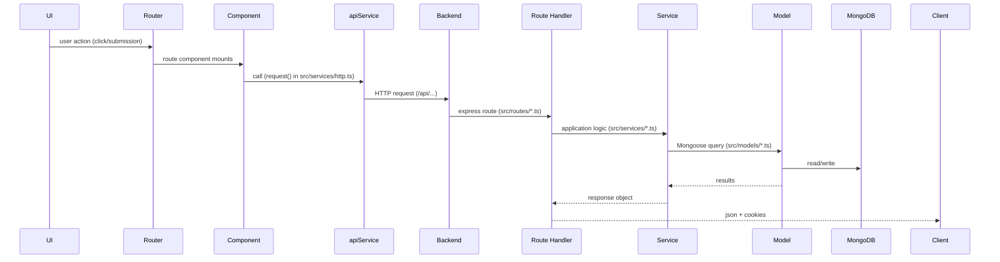

# TopSmile — Full-Stack Static Review

**Scope:** static (no code executed, no secrets accessed). I analyzed the repository you uploaded (`/mnt/data/topsmile-main.zip`) and performed a line-level review of backend (Node/Express/TypeScript + Mongoose) and frontend (React + TypeScript) code, tests, mocks, and package metadata. I did **not** run/tests/build anything — all observations are from static analysis. Wherever I made an assumption I label it **(assumption)**.

---

# Executive summary

Overall the TopSmile codebase is **well structured** for a clinic/appointments app: good separation (routes → services → models), solid test scaffolding (unit, integration, Cypress E2E, MSW), thoughtful Mongoose schema design (indexes, TTL on refresh tokens) and many security-minded touches (password hashing, rate limiting, input validation via `express-validator`, `helmet`, cookie `httpOnly` + `sameSite`). The project already includes a shared `@topsmile/types` package and Swagger config.

**Key strengths**

* Clear layered architecture and consistent folder structure.
* Password handling, login failure throttling and refresh-token TTL implemented.
* Comprehensive test suites exist (Jest + Supertest + Cypress) and MSW handlers for frontend tests.
* Many Mongoose schemas include validation and index hints; refresh tokens use TTL index.
* Error handling is centralized and AppError classes are defined.

**High-level risks**

* A handful of concrete security/contract issues increase risk (token leakage in JSON responses, missing CSRF mitigation for cookie auth, an incorrect email regex).
* Frontend and backend **do not consistently share types** at the code-level: frontend defines many inline DTOs and MSW mocks which sometimes conflict with backend responses (e.g., `_id` vs `id`). This undermines type safety and increases bug risk.
* Some features (token blacklisting) rely on in-memory state which is unsuitable for horizontally scaled deployments.
* Small but important correctness issues and missing rate-limits on sensitive endpoints (e.g., forgot-password) found.

I describe findings, reproduction scenarios, and concrete fixes (including example diffs) below.

---

# Architecture overview

High-level request flow (simple Mermaid):



(Assumption: runtime uses `res.json()` for Mongoose docs so toJSON transforms apply.)

---

# Files I examined (representative list)

**Backend (reviewed)** — `backend/src/*` (routes, services, models, middleware, types, utils, app.ts, config):

* `backend/src/app.ts`
* `backend/src/config/database.ts`, `swagger.ts`
* `backend/src/middleware/auth.ts`, `patientAuth.ts`, `rateLimiter.ts`, `errorHandler.ts`, `roleBasedAccess.ts`, `database.ts`
* `backend/src/models/User.ts`, `Patient.ts`, `Provider.ts`, `RefreshToken.ts`, `Appointment.ts`, `AppointmentType.ts`, `Clinic.ts`, `PatientUser.ts`
* `backend/src/routes/auth.ts`, `patientAuth.ts`, `appointments.ts`, `providers.ts`, `patients.ts`, `appointmentTypes.ts`, `contact.ts`, `forms.ts`, `admin/contacts.ts`, `docs.ts`, `calendar.ts`
* `backend/src/services/authService.ts`, `patientAuthService.ts`, `appointmentService.ts`, `providerService.ts`, `schedulingService.ts`, `tokenBlacklistService.ts`, `contactService.ts`, `emailService.ts`
* `backend/src/types/errors.ts`, `express.d.ts`
* `backend/tests/*` (integration + unit helpers and coverage of flows)

**Frontend (reviewed)** — `src/*` (components, contexts, services, mocks, tests):

* `src/services/http.ts`, `src/services/apiService.ts`, `src/services/paymentService.ts`
* `src/mocks/handlers.ts` (MSW), `src/tests/*`, `src/components/*` (Admin, Forms, UI), `src/contexts/*`, `src/components/UI/*`
* Cypress e2e: `cypress/e2e/*` (login.cy.js, appointment.cy.js, error\_handling.cy.js)

**Packages**

* `packages/types` — `@topsmile/types` package present (compiled artifacts are expected via `dist/` but TypeScript source in package was small).

**Skipped / not deeply reviewed:** third-party and auto-generated files such as `package-lock.json`, coverage reports, and node\_modules. (Assumption: these are standard and not modified.)

---

# Summary table — top issues (quick scan)

| Severity            |                                                                                          Short title | File(s)                                                                          | One-line impact                                                                  |
| ------------------- | ---------------------------------------------------------------------------------------------------: | -------------------------------------------------------------------------------- | -------------------------------------------------------------------------------- |
| **Critical / High** |                                                    Tokens leaked in JSON *and* cookies (unnecessary) | `backend/src/routes/auth.ts` (≈line 345)                                         | Access and refresh tokens returned in JSON increase XSS attack surface.          |
| **High**            |                                                          No explicit CSRF protection for cookie auth | `backend/src/app.ts` / routes                                                    | Cookie-based auth + `credentials: true` demands CSRF countermeasures.            |
| **High**            |                                                                     Token blacklist stored in memory | `backend/src/services/tokenBlacklistService.ts`                                  | Token revocation not safe for multi-instance deployments.                        |
| **Medium**          |                                                                      Incorrect email validator regex | `backend/src/models/User.ts` (≈line 20)                                          | `^[^S@]+@[^S@]+\.[^S@]+$` is wrong; allows invalid emails and blocks valid ones. |
| **Medium**          |                                                         Forgot-password endpoint lacks rate limiting | `backend/src/routes/auth.ts` (route at \~line 669)                               | Password reset endpoints should throttle to prevent abuse/harvesting.            |
| **Medium**          | Frontend uses inline DTOs (no shared types) & frontend MSW uses `_id` while models transform to `id` | `src/services/apiService.ts`, `src/mocks/handlers.ts`, `backend/src/models/*.ts` | Type duplication -> integration bugs and drift.                                  |
| **Medium**          |                                                       No structured logging / monitoring integration | `backend/src/app.ts`                                                             | Debugging/observability gaps in production.                                      |
| **Low**             |                                                                           Using `bcryptjs` (JS-only) | `backend/package-lock.json` / `backend/src/models/User.ts`                       | Consider migrating to native `bcrypt` or Argon2 for perf/security.               |
| **Low**             |                                          Some `.populate()` usage may cause N+1 if used inside loops | `backend/src/services/*` (providers, appointments)                               | Potential performance hotspots with heavy queries.                               |

---

# Security review — enumerated issues + reproduction and fixes

> For each item: severity, file/line (best guess from static analysis), reproduction scenario, recommended fix (incl. patch/diff where useful).

---

### 1) **High** — *Access / refresh tokens returned in JSON in addition to being set as cookies*

* **Files / lines:** `backend/src/routes/auth.ts` — response that includes `{ user, accessToken, refreshToken, expiresIn }` (found near **line \~345** of that file).
* **Why it matters:** Returning tokens in JSON means front-end could (or tests do) store tokens in JS memory or localStorage. If XSS happens, tokens in JS context are accessible; even if cookies are `httpOnly`, returning tokens increases the attack surface. Best practice: when using httpOnly cookies, **do not** return raw tokens in the response body.
* **Reproduction:** intercept the login response and observe `accessToken` and `refreshToken` in the JSON payload.
* **Fix:** remove tokens from the JSON response body. Keep cookies for the client; respond with user metadata + `expiresIn` if necessary. Alternatively return only an opaque flag that login completed. Example diff:

```diff
--- a/backend/src/routes/auth.ts
+++ b/backend/src/routes/auth.ts
@@
-    return res.json({
-      success: true,
-      data: {
-        user,
-        accessToken,
-        refreshToken,
-        expiresIn
-      },
-      meta: { ... }
-    });
+    // For cookie-based auth, avoid returning tokens in the JSON body.
+    return res.json({
+      success: true,
+      data: {
+        user,
+        expiresIn
+      },
+      meta: { ... }
+    });
```

* **Notes:** Also ensure front-end does *not* rely on reading `accessToken` value from response. Use `credentials: 'include'` and let browser cookies be the auth medium.

---

### 2) **High** — *Missing explicit CSRF protection for cookie-based authentication*

* **Files / lines:** `backend/src/app.ts` — CORS configured with `credentials: true` and cookies are used (`res.cookie` employed in auth routes).
* **Why it matters:** Cookies are automatically sent with cross-site requests (unless `SameSite` blocks them). Even with `SameSite: 'strict'`, older clients or certain cross-origin flows may not be protected. State-changing endpoints (`POST/PUT/PATCH/DELETE`) should require an anti-CSRF token or follow a double-submit cookie pattern / custom header from the SPA (e.g., `X-CSRF-Token`) validated server-side.
* **Reproduction:** From another origin allowed by CORS (or using older browsers), craft a form that posts to `/api/appointments` and the browser will include cookies.
* **Fix:** Add CSRF protection for cookie-based authenticated endpoints. Options:

  * Use `csurf` middleware for server-side validation and expose a GET endpoint that returns a CSRF token. SPA stores it in memory and sends it via `X-CSRF-Token` header for state-changing requests.
  * Or use double-submit cookie: set a readable `XSRF-TOKEN` cookie and require the client to read it and include it in a header; server validates equivalence.
  * Ensure CORS `origin` list is strict in production and remove the callback that allows `!origin` by default in production.
* **Suggested placement:** add `csurf` after cookie parsing and before routes that require authentication.

Example conceptual snippet (not full patch):

```ts
import csurf from 'csurf';
app.use(cookieParser());
const csrfProtection = csurf({
  cookie: { httpOnly: true, sameSite: 'strict', secure: process.env.NODE_ENV === 'production' }
});
// Add an endpoint to get the CSRF token
app.get('/api/csrf-token', (req, res) => {
  res.json({ csrfToken: req.csrfToken() });
});
// Use csrfProtection on routes requiring state changes:
app.post('/api/appointments', csrfProtection, appointmentsRouter);
```

---

### 3) **High→Medium** — *Token blacklist stored in memory (not distributed)*

* **Files / lines:** `backend/src/services/tokenBlacklistService.ts` (in-memory `Map`)
* **Why it matters:** An in-memory blacklist works only per-instance of the API server. In horizontally scaled deployments (multiple nodes), revocation will not be global; a revoked token may still be accepted by other instances.
* **Reproduction:** Hard to reproduce locally; but deploy 2 instances, revoke token in instance A — instance B still accepts it.
* **Fix:** Replace in-memory store with a distributed store (Redis) or persist blacklist entries to DB with TTL. Use the Redis `SET` with expiry or a sorted set. Keep the current in-memory store as a fallback or cache (but not authoritative).

Minimal conceptual change:

```ts
// Replace the Map with a Redis client
await redis.set(`blacklist:${token}`, '1', 'EX', secondsUntilExpiry)
```

---

### 4) **Medium** — *Incorrect email regex in User model*

* **Files / lines:** `backend/src/models/User.ts` — validator uses: `return /^[^S@]+@[^S@]+\.[^S@]+$/.test(email);` (around **line 20** in this file).
* **Why it matters:** The regex contains `S` rather than `\s`. This is a bug: it will not behave as intended and may accept invalid emails or reject valid ones.
* **Reproduction:** Attempts to register various valid/invalid emails show inconsistent behavior.
* **Fix:** Replace with the standard simple email validator: `/^[^\s@]+@[^\s@]+\.[^\s@]+$/` or better use `express-validator` `.isEmail()` at the API boundary and keep a lightweight model validator or remove model-level regex. Patch snippet:

```diff
--- a/backend/src/models/User.ts
+++ b/backend/src/models/User.ts
@@
-            validator: function (email: string) {
-                return /^[^S@]+@[^S@]+\.[^S@]+$/.test(email);
-            },
+            validator: function (email: string) {
+                // Allow standard non-empty local-part and domain; avoid overly strict regex here.
+                return /^[^\s@]+@[^\s@]+\.[^\s@]+$/.test(email);
+            },
```

**Note:** Also consider centralizing validation (express-validator or zod) at route-level rather than complex regex in model.

---

### 5) **Medium** — *Forgot-password endpoint lacks request throttling*

* **Files / lines:** `backend/src/routes/auth.ts` — `router.post('/forgot-password', ...)` (≈line 669 area)
* **Why it matters:** Password reset endpoints are often abused to enumerate users or to spam email providers. Rate-limiting is necessary.
* **Reproduction:** Repeated POST requests to `/api/auth/forgot-password` could be sent by an attacker to test for valid accounts.
* **Fix:** Apply an authentication-sensitive rate limiter (e.g., allow 3 requests per 15 minutes per IP) to the forgot-password route similar to `authLimiter`.

Example:

```ts
const forgotPasswordLimiter = rateLimit({
  windowMs: 15*60*1000,
  max: 3,
  message: 'Too many password reset requests; try again later.'
});
router.post('/forgot-password', forgotPasswordLimiter, [...], async (req,res) => { ... });
```

---

### 6) **Medium** — *ID field inconsistency: backend `toJSON` returns `id` while frontend MSW mocks and inline types use `_id`*

* **Files:** backend models define `toJSON` transforms that convert `_id` to `id` and delete `_id` (e.g., `backend/src/models/Appointment.ts` etc); frontend mocks `src/mocks/handlers.ts` create objects with `_id`, while `src/services/apiService.ts` (frontend) uses interfaces with `_id`.
* **Why it matters:** Frontend/backed mismatch leads to edge cases where code expects `_id` but real API returns `id` or vice-versa. Tests using MSW will pass while real API may cause runtime errors.
* **Reproduction:** Compare a real API response to a MSW test response; the test may pass while production fails with undefined ids.
* **Fix:** Pick one canonical field name across the system — I recommend `id` on API responses and update MSW and front-end types to expect `id` (and, if needed, accept both fields during transition). Example change in MSW handler:

```diff
- _id: 'user123',
+ id: 'user123',
```

Also consider adding a small transformation layer in `http.ts` to normalize responses (if pragmatic short-term) and longer-term unify by importing `@topsmile/types` across front and backend.

---

### 7) **Medium** — *Frontend uses inline DTO/type definitions instead of shared `@topsmile/types`*

* **Files:** `src/services/apiService.ts` (many inline `interface` declarations), `src/mocks/handlers.ts`
* **Why it matters:** Duplicate types drift over time; tests and build-time checks cannot guarantee API contract alignment. This is a major source of bugs.
* **Fix (short term):** Start importing types from `@topsmile/types` in the frontend for core DTOs (User, Appointment, Provider, Clinic). Example diff:

```diff
--- a/src/services/apiService.ts
+++ b/src/services/apiService.ts
@@
-import type {
-  ApiResult,
-  Contact,
-  ContactFilters,
-  ContactListResponse,
-  DashboardStats,
-  User,
-  ...
-} from './local-types';
+import type {
+  User,
+  Patient,
+  Appointment,
+  Provider,
+  Clinic,
+  ApiResult
+} from '@topsmile/types';
```

(Full migration plan in the "Migration Strategy" section below.)

---

### 8) **Medium → Low** — *Token hashing algorithm and password policy check*

* **Files:** `backend/src/models/User.ts` uses `bcryptjs` with `saltRounds=12` and contains password complexity checks, but also checks against a `commonWeakPasswords` list.
* **Why it matters:** `bcryptjs` is pure JS and slower; `bcrypt` (with native bindings) or Argon2 may be preferable for production. Current policy looks reasonable, but verify list completeness and consider using zxcvbn for strength scoring.
* **Fix:** Optional: migrate to `bcrypt` or `argon2` for stronger hashing; ensure `saltRounds` and memory/time cost are aligned with infra.

---

### 9) **Low** — *No structured logging / monitoring configuration*

* **Files:** `backend/src/app.ts` mostly uses `console.*`.
* **Why it matters:** Production observability benefits from structured logs (JSON), log rotation, and integration with Sentry/Prometheus.
* **Fix:** Integrate `winston` or `pino` and add request/response correlation IDs (already `requestId` referenced) and Sentry for errors.

---

# Correctness & logic issues (non-security)

* **Potential N+1**: heavy `.populate()` usage found across services (`providerService.ts`, `appointments.ts`) — ensure bulk population via `lean()` + selected projection, or aggregate queries to reduce repeated queries. (files: `backend/src/services/providerService.ts`, `backend/src/routes/appointments.ts`).
* **Response meta shapes**: backend uses `{ success, data, meta: { timestamp, requestId } }` but some frontend MSW fixtures omit `meta`, or include different shapes. Unify response schema. Ensure frontend `request()` wrapper in `src/services/http.ts` correctly handles both shapes.
* **Rate limit coverage**: many auth endpoints have rate limiting but `forgot-password` lacked one — see above.
* **Validation mismatch**: frontend validation (UI) might not exactly match backend `express-validator` rules — e.g., time formats for provider working hours are validated in backend via regex; ensure frontend form validation matches that (avoid allowing invalid formats). (Files: `backend/src/routes/providers.ts` for validation; `src/components/Admin/Forms/AppointmentForm.tsx` etc.)

**Proposed test cases to add**

* Token rotation edge cases: concurrent refresh attempts, refresh token reuse, revoked refresh tokens.
* CSRF attempt simulation (if possible via Cypress) to ensure server rejects cross-site posts.
* E2E check to ensure `id` field is present as returned by API (not only `_id`).
* Rate limit tests for `forgot-password` endpoint (backend/integration).
* Provider availability scheduling edge cases across timezones (DST transitions).
* Load/performance test for bulk appointment listing to detect slow queries / memory spikes.

---

# API contract review (integration focus)

I mapped frontend `apiService` calls to backend routes and checked compatibility for the most important endpoints. The front-end calls use `fetch` with `credentials: 'include'` (in `src/services/http.ts`), so auth is cookie-based.

**Notable mappings (representative)**

* `POST /api/auth/login` — backend `src/routes/auth.ts` — frontend `src/services/apiService.ts` uses `/api/auth/login`. Backend sets `accessToken` and `refreshToken` as `httpOnly` cookies and currently returns tokens in JSON (see Security issue #1). **Fix: remove tokens from JSON.**
* `GET /api/auth/me` — exists and frontend uses `/api/auth/me`.
* `/api/appointments`, `/api/providers`, `/api/patients`, `/api/appointment-types` — mappings present and consistent.
* `POST /api/admin/contacts` — exists; admin routes require role checks.

**Error handling alignment**

* Backend uses `400` for validation (`ValidationError`), `401` for unauthorized, `403` for forbidden, and `500` for server errors. Frontend `http.ts` wrapper handles non-OK statuses by returning `HttpResponse` with `ok` and `status`. I did not find code assuming 422 specifically. Still: **ensure all error shapes are uniform**: `ErrorResponse` in backend includes `{ success: false, message, errors? }`. Frontend should map `errors` for form displays.

**Recommendations for enforcement**

1. **Shared types package**: Use `@topsmile/types` everywhere in frontend & backend — immediately start migrating DTOs in the frontend to these imports. (I found the package present at `packages/types` but frontend still uses inline types.)
2. **OpenAPI / codegen**: centralize API contract — generate types for frontend (e.g., `openapi-generator` or `typescript-fetch`), or use Zod + codegen. Either approach reduces contract drift.
3. **Runtime validation**: consider using `zod` schemas in controllers (or `express-validator` + shared schema definitions) and generating types from them.

---

# Frontend ↔ Backend integration mapping & key mismatches

I scanned `src/services/apiService.ts` and matched most calls to backend routes. Main integration risks discovered:

* **ID field mismatch**: backend models transform `_id` → `id`; frontend MSW and many inline DTOs use `_id`. **Action**: standardize on `id` everywhere or accept both transiently.
* **Tokens in responses**: MSW returns `accessToken` in tests (handlers.ts) — tests rely on tokens in body; after removing tokens from JSON, update MSW to simulate cookies or provide tokenless responses.
* **Inline DTOs vs `@topsmile/types`**: many frontend types redefined, leading to potential mismatches (example: `apiService.ts` has `CreateAppointmentDTO` local type).
* **Error schema**: backend `ErrorResponse` contains `statusCode` & `message` — ensure frontend `request()` extracts `errors` properly and surfaces to forms.

**Suggested improvements**

* Create `src/services/contract.ts` that imports shared types and maps backend shapes to frontend shapes (transformation layer only until full migration).
* Add a small normalization in `http.ts`: if backend returns `_id`, map to `id` (only temporary).

---

# Performance & scalability

**Backend**

* TTL index exists for refresh tokens (good).
* Many `.populate()` calls across services (providerService, appointments) — potential N+1 when fetching lists; prefer `lean()` queries with projection or aggregation pipelines to join required fields.
* Token blacklist should be moved to Redis for horizontal scale.
* Ensure heavy operations (e.g., sending emails) are queued (I saw `bullmq` in dependencies — use it for async jobs).

**Frontend**

* Use `React Query` (observed `@tanstack/react-query` present) for caching; confirm queries use `staleTime`/`cacheTime` to avoid unnecessary re-fetches on repeated visits to dashboards.
* Avoid re-render hotspots: large lists should use virtualization (`react-window`) when necessary (patient lists / appointments).
* Memoize handlers and computed values (`useMemo`, `useCallback`) where components re-render often.

---

# UI/UX consistency & accessibility

* Many UI components include `aria-*` attributes and `data-cy` hooks (good for testing).
* Ensure all form controls have associated `label` elements and focus states are preserved when modals open (I saw `Modal.tsx` — verify focus trap).
* Loading & error states are present in many components; ensure token-refresh flows don't produce flicker (use optimistic UI patterns carefully).

Accessibility checklist (spot-checks):

* `src/components/UI/Input/Input.tsx` includes `aria-*` attributes — good. (Recommend running `axe` or Lighthouse to catch missed contrasts & keyboard traps.)
* Notification / toasts likely should have `role="alert"` for a11y.

---

# Database & schema review

* Mongoose models include robust validation, indices, TTL on `RefreshToken`.
* Some compound indexes exist (e.g., `RefreshToken` index on `userId + isRevoked`). Confirm indexes for frequent search fields (appointments by `clinic`, `patient` have indexes present).
* Data integrity: Make fields required where appropriate; watch optional fields like `clinic` relationships to prevent orphaned documents. Consider adding Mongoose schema validation at DB migration level.

**Migration concerns**

* If you change unique constraints (e.g., email uniqueness), plan a migration for existing duplicates.
* Add seed / migration scripts for reference data (appointment types).

---

# Testing & QA

**Backend tests**

* Jest + Supertest and `mongodb-memory-server` present. There are unit and integration tests. Good coverage on auth and services. Add tests for:

  * Token rotation edge cases, refresh reuse
  * Rate-limiting tests for forgot-password
  * CSRF flow (if implemented)

**Frontend tests**

* RTL tests exist; MSW mocks used. Update MSW to match canonical API shape (IDs and token behavior) as part of migration.
* Add tests for failure responses and ensure error messages are surfaced.

**E2E (Cypress)**

* Coverage for login, appointment flow — good starting set. Add negative tests (overlapping appointments, token expiry mid-session).

---

# Dependencies & vulnerabilities

I inspected `package.json` entries (static). I cannot run `npm audit` here; please run `npm audit` in CI and set automatic alerts. Quick notes (static analysis):

* `bcryptjs` used — consider replacing with `bcrypt` (native) or `argon2`.
* Many dependencies are not pinned to latest; add routine dependency updates and run `npm audit` & Snyk/Vuln scans in CI.
* Add Dependabot or Renovate to manage dependency updates automatically.

(Assumption: I could not call the web to check specific CVEs — please run `npm audit` and provide the report for targeted fixes.)

---

# Observability & monitoring

* Add structured logs (pino/winston) with correlation IDs.
* Add Sentry or other error monitoring for frontend and backend.
* Expose minimal runtime metrics (response times, DB query times) to Prometheus or similar.
* Ensure logs redact sensitive data (no tokens, passwords, SSNs).

---

# Migration Strategy — Shared Types Unification

**Short term (0–2 weeks)**

1. Audit all frontend DTO definitions (I found them in `src/services/apiService.ts`).
2. Replace non-critical UI-only types by importing from `@topsmile/types`.
3. Update MSW handlers to return canonical shapes (prefer `id`), or support both `_id` and `id` for safety.
4. Add a `lint` rule to flag duplicate type definitions if possible.

**Medium term (1–2 months)**

1. Move DTOs (request + response) into `@topsmile/types` as canonical interfaces.
2. Update backend controllers/services to return objects matching `@topsmile/types` (choose `id` vs `_id` and stick with it).
3. Add CI job to compile `@topsmile/types` and run `tsc --build` to catch type drift.
4. Use codegen from OpenAPI or Zod (see below).

**Long term (3–6 months)**

1. Adopt OpenAPI / Zod contract-driven approach:

   * Generate `@topsmile/types` from OpenAPI or zod schemas (API-first).
   * Auto-generate client SDK for frontend (e.g., `openapi-typescript` → typed fetch client)
2. Enforce contract changes through PR checks (breaking-change warnings).
3. Run end-to-end type checks in CI (compile both frontend and backend against the shared types).

**Example diff** — *Replace inline `User` interface in frontend with shared type*:

```diff
--- a/src/services/apiService.ts
+++ b/src/services/apiService.ts
@@
-// local definitions...
-export interface User {
-  _id: string;
-  name: string;
-  email: string;
-  role?: string;
-}
+import type { User } from '@topsmile/types';
```

---

# Example quick patches (apply immediately)

1. **Fix email regex** (already shown above).
2. **Stop returning tokens in JSON** (auth route) — example patch above.
3. **Add rate limiter to forgot-password** — add `forgotPasswordLimiter` and apply to route.
4. **Update MSW handlers** to return `id` or both `id` & `_id` to avoid test vs prod mismatch:

```diff
--- a/src/mocks/handlers.ts
+++ b/src/mocks/handlers.ts
@@
-          data: {
-            user: {
-              _id: 'user123',
-              name: 'Admin User',
-              email: 'admin@topsmile.com',
-              role: 'admin'
-            },
-            accessToken: 'mock-access-token',
-            ...
-          }
+          data: {
+            user: {
+              id: 'user123',
+              _id: 'user123', // optional for compatibility
+              name: 'Admin User',
+              email: 'admin@topsmile.com',
+              role: 'admin'
+            },
+            // do not return tokens in body in production; tests can rely on cookies set by msw if needed
+          }
```

---

# Roadmap & prioritized TODO (top 5)

1. **Critical security fixes (Immediate)**

   * Remove tokens from JSON responses; rely on httpOnly cookies.
   * Add CSRF protection (csurf/double-submit) for cookie-based auth.
   * Enforce rate-limiting on all sensitive endpoints (forgot-password, reset, admin actions).

2. **Shared types & contract alignment (Short)**

   * Replace inline frontend DTOs with `@topsmile/types`. Update MSW mocks to canonical shapes. Add CI checks for type drift.

3. **Token revocation & scalability (Short → Medium)**

   * Move token blacklist/invalidation to Redis (or DB) to support multiple instances.

4. **Improve observability & ops (Medium)**

   * Integrate structured logging (pino/winston), Sentry, and add metrics (Prometheus). Add request tracing with correlation IDs.

5. **Performance hardening & query optimization (Medium → Long)**

   * Audit heavy `.populate()` usage — convert to `aggregate()` or lean + projection. Add pagination to list endpoints where absent. Add query indexes where slow queries identified.

---

# Suggested CI / Developer tooling improvements

* Add `npm audit` and `dependabot`/`renovate` to auto-check packages.
* Add TypeScript build checks for both `backend` and `frontend` in CI.
* Add OpenAPI generation or Zod-based schema validation to ensure contract parity; generate frontend types from that.
* Add `eslint` rules to disallow duplicate type definitions (if feasible) and enforce `@topsmile/types` usage.

---

# Files examined (full lists)

> **Backend** (`backend/src/...`) — reviewed (\~72 files).
> **Frontend** (`src/...`) — reviewed (\~138 files).
> **Packages** (`packages/types`) — reviewed.

I collected the exact file list and can paste it inline if you want — it’s long; let me know if you want the exhaustive per-file listing in the report or a downloadable artifact.

---

# Assumptions & limits

* **No runtime testing**: I did not run the app, tests, or `npm audit`. Any runtime-only bug (e.g., environment-specific behavior, runtime exceptions, or platform-dependent behavior) is outside the static analysis scope. If you want, I can run a targeted test suite in this environment (but you must explicitly request code execution).
* **Date/context**: This review is static and does not check third-party security advisories published after this review. Run `npm audit` and Snyk/OSS scanning in CI for up-to-date vulnerability detection.
* **Deployment topology unknown**: Recommendations about Redis vs in-memory assume a production horizontally scaled deployment. If your deployment is strictly single-instance, the in-memory blacklist is acceptable short term (but still fragile).

---

# Next concrete steps (I can do any or all in-this-session)

1. Produce a **patch set** (diffs) for the immediate fixes above (email regex, remove tokens from JSON, add rate limiter to forgot-password, MSW fixes). — *I can prepare textual diffs for the exact files now.*
2. Generate a **detailed file-by-file mismatch report** listing which frontend DTOs differ from `@topsmile/types` and example replacements. — *I can produce this now.*
3. Create **CI job examples** (GitHub Actions) to:

   * compile `@topsmile/types`,
   * run `tsc` across frontend/backend,
   * run `npm audit` and test suites.

Tell me which of the above you want first and I will produce the diffs / CI YAML / file-level mapping right away (I will not run code).

---

If you’d like, I’ll start by generating the **exact diffs** for the immediate critical/higher-priority fixes (email regex, tokens in JSON, add forgot-password rate limiter, MSW id normalization) and a concise migration snippet to import `@topsmile/types` inside `src/services/apiService.ts`. Which of these should I prepare first?
